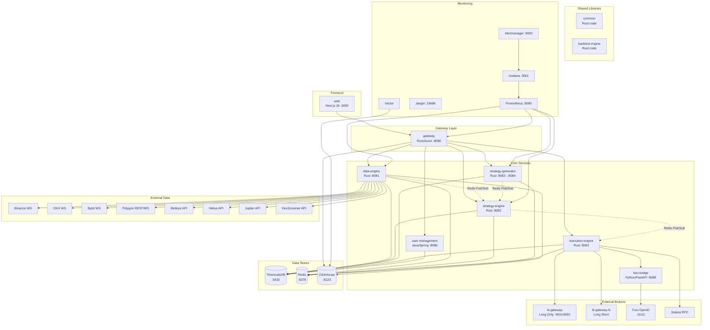
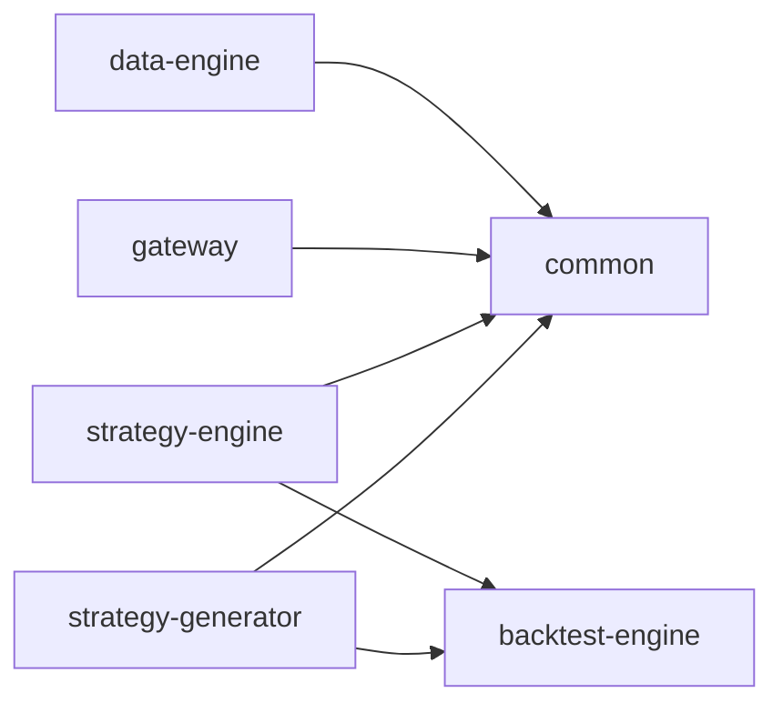

# PROJECT_INDEX.md - HermesFlow

> Auto-generated project index. Last updated: 2026-03-01

## Overview

HermesFlow is a quantitative trading platform with a hybrid Rust + Python + Java + TypeScript microservices architecture. It handles multi-exchange market data aggregation (crypto + traditional stocks), genetic algorithm strategy evolution, real-time strategy execution, risk management, and trade execution across Solana/Raydium, IBKR, and Futu brokers.

## Architecture Diagram

## Service Index

| Service | Language | Port | Role | Entry Point |
|---------|----------|------|------|-------------|
| [data-engine](services/data-engine/) | Rust | 8081→8080 | Market data aggregation, 12+ data source connectors, candle aggregation, data quality monitoring | `src/main.rs` |
| [gateway](services/gateway/) | Rust | 8080 | API gateway, WebSocket router, JWT auth, CORS, rate limiting, reverse proxy | `src/main.rs` |
| [strategy-engine](services/strategy-engine/) | Rust | 8082 | Real-time strategy execution, event-driven signals via Redis Pub/Sub, portfolio management | `src/main.rs` |
| [strategy-generator](services/strategy-generator/) | Rust | 8082→8084 | GA strategy evolution, ALPS, PSR fitness, LLM oracle, MCTS semantic prior (P8), CCIPCA augmentation (P8), diversity trigger (P8), Decimal weights (P8) | `src/main.rs` |
| [execution-engine](services/execution-engine/) | Rust | 8083 | Trade execution (IBKR, Futu, Solana); risk checks, shadow trading (P6), shadow promotion guard (P7) | `src/main.rs` |
| [backtest-engine](services/backtest-engine/) | Rust | (library) | Factor computation (ATR, MACD, Bollinger, etc.), VM-based strategy execution, P8 shape guard + O(n) TS ops | `src/lib.rs` |
| [common](services/common/) | Rust | (library) | Shared types, event bus, health endpoints, metrics, telemetry | `src/lib.rs` |
| [user-management](services/user-management/) | Java | 8086 | RBAC, JWT auth, multi-tenancy (Spring Boot 3.2) | `UserManagementApplication.java` |
| [futu-bridge](services/futu-bridge/) | Python | 8088 | HTTP bridge to Futu OpenD for HK stocks (FastAPI) | `app/main.py` |
| [web](services/web/) | TypeScript | 3000 | Dashboard UI (Next.js 16, React 19, Tailwind CSS 4) | `src/app/page.tsx` |

## Shared Crate Dependencies

- **common**: Events (`events.rs`), health checks (`health.rs`), heartbeat (`heartbeat.rs`), metrics (`metrics.rs`), telemetry (`telemetry.rs`)
- **backtest-engine**: Factor computation (`factors/`), VM execution (`vm/`), backtest runner (`backtest.rs`), config (`config.rs`). No workspace crate deps (standalone library).

## Inter-Service Communication

| From | To | Protocol | Purpose |
|------|----|----------|---------|
| web | gateway | HTTP/WS | All API calls and real-time data |
| gateway | data-engine | HTTP proxy | Market data, candles, metrics |
| gateway | strategy-engine | HTTP proxy | Strategy status, signals |
| gateway | strategy-generator | HTTP proxy | Evolution status, backtest results |
| gateway | execution-engine | HTTP proxy | Order management, positions |
| gateway | user-management | HTTP proxy | Auth, RBAC |
| gateway | ClickHouse | HTTP | Log queries |
| data-engine | Redis | Pub/Sub | Broadcast market data updates |
| strategy-engine | Redis | Sub | Receive market data, publish signals |
| strategy-generator | Redis | Sub | Receive market data for backtesting |
| execution-engine | Redis | Sub | Receive trade signals |
| execution-engine | ib-gateway | TCP (TWS API) | IBKR order execution |
| execution-engine | futu-bridge | HTTP | Futu order execution |
| execution-engine | Solana RPC | HTTP/WS | Solana/Raydium execution |
| All Rust services | TimescaleDB | PostgreSQL | Persistent storage |
| Vector | ClickHouse | HTTP | Log aggregation |

## Database Schema (39 migrations)

### TimescaleDB (PostgreSQL)
- `001-006`: Core schema, market data, trading system, active tokens
- `007`: Candle aggregates (hypertable)
- `008`: Factors table
- `009-010`: Backtest results, strategy IDs
- `011`: API usage metrics
- `012-014`: Watchlists (Polygon, universal), auto-sync triggers
- `015-017`: Performance optimization, constraints, dedup indexes
- `018`: Data quality incidents
- `019-024`: Strategy exchange partition, candle history, per-symbol evolution, strategy mode, generation ordering, trade orders mode
- `025-028`: Trading accounts (per-account config, initial capital, cached broker data, daily snapshots)
- `029`: Backtest retention policy
- `030`: Portfolio ensemble (HRP allocation, shadow equity)
- `031`: Parameterize trading accounts (remove hardcoded IDs)
- `035`: P6-1D Strategy decay routing (decay_state, decay_factor columns)
- `036`: P6-2B Shadow trading signals table + shadow status columns
- `037`: P6-2C Execution quality metrics table
- `038`: P7-4A Shadow promotion guard (7-trading-day trigger)
- `039`: P7-4C Auto-demotion logic (consecutive underperformance tracking)

### ClickHouse
- `002`: Ticks table (time-series)
- `003`: Materialized views for aggregation
- `004`: System logs (structured logging)
- `005`: Dedup ticks
- `006`: Dead letter queue

## Config Files

| File | Purpose |
|------|---------|
| `config/factors.yaml` | Factor definitions for crypto backtest/strategy engines |
| `config/factors-stock.yaml` | 25 factor definitions for stock (Polygon) evolution |
| `config/generator.yaml` | Strategy generator: exchanges, multi-timeframe, thresholds, LLM oracle, ensemble, MCTS, lFDR, diversity_trigger (P8), llm_mcts_prior (P8) |
| `Cargo.toml` | Rust workspace definition + shared dependencies |
| `docker-compose.yml` | Full service orchestration (19 containers) |
| `docker-compose.prod.yml` | Production overrides |
| `Makefile` | Build/lint/test/deploy automation |
| `rustfmt.toml` | Rust formatting rules |

## Infrastructure

### Terraform (Azure)
- `modules/aks/` - Azure Kubernetes Service
- `modules/acr/` - Azure Container Registry
- `modules/database/` - Managed PostgreSQL
- `modules/keyvault/` - Secret management
- `modules/monitoring/` - Monitoring stack
- `modules/networking/` - VNet, subnets, NSGs

### Monitoring Stack
- **Prometheus** (`infrastructure/prometheus/`) - Metrics collection + alert rules
- **Grafana** (`infrastructure/grafana/`) - Dashboards + data source provisioning
- **Alertmanager** (`infrastructure/alertmanager/`) - Alert routing → Discord
- **Jaeger** - Distributed tracing (OTLP)
- **Vector** (`infrastructure/vector/`) - Log aggregation → ClickHouse

## Documentation

| Document | Purpose |
|----------|---------|
| `docs/ARCHITECTURE.md` | System design + ADRs |
| `docs/STANDARDS.md` | Engineering standards (authoritative) |
| `docs/CODE_CONVENTIONS.md` | Error handling, config patterns |
| `docs/DEVELOPMENT_ROADMAP.md` | Feature roadmap |
| `docs/P0-P5_*.md` | Phase implementation reports |
| `docs/P8_ARCHITECTURE_DESIGN.md` | P8 architecture design (Gemini review response) |

## Key Algorithms

- **ALPS** (Age-Layered Population Structure): 5 Fibonacci layers [5,13,34,89,500], 100 genomes/layer
- **PSR Fitness**: Probabilistic Sharpe Ratio (Bailey & Lopez de Prado, 2012)
- **VM Execution**: Stack-based RPN with 23 opcodes for strategy evaluation
- **Multi-Timeframe Stacking** (P3): 25 factors x 3 resolutions = 75 features
- **Adaptive Thresholds** (P4): Percentile-based signal thresholds with utilization feedback
- **HRP Allocation** (P5): Hierarchical Risk Parity for portfolio ensemble
- **LLM Oracle** (P2): Bedrock/Claude-guided mutation on GA stagnation
- **Local FDR** (P6): n-gram Jaccard clustering with per-cluster lFDR hypothesis testing
- **CCIPCA** (P6): O(n·k) incremental PCA for high-dimensional feature reduction
- **MCTS Symbolic Regression** (P6→P7): Arena-allocated MCTS for RPN formula discovery, integrated into evolution loop with dedicated Rayon pool (P7)
- **Poisson Staleness Detection** (P6): Per-symbol EWMA tick rate with dynamic alert thresholds
- **Permutation Factor Importance** (P7): Shuffle each factor column, measure PSR drop for attribution
- **Genome Diversity Metrics** (P7): Per-ALPS-layer Hamming distance monitoring every 50 generations
- **LLM-Guided MCTS Prior** (P8): Factor-importance-weighted policy prior with canonical RPN hash for semantic MCTS search
- **CCIPCA Active Remapping** (P8): PC feature augmentation (75→80 features) from incremental PCA after 200 observations
- **Diversity-Triggered Injection** (P8): Active L3/L4 Hamming diversity trigger with elitist cull + random injection
- **VM Shape Guard + O(n) TS Ops** (P8): Pre-execution feature index validation, running-sum ts_mean/ts_sum, conditional NaN sanitization
- **Decimal Financial Precision** (P8): rust_decimal::Decimal for HRP weights, crowding penalties, turnover cost in ensemble_weights

## File Statistics

| Category | Count |
|----------|-------|
| Rust source files | ~168 |
| TypeScript/TSX files | 23 |
| Python files | 6 |
| Java files | 15 |
| SQL migrations | 41 |
| Terraform files | 21 |
| Docker services | 19 |
