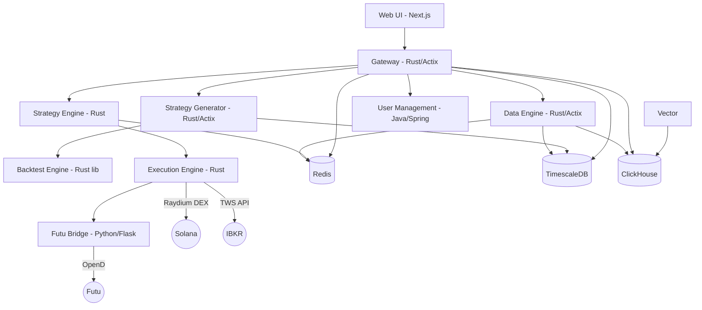

# HermesFlow

A Rust-based quantitative trading platform with multi-asset support: crypto via Solana/Raydium, US equities via IBKR, and HK stocks via Futu.

## Architecture



## Tech Stack

| Service | Language | Framework | Port | Description |
|---------|----------|-----------|------|-------------|
| **data-engine** | Rust | Actix-web | 8081 (ext) / 8080 (int) | Market data ingestion, normalization, storage |
| **gateway** | Rust | Actix-web | 8080 | API gateway, auth, rate limiting, WebSocket proxy |
| **strategy-engine** | Rust | Custom | -- (8082 internal health) | Real-time strategy execution, signal generation |
| **strategy-generator** | Rust | Actix-web | 8082 (ext) / 8084 (int health) | Genetic algorithm strategy evolution |
| **execution-engine** | Rust | Custom | -- (8083 internal health) | Trade execution: Raydium, IBKR, Futu |
| **backtest-engine** | Rust | Library crate | -- | Factor computation, VM-based strategy backtesting |
| **common** | Rust | Library crate | -- | Shared types, health checks, event bus, heartbeat |
| **user-management** | Java | Spring Boot | 8086 | User auth, tenant management |
| **futu-bridge** | Python | Flask | 8088 | Bridge to Futu OpenD for HK stock trading |
| **web** | TypeScript | Next.js | 3000 | Dashboard, strategy lab, data discovery |

## Infrastructure

| Component | Image | Port | Role |
|-----------|-------|------|------|
| **Redis** | `redis:alpine` | 6379 | Pub/Sub event bus, price cache |
| **TimescaleDB** | `timescale/timescaledb:latest-pg15` | 5432 | Primary time-series store (candles, snapshots) |
| **ClickHouse** | `clickhouse/clickhouse-server:24.3` | 8123 / 9000 | OLAP analytics, log storage |
| **Vector** | `timberio/vector:latest-alpine` | -- | Log pipeline (Docker -> ClickHouse) |

## Quick Start

### Prerequisites

- Docker and Docker Compose
- Rust toolchain (stable)
- Node.js 18+ (for web frontend)

### Start all services

```bash
# Start infrastructure and services
docker compose up -d

# Verify
docker compose ps
```

### Local development

```bash
# Verify toolchain and install frontend deps
make setup

# Run lints
make lint

# Run tests
make test

# Build Docker images
make build
```

## Project Structure

```
HermesFlow/
├── services/                  # Microservices
│   ├── common/                # [Rust] Shared library crate
│   ├── backtest-engine/       # [Rust] Backtesting library crate
│   ├── data-engine/           # [Rust] Market data ingestion
│   ├── gateway/               # [Rust] API gateway
│   ├── strategy-engine/       # [Rust] Strategy execution
│   ├── strategy-generator/    # [Rust] Genetic strategy evolution
│   ├── execution-engine/      # [Rust] Trade execution (excluded from workspace)
│   ├── user-management/       # [Java] User auth (Spring Boot)
│   ├── futu-bridge/           # [Python] Futu OpenD bridge
│   └── web/                   # [TypeScript] Next.js dashboard
├── infrastructure/            # Database migrations, Vector config, Terraform
├── config/                    # Shared configuration files (factors.yaml)
├── docs/                      # Architecture, standards, conventions
├── docker-compose.yml         # Local orchestration
├── Cargo.toml                 # Rust workspace definition
├── Makefile                   # Unified build commands
└── rustfmt.toml               # Rust formatting config
```

See [docs/PROJECT_STRUCTURE.md](docs/PROJECT_STRUCTURE.md) for the full breakdown.

## Documentation

- [Architecture](docs/ARCHITECTURE.md) -- system design, component descriptions, data flow
- [Engineering Standards](docs/STANDARDS.md) -- architecture-level standards and conventions
- [Code Conventions](docs/CODE_CONVENTIONS.md) -- Rust code patterns, error handling, config, logging
- [Project Structure](docs/PROJECT_STRUCTURE.md) -- directory layout, workspace details, config locations

## License

See [LICENSE](LICENSE).
