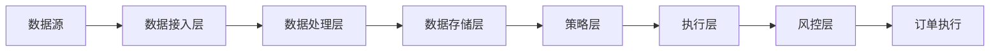

# HermesFlow 量化交易平台架构文档

## 1. 系统概述

HermesFlow 是一个现代化的量化交易平台，支持多交易所（CEX/DEX）数据接入、策略开发、回测、实盘交易等功能。系统采用微服务架构，各模块之间通过消息队列和 API 进行通信，保证系统的高可用性和可扩展性。

## 2. 核心架构

### 2.1 技术栈选择

- 后端服务：
  - 核心服务：Rust（高性能交易引擎）
  - 业务服务：Python（策略开发、数据处理）
  - API 服务：Go（高并发 HTTP/WebSocket 服务）
  
- 数据存储：
  - 实时数据：Redis
  - 历史数据：ClickHouse
  - 配置数据：PostgreSQL
  
- 消息队列：
  - Kafka（行情数据传输）
  - Redis Pub/Sub（实时通知）

- 容器化：
  - Docker
  - Kubernetes

### 2.2 系统模块

#### 2.2.1 数据模块（Data Module）
- 交易所数据接入服务
- 数据标准化服务
- 数据存储服务
- 数据分析服务

#### 2.2.2 策略模块（Strategy Module）
- 策略开发框架
- 回测引擎
- 策略执行引擎
- 策略管理服务

#### 2.2.3 风控模块（Risk Control Module）
- 风险监控服务
- 风险控制服务
- 资金管理服务

#### 2.2.4 执行模块（Execution Module）
- 订单路由服务
- 订单执行服务
- 订单管理服务

#### 2.2.5 账户模块（Account Module）
- 账户管理服务
- 资金管理服务
- 权限管理服务

#### 2.2.6 安全模块（Security Module）
- API 密钥管理
- 访问控制服务
- 审计日志服务

#### 2.2.7 报表分析模块（Report & Analysis Module）
- 报表生成服务
- 性能分析服务
- 风险分析服务

#### 2.2.8 用户界面模块（UI Module）
- Web 前端服务
- 通知服务
- 监控面板服务

## 3. 详细设计

### 3.1 数据流

### 3.2 模块间通信

- REST API：模块间的同步通信
- WebSocket：实时数据推送
- Kafka：大规模数据流处理
- Redis Pub/Sub：实时事件通知

### 3.3 数据存储设计

#### 3.3.1 实时数据（Redis）
- 行情数据
- 订单簿
- 账户状态
- 策略状态

#### 3.3.2 历史数据（ClickHouse）
- K线数据
- 交易记录
- 订单历史
- 资金流水

#### 3.3.3 配置数据（PostgreSQL）
- 用户信息
- 策略配置
- 系统配置
- 权限配置

## 4. 部署架构

### 4.1 环境划分
- Local：本地开发环境（Docker Desktop）
- Dev：开发测试环境（AWS EKS）
- Prod：生产环境（AWS EKS）

### 4.2 服务部署
- 使用 Kubernetes 进行容器编排
- 使用 Helm 管理应用配置
- 使用 ArgoCD 进行持续部署

### 4.3 监控告警
- Prometheus：指标收集
- Grafana：可视化监控
- AlertManager：告警管理

## 5. 安全设计

### 5.1 API 安全
- JWT 认证
- API 密钥加密存储
- 请求签名验证

### 5.2 数据安全
- 数据加密存储
- 数据访问控制
- 数据备份策略

### 5.3 系统安全
- 网络隔离
- 容器安全
- 日志审计

## 6. 扩展性设计

### 6.1 水平扩展
- 无状态服务水平扩展
- 数据库读写分离
- 缓存集群

### 6.2 模块扩展
- 插件化架构
- 标准化接口
- 配置化开发

## 7. 开发规范

### 7.1 代码规范
- 遵循各语言官方代码规范
- 统一的注释格式
- 统一的错误处理

### 7.2 文档规范
- API 文档（OpenAPI 规范）
- 代码文档
- 部署文档

### 7.3 版本控制
- Git 分支管理策略
- 语义化版本号
- 变更日志管理 