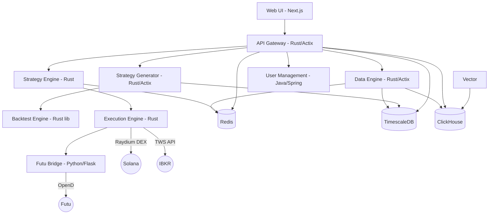

# HermesFlow System Architecture

## 1. High-Level Overview

HermesFlow is a high-performance quantitative trading platform built primarily in Rust. It supports multi-asset trading across crypto (Solana/Raydium), US equities (IBKR), and HK stocks (Futu).

## 2. Core Components

### 2.1 API Gateway (Rust)
- **Tech**: Actix-web, Tokio
- **Role**: Single entry point for all client requests. Handles JWT authentication, rate limiting, request routing, and WebSocket proxying.
- **Port**: 8080

### 2.2 Data Engine (Rust)
- **Tech**: Actix-web, SQLx, Tokio, ClickHouse client
- **Role**:
  - Connects to external data sources (Birdeye, Jupiter, Helius, Polygon, Polymarket).
  - Normalizes and persists market data (candles, snapshots, predictions).
  - Runs background tasks: candle aggregation, historical sync, token discovery.
- **Pattern**: Repository pattern for all database access.
- **Port**: 8080 (internal), mapped to 8081 externally.

### 2.3 Strategy Engine (Rust)
- **Tech**: Tokio, Redis Pub/Sub
- **Role**:
  - Subscribes to market data events via Redis.
  - Runs real-time quantitative strategies.
  - Generates trading signals with risk checks.
  - Publishes execution commands to Redis.
- **Port**: 8082 (health endpoint only, no public port).

### 2.4 Strategy Generator (Rust)
- **Tech**: Actix-web, SQLx, genetic algorithm engine
- **Role**:
  - Evolves trading strategies using genetic algorithms.
  - Evaluates fitness via the backtest engine.
  - Persists top-performing strategies to the database.
  - Exposes an API for triggering generation runs and retrieving results.
- **Port**: 8082 (external API), 8084 (internal health).

### 2.5 Backtest Engine (Rust library crate)
- **Tech**: ndarray, custom VM
- **Role**:
  - Computes technical factors: ATR, Bollinger Bands, CCI, MACD, MFI, OBV, Stochastic, VWAP, Williams %R, moving averages.
  - Executes strategy bytecode via a stack-based virtual machine.
  - Used as a dependency by strategy-engine and strategy-generator.

### 2.6 Execution Engine (Rust)
- **Tech**: Tokio, Solana SDK, reqwest
- **Role**:
  - Listens for trade commands on Redis.
  - Executes trades across multiple venues:
    - **Raydium** (Solana DEX): On-chain swaps with ATA management, wSOL wrapping.
    - **IBKR** (US equities): Via TWS API (TCP gateway).
    - **Futu** (HK stocks): Via futu-bridge HTTP bridge.
  - Manages execution guards, retry logic, RPC fallback.
- **Port**: 8083 (health endpoint only, no public port).

### 2.7 Common (Rust library crate)
- **Role**: Shared utilities consumed by all Rust services.
  - `events` module: Redis Pub/Sub event type definitions.
  - `health` module (feature-gated): Standardized `/health` endpoint server.
  - `heartbeat` module (feature-gated): Service liveness heartbeat.

### 2.8 User Management (Java / Spring Boot)
- **Tech**: Spring Boot, Spring Security, JPA
- **Role**: User authentication, authorization, and tenant management.
- **Port**: 8086

### 2.9 Futu Bridge (Python / Flask)
- **Tech**: Python, Flask, futu-api
- **Role**: HTTP bridge between the execution engine and Futu OpenD. Translates REST calls into Futu OpenD protocol for HK stock trading.
- **Port**: 8088

### 2.10 Web (TypeScript / Next.js)
- **Tech**: Next.js, React, WebSocket
- **Role**: Frontend dashboard with strategy lab, data discovery, market overview, and settings management.
- **Port**: 3000

## 3. Data Infrastructure

### 3.1 TimescaleDB (Time-Series Store)
- **Role**: Primary store for all market data (candles, snapshots), trading records, backtest results, and strategy metadata.
- **Rationale**: Hypertable partitioning for efficient time-series writes and reads. Columnar compression for storage savings.
- **Key tables**: `mkt_equity_snapshots`, `mkt_equity_candles`, `candle_aggregates`, `backtest_results`, `watchlist`.

### 3.2 Redis (Real-time Event Bus and Cache)
- **Role**: Pub/Sub channel for live market data streams (`market.stream.*`), trading signals, and execution commands. Also serves as a latest-price cache.

### 3.3 ClickHouse (OLAP Analytics)
- **Role**: Stores tick-level data and system logs for analytical queries. Vector pipeline routes Docker container logs into ClickHouse.

## 4. Supported Data Sources

| Source | Asset Class | Data Type | Protocol |
|--------|------------|-----------|----------|
| **Birdeye** | Crypto (Solana) | Price, metadata | REST |
| **Jupiter** | Crypto (Solana) | Price, swap quotes | REST |
| **Helius** | Crypto (Solana) | Transactions, metadata | REST/WebSocket |
| **Polygon** | US Stocks | Candles, snapshots | REST/WebSocket |
| **Polymarket** | Predictions | Market odds | REST |

## 5. Deployment

- **Containerization**: All services are Dockerized with health checks.
- **Orchestration**: `docker-compose.yml` for local development, `docker-compose.prod.yml` for production overrides.
- **Log pipeline**: Vector collects Docker logs and ships them to ClickHouse.

## Appendix A: Architecture Decision Records (ADR)

### ADR-001: Adoption of TimescaleDB (2026-01-17)

**Context**: Need high-performance storage for billions of market data rows.
**Decision**: Selected TimescaleDB (self-hosted for dev, managed for production).
**Rationale**:
1. **Write performance**: Hypertables maintain constant ingest rates vs. vanilla Postgres bloat.
2. **Compression**: Columnar compression saves ~90% storage costs.
3. **SQL compatibility**: Full Postgres SQL support, no new query language to learn.

### ADR-002: Execution Engine Workspace Exclusion (2026-02)

**Context**: The Solana SDK pins `tokio ~1.14`, which conflicts with the workspace's `tokio 1.35+`.
**Decision**: Exclude `services/execution-engine` from the Cargo workspace. It maintains its own `Cargo.toml` and is built independently.
**Rationale**: Avoids version conflicts while keeping all other Rust services on the latest tokio. The execution engine is built via its own Dockerfile and does not share a binary with other workspace members.
