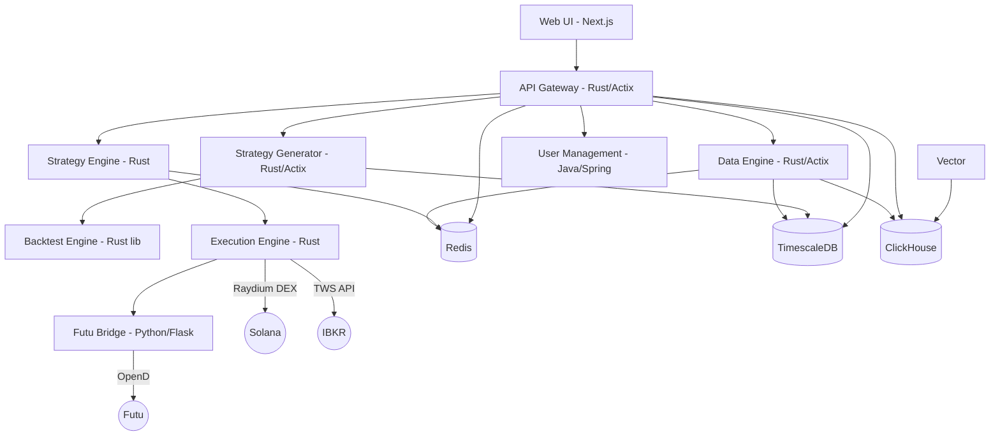

# HermesFlow System Architecture

## 1. High-Level Overview

HermesFlow is a high-performance quantitative trading platform built primarily in Rust. It supports multi-asset trading across crypto (Solana/Raydium), US equities (IBKR), and HK stocks (Futu).

## 2. Core Components

### 2.1 API Gateway (Rust)
- **Tech**: Actix-web, Tokio
- **Role**: Single entry point for all client requests. Handles JWT authentication, rate limiting, request routing, and WebSocket proxying.
- **Port**: 8080

### 2.2 Data Engine (Rust)
- **Tech**: Axum, SQLx, Tokio, ClickHouse client, Prometheus
- **Role**:
  - Connects to 12+ external data sources (Binance, OKX, Bybit, Polygon/Massive, Jupiter, Birdeye, Helius, AkShare, Futu, Polymarket, IBKR, Twitter).
  - Normalizes all data into `StandardMarketData` using `rust_decimal::Decimal` for financial precision.
  - Persists market data (candles, snapshots, predictions) to TimescaleDB.
  - Publishes real-time data via Redis Pub/Sub and WebSocket broadcast.
  - Runs background tasks: candle aggregation (1m/5m/15m/1h/4h/1d/1w), historical sync, token discovery, data quality monitoring.
  - 5-stage data quality pipeline: freshness, gap detection, liquidity guard, price spike detection, metrics export.
- **Pattern**: Repository pattern for all database access.
- **Port**: 8080 (internal), mapped to 8081 externally.

### 2.3 Strategy Engine (Rust)
- **Tech**: Tokio, Redis Pub/Sub
- **Role**:
  - Subscribes to market data events via Redis.
  - Runs real-time quantitative strategies.
  - Generates trading signals with risk checks.
  - Publishes execution commands to Redis.
- **Port**: 8082 (health endpoint only, no public port).

### 2.4 Strategy Generator (Rust)
- **Tech**: Actix-web, SQLx, genetic algorithm engine
- **Role**:
  - Evolves trading strategies using genetic algorithms.
  - Evaluates fitness via the backtest engine.
  - Persists top-performing strategies to the database.
  - Exposes an API for triggering generation runs and retrieving results.
- **Port**: 8082 (external API), 8084 (internal health).

### 2.5 Backtest Engine (Rust library crate)
- **Tech**: ndarray, custom VM
- **Role**:
  - Computes technical factors: ATR, Bollinger Bands, CCI, MACD, MFI, OBV, Stochastic, VWAP, Williams %R, moving averages.
  - Executes strategy bytecode via a stack-based virtual machine.
  - Used as a dependency by strategy-engine and strategy-generator.

### 2.6 Execution Engine (Rust)
- **Tech**: Tokio, Solana SDK, reqwest
- **Role**:
  - Listens for trade commands on Redis.
  - Executes trades across multiple venues:
    - **Raydium** (Solana DEX): On-chain swaps with ATA management, wSOL wrapping.
    - **IBKR** (US equities): Via TWS API (TCP gateway).
    - **Futu** (HK stocks): Via futu-bridge HTTP bridge.
  - Manages execution guards, retry logic, RPC fallback.
- **Port**: 8083 (health endpoint only, no public port).

### 2.7 Common (Rust library crate)
- **Role**: Shared utilities consumed by all Rust services.
  - `events` module: Redis Pub/Sub event type definitions.
  - `health` module (feature-gated): Standardized `/health` endpoint server.
  - `heartbeat` module (feature-gated): Service liveness heartbeat.

### 2.8 User Management (Java / Spring Boot)
- **Tech**: Spring Boot, Spring Security, JPA
- **Role**: User authentication, authorization, and tenant management.
- **Port**: 8086

### 2.9 Futu Bridge (Python / Flask)
- **Tech**: Python, Flask, futu-api
- **Role**: HTTP bridge between the execution engine and Futu OpenD. Translates REST calls into Futu OpenD protocol for HK stock trading.
- **Port**: 8088

### 2.10 Web (TypeScript / Next.js)
- **Tech**: Next.js, React, WebSocket
- **Role**: Frontend dashboard with strategy lab, data discovery, market overview, and settings management.
- **Port**: 3000

## 3. Data Infrastructure

### 3.1 TimescaleDB (Time-Series Store)
- **Role**: Primary store for all market data (candles, snapshots), trading records, backtest results, and strategy metadata.
- **Rationale**: Hypertable partitioning for efficient time-series writes and reads. Columnar compression for storage savings.
- **Key tables**: `mkt_equity_snapshots`, `mkt_equity_candles`, `candle_aggregates`, `backtest_results`, `watchlist`.

### 3.2 Redis (Real-time Event Bus and Cache)
- **Role**: Pub/Sub channel for live market data streams (`market.stream.*`), trading signals, and execution commands. Also serves as a latest-price cache.

### 3.3 ClickHouse (OLAP Analytics)
- **Role**: Stores tick-level data and system logs for analytical queries. Vector pipeline routes Docker container logs into ClickHouse.

## 4. Supported Data Sources

| Name | Protocol | Data Types | Source Type | Status |
|------|----------|-----------|-------------|--------|
| **Binance** | WS | Spot + futures tickers, trades | CEX | Active |
| **OKX** | WS | Spot + futures tickers | CEX | Active |
| **Bybit** | WS | Spot + futures tickers | CEX | Active |
| **Polygon / Massive** | REST + WS | US stock candles, tickers | Traditional | Active |
| **Jupiter** | REST (polling) | Solana DEX prices | DeFi | Active |
| **Birdeye** | REST | Solana token metadata, prices | DeFi | Active |
| **Helius** | REST | Solana token metadata | DeFi | Active |
| **AkShare** | REST (polling) | A-share stock data | Traditional | Active |
| **Futu** | REST (via Python bridge) | HK stock data | Traditional | Active |
| **Polymarket** | REST (polling) | Prediction market outcomes | Prediction | Active |
| **IBKR** | Native API | US/global stocks, options | Traditional | Active |
| **Twitter** | REST | Social sentiment | Social | Active |

Each data source has its own collector module under `services/data-engine/src/collectors/`. Multi-file collectors (Binance, OKX, Bybit, Polygon, Jupiter, Birdeye, Helius, Futu, Massive, DexScreener) have dedicated subdirectories with `mod.rs`, `client.rs`, `config.rs`, and optionally `connector.rs`/`websocket.rs`. Single-file collectors (AkShare, IBKR, Twitter, Polymarket) live as standalone `.rs` files.

### 4.1 StandardMarketData Field Dictionary

All data sources normalize their output into a unified `StandardMarketData` struct (defined in `services/data-engine/src/models/market_data.rs`). This struct uses `rust_decimal::Decimal` for all financial values to avoid floating-point precision errors.

| Field | Type | Required | Description |
|-------|------|----------|-------------|
| `source` | `DataSourceType` | Yes | Enum identifying the data source (e.g., `BinanceSpot`, `OkxFutures`) |
| `exchange` | `String` | Yes | Human-readable exchange name (e.g., "Binance", "OKX") |
| `symbol` | `String` | Yes | Trading pair or asset symbol (e.g., "BTCUSDT", "AAPL") |
| `asset_type` | `AssetType` | Yes | Asset classification (Spot, Perpetual, Stock, etc.) |
| `data_type` | `MarketDataType` | Yes | Type of market data (Trade, Ticker, Candle, FundingRate, OrderBook) |
| `price` | `Decimal` | Yes | Last/current price |
| `quantity` | `Decimal` | Yes | Volume or quantity |
| `timestamp` | `i64` | Yes | Exchange-side timestamp (milliseconds since epoch) |
| `received_at` | `i64` | Yes | System receive timestamp (milliseconds since epoch), for latency measurement |
| `bid` | `Option<Decimal>` | No | Best bid price |
| `ask` | `Option<Decimal>` | No | Best ask price |
| `high_24h` | `Option<Decimal>` | No | 24-hour high price |
| `low_24h` | `Option<Decimal>` | No | 24-hour low price |
| `volume_24h` | `Option<Decimal>` | No | 24-hour trading volume |
| `open_interest` | `Option<Decimal>` | No | Open interest (futures/perpetuals only) |
| `funding_rate` | `Option<Decimal>` | No | Funding rate (perpetuals only) |
| `liquidity` | `Option<Decimal>` | No | DEX liquidity in USD (Solana meme coins) |
| `fdv` | `Option<Decimal>` | No | Fully diluted valuation |
| `sequence_id` | `Option<u64>` | No | Sequence ID for message ordering and gap detection |
| `raw_data` | `String` | Yes | Original raw message JSON (retained for debugging/replay) |

Built-in validation (`StandardMarketData::validate()`) enforces: non-empty symbol, positive price for Trade/Ticker types, non-negative quantity, sane timestamp bounds, and bid <= ask ordering.

### 4.2 Data Quality Monitoring

The data engine runs a 5-stage data quality monitoring pipeline (defined in `services/data-engine/src/monitoring/quality.rs`), executed hourly via a scheduled task plus once on startup. Each stage exports Prometheus gauge metrics for alerting.

| Stage | Name | What It Checks | Metric |
|-------|------|---------------|--------|
| 1 | **Freshness** | Detects symbols with no new snapshot data within a configurable threshold (default: 30s for tokens, scaled for equities). Checks both `active_tokens` and `mkt_equity_snapshots`. | `data_engine_dq_stale_symbols` |
| 2 | **Gap Detection** | Verifies candle continuity across all timeframes (1m, 5m, 15m, 1h, 4h, 1d). Flags symbols where candle count falls below minimum expected thresholds within a lookback window. | `data_engine_dq_gap_symbols` |
| 3 | **Liquidity Guard** | Identifies active tokens whose USD liquidity has dropped below the configured minimum (default: $100k). Recommends deactivation to prevent trading on illiquid assets. | `data_engine_dq_low_liq_symbols` |
| 4 | **Price Spike Detection** | Uses LAG window functions to detect price movements exceeding a configurable threshold (default: 50%) within a 10-minute window. Flags potential bad data or extreme volatility. | `data_engine_dq_spike_symbols` |
| 5 | **Metrics Export** | All stages export their findings as Prometheus gauges. Combined with per-source counters (`data_engine_messages_by_source_total`, `data_engine_errors_by_source_total`) and latency histograms (`data_engine_latency_by_source_seconds`) for comprehensive observability. | Multiple (see `monitoring/metrics.rs`) |

Additional metrics exported: `data_engine_active_symbols_count`, `data_engine_ingest_latency_seconds`, `data_engine_validation_failures_total`, plus per-source breakdowns.

## 5. Deployment

- **Containerization**: All services are Dockerized with health checks.
- **Orchestration**: `docker-compose.yml` for local development, `docker-compose.prod.yml` for production overrides.
- **Log pipeline**: Vector collects Docker logs and ships them to ClickHouse.

## Appendix A: Architecture Decision Records (ADR)

### ADR-001: Adoption of TimescaleDB (2026-01-17)

**Context**: Need high-performance storage for billions of market data rows.
**Decision**: Selected TimescaleDB (self-hosted for dev, managed for production).
**Rationale**:
1. **Write performance**: Hypertables maintain constant ingest rates vs. vanilla Postgres bloat.
2. **Compression**: Columnar compression saves ~90% storage costs.
3. **SQL compatibility**: Full Postgres SQL support, no new query language to learn.

### ADR-002: Execution Engine Workspace Exclusion (2026-02)

**Context**: The Solana SDK pins `tokio ~1.14`, which conflicts with the workspace's `tokio 1.35+`.
**Decision**: Exclude `services/execution-engine` from the Cargo workspace. It maintains its own `Cargo.toml` and is built independently.
**Rationale**: Avoids version conflicts while keeping all other Rust services on the latest tokio. The execution engine is built via its own Dockerfile and does not share a binary with other workspace members.
