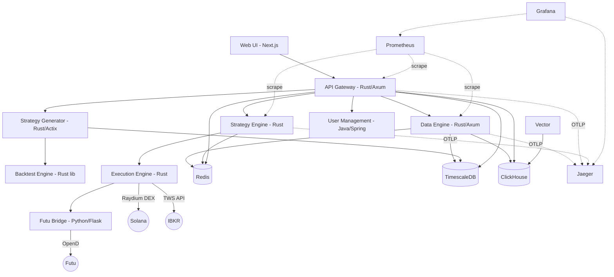

# HermesFlow System Architecture

## 1. High-Level Overview

HermesFlow is a high-performance quantitative trading platform built primarily in Rust. It supports multi-asset trading across crypto (Solana/Raydium), US equities (IBKR), and HK stocks (Futu).



## 2. Core Components

### 2.1 API Gateway (Rust)
- **Tech**: Actix-web, Tokio, Prometheus
- **Role**: Single entry point for all client requests. Handles JWT authentication, rate limiting, request routing, and WebSocket proxying.
- **Metrics**: HTTP request duration/count (by method/path/status), upstream health gauges, upstream latency histograms, WebSocket connection count, proxy error counter.
- **Port**: 8080

### 2.2 Data Engine (Rust)
- **Tech**: Axum, SQLx, Tokio, ClickHouse client, Prometheus
- **Role**:
  - Connects to 12+ external data sources (Binance, OKX, Bybit, Polygon/Massive, Jupiter, Birdeye, Helius, AkShare, Futu, Polymarket, IBKR, Twitter).
  - Normalizes all data into `StandardMarketData` using `rust_decimal::Decimal` for financial precision.
  - Persists market data (candles, snapshots, predictions) to TimescaleDB with dedup (`ON CONFLICT DO NOTHING`).
  - Publishes real-time data via Redis Pub/Sub and WebSocket broadcast.
  - Runs background tasks: candle aggregation (1m/5m/15m/1h/4h/1d/1w), historical sync, token discovery, data quality monitoring. All tasks are guarded with `AtomicBool` overlap prevention and `tokio::time::timeout`.
  - 7-stage data quality pipeline with tiered scheduling (critical/warning/full-audit). See section 4.2.
  - **Circuit breaker** per collector: Closed/Open/HalfOpen states; trips after 5 consecutive failures, recovers after 60s. See section 6.1.
  - **Dead letter queue**: Failed records persisted to ClickHouse `dead_letters` table via async mpsc channel. CLI tool (`replay-dead-letters`) for recovery. See section 6.2.
  - **ClickHouse flush retry**: `retry_with_backoff` wraps batch inserts (3 attempts, 500ms initial delay).
- **Pattern**: Repository pattern for all database access.
- **Metrics**: 30+ Prometheus metrics covering ingest rates, latency, data quality gauges, circuit breaker state, task duration/timeouts, Redis cache hits, dead letter counts. See section 7.1.
- **Port**: 8080 (internal), mapped to 8081 externally.

### 2.3 Strategy Engine (Rust)
- **Tech**: Tokio, Redis Pub/Sub, Prometheus
- **Role**:
  - Subscribes to market data events via Redis.
  - Runs real-time quantitative strategies via stack-based VM.
  - Generates trading signals with risk checks (honeypot detection, equity sizing).
  - Manages portfolio positions with stop-loss/take-profit exit logic.
  - Publishes execution commands to Redis.
- **Metrics**: Signal generation rate (by strategy/direction), signal latency, active positions, risk check results (approved/rejected), market data consumption rate, market data lag.
- **Port**: 8082 (health endpoint only, no public port).

### 2.4 Strategy Generator (Rust)
- **Tech**: Actix-web, SQLx, genetic algorithm engine
- **Role**:
  - Evolves trading strategies using genetic algorithms.
  - Evaluates fitness via the backtest engine.
  - Persists top-performing strategies to the database.
  - Exposes an API for triggering generation runs and retrieving results.
- **Port**: 8082 (external API), 8084 (internal health).

### 2.5 Backtest Engine (Rust library crate)
- **Tech**: ndarray, custom VM
- **Role**:
  - Computes technical factors: ATR, Bollinger Bands, CCI, MACD, MFI, OBV, Stochastic, VWAP, Williams %R, moving averages.
  - Executes strategy bytecode via a stack-based virtual machine.
  - Used as a dependency by strategy-engine and strategy-generator.

### 2.6 Execution Engine (Rust)
- **Tech**: Tokio, Solana SDK, reqwest
- **Role**:
  - Listens for trade commands on Redis.
  - Executes trades across multiple venues:
    - **Raydium** (Solana DEX): On-chain swaps with ATA management, wSOL wrapping.
    - **IBKR** (US equities): Via TWS API (TCP gateway).
    - **Futu** (HK stocks): Via futu-bridge HTTP bridge.
  - Manages execution guards, retry logic, RPC fallback.
- **Port**: 8083 (health endpoint only, no public port).

### 2.7 Common (Rust library crate)
- **Role**: Shared utilities consumed by all Rust services.
  - `events` module: Redis Pub/Sub event type definitions.
  - `health` module (feature-gated): Standardized `/health` endpoint server with `/metrics` endpoint.
  - `heartbeat` module (feature-gated): Service liveness heartbeat via Redis.
  - `metrics` module (feature-gated): Prometheus metric initialization per service.
  - `telemetry` module (feature-gated): OpenTelemetry OTLP tracing. Conditionally activates when `OTEL_EXPORTER_OTLP_ENDPOINT` is set; combines structured logging (fmt layer) + distributed tracing (OTLP export) + env-filter. See section 8.

### 2.8 User Management (Java / Spring Boot)
- **Tech**: Spring Boot, Spring Security, JPA
- **Role**: User authentication, authorization, and tenant management.
- **Port**: 8086

### 2.9 Futu Bridge (Python / Flask)
- **Tech**: Python, Flask, futu-api
- **Role**: HTTP bridge between the execution engine and Futu OpenD. Translates REST calls into Futu OpenD protocol for HK stock trading.
- **Port**: 8088

### 2.10 Web (TypeScript / Next.js)
- **Tech**: Next.js, React, WebSocket
- **Role**: Frontend dashboard with strategy lab, data discovery, market overview, and settings management.
- **Port**: 3000

## 3. Data Infrastructure

### 3.1 TimescaleDB (Time-Series Store)
- **Role**: Primary store for all market data (candles, snapshots), trading records, backtest results, and strategy metadata.
- **Rationale**: Hypertable partitioning for efficient time-series writes and reads. Columnar compression for storage savings.
- **Key tables**: `mkt_equity_snapshots`, `mkt_equity_candles`, `candle_aggregates`, `backtest_results`, `watchlist`, `dq_incidents`.
- **Integrity constraints**:
  - `mkt_equity_snapshots`: price > 0, bid <= ask, volume >= 0, dedup partial index on (exchange, symbol, time).
  - `mkt_equity_candles`: OHLC relationship (high >= max(open,close), low <= min(open,close)), positive prices, volume >= 0.

### 3.2 Redis (Real-time Event Bus and Cache)
- **Role**: Pub/Sub channel for live market data streams (`market.stream.*`), trading signals, and execution commands. Also serves as a latest-price cache.

### 3.3 ClickHouse (OLAP Analytics)
- **Role**: Stores tick-level data, dead letter records, and system logs for analytical queries. Vector pipeline routes Docker container logs into ClickHouse.
- **Key tables**:
  - `unified_ticks`: Tick-level market data. Uses `ReplacingMergeTree(ingested_at)` with ORDER BY `(source, symbol, timestamp, sequence_id)` for automatic deduplication.
  - `dead_letters`: Failed records after retry exhaustion. MergeTree with 90-day TTL, partitioned by month. Supports replay via `replayed_at` / `replay_status` columns.

## 4. Supported Data Sources

| Name | Protocol | Data Types | Source Type | Status |
|------|----------|-----------|-------------|--------|
| **Binance** | WS | Spot + futures tickers, trades | CEX | Active |
| **OKX** | WS | Spot + futures tickers | CEX | Active |
| **Bybit** | WS | Spot + futures tickers | CEX | Active |
| **Polygon / Massive** | REST + WS | US stock candles, tickers | Traditional | Active |
| **Jupiter** | REST (polling) | Solana DEX prices | DeFi | Active |
| **Birdeye** | REST | Solana token metadata, prices | DeFi | Active |
| **Helius** | REST | Solana token metadata | DeFi | Active |
| **AkShare** | REST (polling) | A-share stock data | Traditional | Active |
| **Futu** | REST (via Python bridge) | HK stock data | Traditional | Active |
| **Polymarket** | REST (polling) | Prediction market outcomes | Prediction | Active |
| **IBKR** | Native API | US/global stocks, options | Traditional | Active |
| **Twitter** | REST | Social sentiment | Social | Active |

Each data source has its own collector module under `services/data-engine/src/collectors/`. Multi-file collectors (Binance, OKX, Bybit, Polygon, Jupiter, Birdeye, Helius, Futu, Massive, DexScreener) have dedicated subdirectories with `mod.rs`, `client.rs`, `config.rs`, and optionally `connector.rs`/`websocket.rs`. Single-file collectors (AkShare, IBKR, Twitter, Polymarket) live as standalone `.rs` files.

### 4.1 StandardMarketData Field Dictionary

All data sources normalize their output into a unified `StandardMarketData` struct (defined in `services/data-engine/src/models/market_data.rs`). This struct uses `rust_decimal::Decimal` for all financial values to avoid floating-point precision errors.

| Field | Type | Required | Description |
|-------|------|----------|-------------|
| `source` | `DataSourceType` | Yes | Enum identifying the data source (e.g., `BinanceSpot`, `OkxFutures`) |
| `exchange` | `String` | Yes | Human-readable exchange name (e.g., "Binance", "OKX") |
| `symbol` | `String` | Yes | Trading pair or asset symbol (e.g., "BTCUSDT", "AAPL") |
| `asset_type` | `AssetType` | Yes | Asset classification (Spot, Perpetual, Stock, etc.) |
| `data_type` | `MarketDataType` | Yes | Type of market data (Trade, Ticker, Candle, FundingRate, OrderBook) |
| `price` | `Decimal` | Yes | Last/current price |
| `quantity` | `Decimal` | Yes | Volume or quantity |
| `timestamp` | `i64` | Yes | Exchange-side timestamp (milliseconds since epoch) |
| `received_at` | `i64` | Yes | System receive timestamp (milliseconds since epoch), for latency measurement |
| `bid` | `Option<Decimal>` | No | Best bid price |
| `ask` | `Option<Decimal>` | No | Best ask price |
| `high_24h` | `Option<Decimal>` | No | 24-hour high price |
| `low_24h` | `Option<Decimal>` | No | 24-hour low price |
| `volume_24h` | `Option<Decimal>` | No | 24-hour trading volume |
| `open_interest` | `Option<Decimal>` | No | Open interest (futures/perpetuals only) |
| `funding_rate` | `Option<Decimal>` | No | Funding rate (perpetuals only) |
| `liquidity` | `Option<Decimal>` | No | DEX liquidity in USD (Solana meme coins) |
| `fdv` | `Option<Decimal>` | No | Fully diluted valuation |
| `sequence_id` | `Option<u64>` | No | Sequence ID for message ordering and gap detection |
| `raw_data` | `String` | Yes | Original raw message JSON (retained for debugging/replay) |

Built-in validation (`StandardMarketData::validate()`) enforces: non-empty symbol, positive price for Trade/Ticker types, non-negative quantity, sane timestamp bounds, and bid <= ask ordering.

### 4.2 Data Quality Monitoring

The data engine runs a 7-stage data quality monitoring pipeline (defined in `services/data-engine/src/monitoring/quality.rs`) with **tiered scheduling**. Each stage exports Prometheus gauge metrics and records structured incidents to the `dq_incidents` table.

**Tiered Execution Schedule:**

| Tier | Interval | Timeout | Stages |
|------|----------|---------|--------|
| Critical | 30s | 25s | Active count, freshness |
| Warning | 5min | 4min | Gaps, spikes, cross-source divergence |
| Full Audit | 1h | 50min | All stages including liquidity, volume anomaly, timestamp drift, per-source scoring |

All tasks use `guarded_task()` with `AtomicBool` overlap prevention and `tokio::time::timeout`.

**Check Stages:**

| Stage | Name | What It Checks | Metric |
|-------|------|---------------|--------|
| 0 | **Active Count** | Queries `active_tokens` table to count tracked symbols. | `data_engine_active_symbols_count` |
| 1 | **Freshness** | Detects symbols with no new snapshot data within a configurable threshold (default: 30s). | `data_engine_dq_stale_symbols` |
| 2 | **Gap Detection** | Verifies candle continuity across all timeframes (1m, 5m, 15m, 1h, 4h, 1d). | `data_engine_dq_gap_symbols` |
| 3 | **Liquidity Guard** | Identifies active tokens whose USD liquidity has dropped below the configured minimum (default: $100k). | `data_engine_dq_low_liq_symbols` |
| 4 | **Price Spike Detection** | Uses LAG window functions to detect price movements exceeding 50% within a 10-minute window. | `data_engine_dq_spike_symbols` |
| 5 | **Cross-Source Divergence** | JOINs latest snapshots by symbol across exchanges, flags >1% price divergence. | `data_engine_dq_cross_source_divergence` |
| 6 | **Volume Anomaly** | Compares hourly message count vs 7-day average; flags if below 10% of baseline. | `data_engine_dq_volume_anomaly` |
| 7 | **Timestamp Drift** | Uses PERCENTILE_CONT to detect excessive exchange clock skew (>30s). | `data_engine_dq_timestamp_drift_symbols` |

**Per-Source Quality Score:** Each source receives a 0.0–1.0 composite score: 60% freshness component (1.0 if <30s, linear decay to 0 at 300s) + 40% volume component (normalized to 100 snapshots/hour baseline). Exported as `data_engine_dq_source_score{source="..."}`.

**Incident Recording:** Each check records findings to `dq_incidents` table (Postgres) with `check_type`, `severity`, `symbol`, `source`, `details` (JSONB). Increments `data_engine_dq_incidents_total` counter.

**Configuration** (`DataQualityConfig`): `freshness_threshold_sec=30`, `liquidity_min_usd=100000`, `price_change_threshold_pct=0.50`, `cross_source_divergence_pct=0.01`, `volume_anomaly_ratio=0.10`, `timestamp_drift_threshold_sec=30`.

## 5. Deployment

- **Containerization**: All services are Dockerized with health checks.
- **Orchestration**: `docker-compose.yml` for local development, `docker-compose.prod.yml` for production overrides.
- **Log pipeline**: Vector collects Docker logs and ships them to ClickHouse.
- **Tracing**: Jaeger (all-in-one) receives OTLP gRPC spans on port 4317; UI on port 16686. Grafana configured with Jaeger as a datasource.

## 6. Resilience Patterns

### 6.1 Circuit Breaker

Each data source collector is wrapped with a circuit breaker (`services/data-engine/src/collectors/circuit_breaker.rs`). Thread-safe via `AtomicU8` state + `AtomicU32` failure counter.

```
Closed ──(failures >= threshold)──> Open ──(recovery_timeout)──> HalfOpen
  ^                                                                  │
  └──────────(probe succeeds)──────────────────────────────────────────┘
                                   (probe fails) ──> Open
```

| Parameter | Default |
|-----------|---------|
| `failure_threshold` | 5 consecutive failures |
| `recovery_timeout` | 60 seconds |

**Metrics**: `data_engine_circuit_breaker_state{source}` (0=closed, 1=open, 2=half-open), `data_engine_circuit_breaker_trips_total{source}`.

### 6.2 Dead Letter Queue

Records that fail persistence after all retries are captured by the dead letter system (`services/data-engine/src/monitoring/dead_letter.rs`).

**Architecture:**
1. `DeadLetterWriter` holds a bounded mpsc channel (capacity: 256).
2. `record()` is called on failure → increments `data_engine_dead_letter_total` → logs to `"dead_letter"` tracing target → sends to background channel.
3. Background tokio task batch-inserts into ClickHouse `dead_letters` table.
4. If the channel is full, ClickHouse persistence is skipped but the tracing log is always emitted.

**Replay CLI** (`services/data-engine/src/bin/replay-dead-letters.rs`):
- Queries unreplayed records from ClickHouse `dead_letters` table.
- Reconstructs `StandardMarketData` and re-inserts into Postgres via `insert_snapshot()`.
- Optionally re-inserts into ClickHouse `unified_ticks` with `--include-clickhouse`.
- Supports filtering: `--source`, `--symbol`, `--target`, `--from`, `--to`, `--limit`.
- `--dry-run` mode for safe preview.
- Marks successful replays with `replayed_at` timestamp and `replay_status`.

### 6.3 Task Guards

All scheduled background tasks in `TaskManager` use a `guarded_task()` wrapper:

1. **Overlap prevention**: `AtomicBool` compare-and-swap; skips if already running. Metric: `data_engine_task_overlap_skipped_total{task}`.
2. **Timeout protection**: `tokio::time::timeout()` with per-task duration. Metric: `data_engine_task_timeout_total{task}`.
3. **Duration tracking**: Elapsed time recorded in `data_engine_task_duration_seconds{task}` histogram.

### 6.4 ClickHouse Flush Retry

`ClickHouseWriter::flush()` wraps batch inserts with `retry_with_backoff()` (3 attempts, 500ms initial delay). If all retries fail, the batch is retained in memory for the next scheduled flush cycle.

### 6.5 Snapshot Deduplication

`mkt_equity_snapshots` has a partial unique index on `(exchange, symbol, time)`. `insert_snapshot()` uses `ON CONFLICT DO NOTHING` to silently drop duplicates, making dead letter replay and collector restarts idempotent.

## 7. Observability

### 7.1 Prometheus Metrics

All services expose a `/metrics` endpoint in Prometheus exposition format.

**Data Engine** (30+ metrics in `services/data-engine/src/monitoring/metrics.rs`):

| Category | Key Metrics |
|----------|-------------|
| Ingest | `messages_received_total`, `messages_processed_total`, `errors_total`, `ingest_latency_seconds` |
| Per-source | `messages_by_source_total{source}`, `errors_by_source_total{source}`, `latency_by_source_seconds{source}` |
| Storage | `clickhouse_inserts_total`, `clickhouse_latency_seconds`, `redis_latency_seconds`, `redis_cache_hits_total`, `redis_cache_misses_total` |
| Data quality | `dq_stale_symbols`, `dq_gap_symbols`, `dq_low_liq_symbols`, `dq_spike_symbols`, `dq_cross_source_divergence`, `dq_volume_anomaly`, `dq_timestamp_drift_symbols`, `dq_source_score{source}`, `dq_incidents_total{check_type,severity}` |
| Resilience | `circuit_breaker_state{source}`, `circuit_breaker_trips_total{source}`, `dead_letter_total`, `task_duration_seconds{task}`, `task_timeout_total{task}`, `task_overlap_skipped_total{task}` |
| Freshness | `e2e_freshness_seconds{source}`, `collector_last_message_timestamp{source}` |

All metric names are prefixed with `data_engine_`.

**Gateway** (6 metrics in `services/gateway/src/metrics.rs`):
`gateway_http_requests_total{method,path,status}`, `gateway_http_request_duration_seconds{method,path,status}`, `gateway_websocket_connections`, `gateway_proxy_errors_total{target}`, `gateway_upstream_health{target}`, `gateway_upstream_latency_seconds{target}`.

**Strategy Engine** (6 metrics in `services/strategy-engine/src/metrics.rs`):
`strategy_signals_generated_total{strategy,direction}`, `strategy_signal_latency_seconds`, `strategy_active_positions`, `strategy_risk_checks_total{result}`, `strategy_market_data_consumed_total`, `strategy_market_data_lag_seconds`.

### 7.2 Alerting Rules

25 Prometheus alert rules in `infrastructure/prometheus/rules/data_integrity.yml`, organized into 6 groups:

| Group | Interval | Alerts | Severity |
|-------|----------|--------|----------|
| Critical Data Integrity | 30s | `DataEngineDown`, `MajorDataStaleness`, `DeadLetterSpike`, `HighErrorRate` | critical |
| Warning Data Quality | 60s | `DataGapsDetected`, `PriceSpikesDetected`, `CrossSourceDivergence`, `HighIngestLatency`, `ValidationFailureSpike`, `TimestampDrift` | warning |
| Info Monitoring | 300s | `SourceQualityDegraded`, `LowLiquidityTokens`, `VolumeAnomaly` | info |
| Gateway | 30s | `GatewayHighErrorRate`, `WebSocketConnectionDrop`, `GatewayHighLatency`, `GatewayUpstreamDown` | warning/critical |
| Strategy Engine | 30s | `StrategyEngineDown`, `RiskRejectionSpike`, `MarketDataLagHigh`, `NoMarketDataConsumed` | warning/critical |
| Circuit Breaker & Tasks | 30s | `CircuitBreakerOpen`, `TaskTimeoutSpike`, `E2EFreshnessStale`, `DQIncidentRate` | warning/info |

### 7.3 Grafana Dashboards

6 dashboards provisioned via file provisioner in `infrastructure/grafana/dashboards/`:

| Dashboard | UID | Key Panels |
|-----------|-----|------------|
| **System Health** | `hermesflow-system-health` | Service status, active symbols, messages processed, circuit breaker state |
| **Data Pipeline** | `hermesflow-data-pipeline` | Message rate, error rate by source, ingest latency (P50/P95/P99), ClickHouse insert rate |
| **Data Quality** | `hermesflow-data-quality` | Stale/gap/spike/low-liq gauges, volume anomaly, timestamp drift, cross-source divergence |
| **Strategy Engine** | `hermesflow-strategy-engine` | Active positions, signal rate, risk check results, signal latency, market data lag |
| **Collector Health** | `hermesflow-collector-health` | Circuit breaker state/trips, last message age, connection status per source |
| **SLO** | `hermesflow-slo` | Data freshness SLO (<30s for 99%), insert success rate (>99.9%), signal rate health, market data lag SLO |

## 8. Distributed Tracing (OpenTelemetry)

All Rust services integrate optional OpenTelemetry distributed tracing via the `common::telemetry` module (`services/common/src/telemetry.rs`), gated behind the `telemetry` Cargo feature.

**Activation**: Set `OTEL_EXPORTER_OTLP_ENDPOINT` environment variable (e.g., `http://jaeger:4317`). When set, `try_init_telemetry(service_name)` initializes:
- OTLP gRPC exporter (via `opentelemetry-otlp` + Tonic)
- Batch span processor on Tokio runtime
- Combined `tracing-subscriber` with fmt layer (structured logs) + OpenTelemetry layer (spans) + EnvFilter (`RUST_LOG`)
- Resource attribute: `service.name`

When `OTEL_EXPORTER_OTLP_ENDPOINT` is not set, each service falls back to its own `tracing_subscriber::fmt` initialization.

**Backend**: Jaeger all-in-one (port 16686 UI, port 4317 OTLP gRPC) in `docker-compose.yml`. Also configured as a Grafana datasource for trace-to-metric correlation.

**Dependencies** (workspace-level):
- `opentelemetry = "0.22"`
- `opentelemetry_sdk = "0.22"` (features: `rt-tokio`)
- `opentelemetry-otlp = "0.15"` (features: `grpc-tonic`)
- `tracing-opentelemetry = "0.23"`

## Appendix A: Architecture Decision Records (ADR)

### ADR-001: Adoption of TimescaleDB (2026-01-17)

**Context**: Need high-performance storage for billions of market data rows.
**Decision**: Selected TimescaleDB (self-hosted for dev, managed for production).
**Rationale**:
1. **Write performance**: Hypertables maintain constant ingest rates vs. vanilla Postgres bloat.
2. **Compression**: Columnar compression saves ~90% storage costs.
3. **SQL compatibility**: Full Postgres SQL support, no new query language to learn.

### ADR-002: Execution Engine Workspace Exclusion (2026-02)

**Context**: The Solana SDK pins `tokio ~1.14`, which conflicts with the workspace's `tokio 1.35+`.
**Decision**: Exclude `services/execution-engine` from the Cargo workspace. It maintains its own `Cargo.toml` and is built independently.
**Rationale**: Avoids version conflicts while keeping all other Rust services on the latest tokio. The execution engine is built via its own Dockerfile and does not share a binary with other workspace members.

### ADR-003: ReplacingMergeTree for ClickHouse Tick Deduplication (2026-02)

**Context**: `unified_ticks` used plain `MergeTree`, allowing duplicate rows from collector restarts, dead letter replays, or network retries.
**Decision**: Migrate to `ReplacingMergeTree(ingested_at)` with ORDER BY `(source, symbol, timestamp, sequence_id)`.
**Rationale**: ClickHouse's ReplacingMergeTree automatically deduplicates rows with identical sort keys during background merges, keeping only the row with the latest `ingested_at`. This provides eventual deduplication without application-level complexity, at zero query-time overhead for `FINAL` queries on time-partitioned data.

### ADR-004: Dead Letter Persistence in ClickHouse (2026-02)

**Context**: Failed records were previously only logged via `tracing`, making them unrecoverable after log rotation.
**Decision**: Persist dead letters to a dedicated ClickHouse `dead_letters` table with 90-day TTL. Provide a CLI tool (`replay-dead-letters`) for recovery.
**Rationale**:
1. ClickHouse's append-only MergeTree is ideal for write-heavy, rarely-read dead letter workloads.
2. 90-day TTL auto-purges stale records without manual maintenance.
3. Async mpsc channel (capacity: 256) decouples dead letter persistence from the hot data path — if the channel is full, we fall back to log-only (no backpressure on the main pipeline).
4. CLI replay tool makes recovery a deliberate, auditable operation with `--dry-run` safety.

### ADR-005: Conditional OpenTelemetry via Feature Gate (2026-02)

**Context**: Distributed tracing is essential for production debugging but adds overhead and dependencies not needed in all environments.
**Decision**: Gate OpenTelemetry behind a Cargo feature (`telemetry`) and activate via `OTEL_EXPORTER_OTLP_ENDPOINT` environment variable. Services fall back to plain `tracing_subscriber::fmt` when OTel is not configured.
**Rationale**:
1. Zero overhead in dev/test when OTel is disabled (feature not compiled in, or env var absent).
2. No code changes needed to toggle — just set/unset an environment variable.
3. `try_init_telemetry()` returns `bool` so each service can cleanly fall back to its own logging setup.
4. Jaeger all-in-one provides immediate value for local debugging; can swap to Tempo/Grafana Cloud in production without code changes.

### ADR-006: Tiered Data Quality Scheduling (2026-02)

**Context**: Running all 7 data quality checks at a single interval forced a tradeoff between freshness detection latency and database load from expensive analytical queries.
**Decision**: Split checks into 3 tiers — Critical (30s), Warning (5min), Full Audit (1h) — each with independent scheduling, timeout, and overlap guard.
**Rationale**:
1. Freshness checks (Stage 0-1) are cheap queries that benefit from frequent execution for early stale-data detection.
2. Analytical checks (gap detection, cross-source divergence) involve expensive JOINs and window functions; running them every 30s would waste database resources.
3. `guarded_task()` with `AtomicBool` + `tokio::time::timeout` prevents task pile-up under load.
