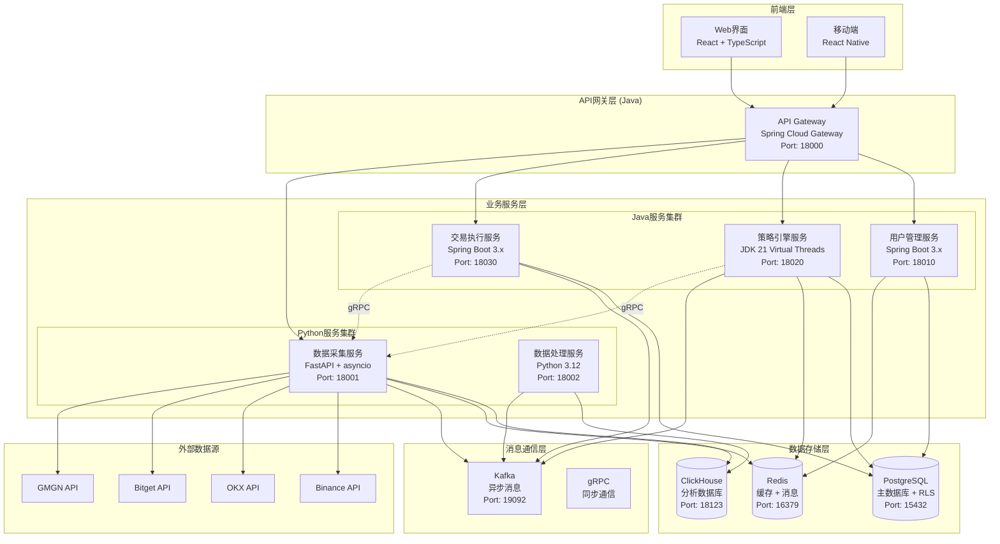

# HermesFlow 系统架构文档

## 1. 系统架构与服务划分

**项目名称**: HermesFlow 量化交易平台  
**版本**: v2.0.0  
**架构类型**: 混合技术栈微服务架构  
**最后更新**: 2024-12-19  

## 项目背景

HermesFlow 是一个个人使用的多租户量化交易平台，专注于成本优化和高性能交易执行。采用混合技术栈架构：Python负责数据采集处理，Java负责用户管理和策略执行，实现各技术栈的最佳适配。

### 核心设计理念
- **技术栈优势互补**: Python专注数据处理，Java专注业务逻辑
- **成本优化**: 轻量级多租户架构，单机支持100+用户
- **高性能**: JDK 21虚拟线程 + Python asyncio双重优化
- **易扩展**: 微服务架构，支持独立扩展和部署

## 系统架构概览

### 混合技术栈架构图



## 核心服务架构

### 1. API网关服务 (Java)

**技术栈**: Spring Cloud Gateway + Spring Security  
**端口**: 18000  
**职责**:
- 统一API入口和路由管理
- 租户识别和JWT Token验证
- 负载均衡和熔断保护
- API版本控制和协议转换

### 2. 用户管理服务 (Java)

**技术栈**: Spring Boot 3.x + Spring Security + JPA  
**端口**: 18010  
**职责**:
- 多租户用户认证和授权
- 权限管理和资源配额控制
- 用户配置和偏好设置
- 审计日志和安全监控

### 3. 策略引擎服务 (Java)

**技术栈**: Spring Boot 3.x + JDK 21 Virtual Threads  
**端口**: 18020  
**职责**:
- 策略开发框架和模板管理
- 策略执行引擎和并发控制
- 策略性能监控和优化
- 回测引擎和历史分析

### 4. 交易执行服务 (Java)

**技术栈**: Spring Boot 3.x + WebFlux  
**端口**: 18030  
**职责**:
- 订单管理和智能路由
- 多交易所API集成
- 风险控制和熔断保护
- 执行报告和性能分析

### 5. 数据采集服务 (Python)

**技术栈**: FastAPI + asyncio + aiohttp  
**端口**: 18001  
**职责**:
- 多交易所实时数据采集
- 数据标准化和质量控制
- 高并发WebSocket连接管理
- 数据分发和缓存

### 6. 数据处理服务 (Python)

**技术栈**: Python 3.12 + Pandas + NumPy  
**端口**: 18002  
**职责**:
- 历史数据处理和分析
- 技术指标计算
- 数据清洗和异常检测
- 报表生成和数据导出

## 多租户架构设计

### 租户隔离策略

**1. 数据库层隔离 (PostgreSQL RLS)**
```sql
-- 启用行级安全
ALTER TABLE users ENABLE ROW LEVEL SECURITY;
ALTER TABLE strategies ENABLE ROW LEVEL SECURITY;
ALTER TABLE orders ENABLE ROW LEVEL SECURITY;

-- 创建租户隔离策略
CREATE POLICY tenant_isolation ON users
    USING (tenant_id = current_setting('app.current_tenant')::uuid);

CREATE POLICY tenant_isolation ON strategies
    USING (tenant_id = current_setting('app.current_tenant')::uuid);
```

**2. 应用层隔离**
- JWT Token包含租户信息
- Spring Security上下文租户绑定
- 服务间调用租户传递

**3. 缓存层隔离**
- Redis Key前缀隔离: `tenant:{tenant_id}:{key}`
- 租户级别的缓存策略和TTL

**4. 消息层隔离**
- Kafka Topic分区按租户路由
- 消息头包含租户标识

### 权限模型

**角色定义**:
```
管理员 (ADMIN)
├── 系统配置管理
├── 用户和租户管理
├── 资源配额分配
└── 系统监控和维护

策略开发者 (DEVELOPER)
├── 策略开发和测试
├── 历史数据回测
├── 策略性能分析
└── 有限的实盘权限

交易员 (TRADER)
├── 策略执行监控
├── 交易记录查看
├── 风险指标监控
└── 基础配置修改

观察者 (VIEWER)
├── 只读访问权限
├── 报表和图表查看
└── 基础数据导出
```

**资源配额管理**:
- CPU时间配额 (基于虚拟线程)
- 内存使用限制
- API调用频率限制
- 存储空间配额

## 2. 技术选型

### Java服务技术栈

**核心框架**:
- JDK 21 (虚拟线程支持)
- Spring Boot 3.x
- Spring Security 6.x
- Spring Data JPA
- Spring Cloud Gateway

**构建工具**:
- Maven 3.9.x
- Docker多阶段构建
- 原生镜像支持 (GraalVM)

**数据访问**:
- PostgreSQL JDBC驱动
- HikariCP连接池
- Redis Lettuce客户端
- Kafka Spring集成

### Python服务技术栈

**核心框架**:
- Python 3.12
- FastAPI (异步Web框架)
- asyncio (异步编程)
- aiohttp (异步HTTP客户端)

**数据处理**:
- Pandas (数据分析)
- NumPy (数值计算)
- ClickHouse驱动
- Redis异步客户端

**依赖管理**:
- Poetry (依赖管理)
- Docker容器化
- 虚拟环境隔离

## 服务间通信

### 1. 同步通信 (gRPC)

**协议定义**:
```protobuf
syntax = "proto3";
package hermesflow.data;

service MarketDataService {
    rpc GetLatestPrice(PriceRequest) returns (PriceResponse);
    rpc GetOrderBook(OrderBookRequest) returns (OrderBookResponse);
    rpc StreamMarketData(StreamRequest) returns (stream MarketDataEvent);
}

message PriceRequest {
    string exchange = 1;
    string symbol = 2;
    string tenant_id = 3;
}
```

### 2. 异步通信 (Kafka)

**Topic设计**:
- `market_data`: 实时行情数据
- `strategy_signals`: 策略信号
- `order_events`: 订单事件
- `system_events`: 系统事件

## 数据架构

### 数据存储分层

**热数据层 (Redis)**:
- 实时行情数据 (TTL: 1小时)
- 用户会话信息 (TTL: 24小时)
- 策略运行状态 (TTL: 7天)
- API调用缓存 (TTL: 5分钟)

**温数据层 (PostgreSQL)**:
- 用户和权限数据
- 策略配置和代码
- 订单和交易记录
- 系统配置和日志

**冷数据层 (ClickHouse)**:
- 历史行情数据 (>30天)
- 策略回测数据
- 系统性能指标
- 审计和合规数据

### 数据模型设计

**用户相关表**:
```sql
-- 租户表
CREATE TABLE tenants (
    id UUID PRIMARY KEY DEFAULT gen_random_uuid(),
    name VARCHAR(100) NOT NULL,
    plan VARCHAR(20) NOT NULL DEFAULT 'BASIC',
    created_at TIMESTAMPTZ DEFAULT NOW(),
    updated_at TIMESTAMPTZ DEFAULT NOW()
);

-- 用户表
CREATE TABLE users (
    id UUID PRIMARY KEY DEFAULT gen_random_uuid(),
    tenant_id UUID NOT NULL REFERENCES tenants(id),
    username VARCHAR(50) UNIQUE NOT NULL,
    email VARCHAR(100) UNIQUE NOT NULL,
    password_hash VARCHAR(255) NOT NULL,
    role VARCHAR(20) NOT NULL DEFAULT 'VIEWER',
    is_active BOOLEAN DEFAULT true,
    created_at TIMESTAMPTZ DEFAULT NOW(),
    updated_at TIMESTAMPTZ DEFAULT NOW()
);

-- 启用RLS
ALTER TABLE users ENABLE ROW LEVEL SECURITY;
CREATE POLICY tenant_isolation ON users
    USING (tenant_id = current_setting('app.current_tenant')::uuid);
```

**策略相关表**:
```sql
-- 策略表
CREATE TABLE strategies (
    id UUID PRIMARY KEY DEFAULT gen_random_uuid(),
    tenant_id UUID NOT NULL REFERENCES tenants(id),
    user_id UUID NOT NULL REFERENCES users(id),
    name VARCHAR(100) NOT NULL,
    description TEXT,
    code TEXT NOT NULL,
    language VARCHAR(20) NOT NULL DEFAULT 'JAVA',
    status VARCHAR(20) NOT NULL DEFAULT 'DRAFT',
    created_at TIMESTAMPTZ DEFAULT NOW(),
    updated_at TIMESTAMPTZ DEFAULT NOW()
);

-- 策略执行记录
CREATE TABLE strategy_executions (
    id UUID PRIMARY KEY DEFAULT gen_random_uuid(),
    tenant_id UUID NOT NULL,
    strategy_id UUID NOT NULL REFERENCES strategies(id),
    status VARCHAR(20) NOT NULL,
    start_time TIMESTAMPTZ NOT NULL,
    end_time TIMESTAMPTZ,
    result JSONB,
    error_message TEXT,
    created_at TIMESTAMPTZ DEFAULT NOW()
);
```

## 3. 环境与部署架构

### Docker容器化部署

**项目结构**:
```
HermesFlow/
├── services/
│   ├── api-gateway/           # Java API网关
│   ├── user-management/       # Java用户管理
│   ├── strategy-engine/       # Java策略引擎
│   ├── execution-engine/      # Java交易执行
│   ├── data-collector/        # Python数据采集
│   └── data-processor/        # Python数据处理
├── shared/
│   ├── proto/                 # gRPC协议定义
│   ├── config/                # 共享配置
│   └── sql/                   # 数据库脚本
├── infrastructure/
│   ├── docker-compose.yml     # 容器编排
│   ├── nginx/                 # 反向代理
│   └── monitoring/            # 监控配置
└── docs/                      # 文档
```

**docker-compose.yml**:
```yaml
version: '3.8'

services:
  # API网关
  api-gateway:
    build: ./services/api-gateway
    ports:
      - "18000:8080"
    environment:
      - SPRING_PROFILES_ACTIVE=docker
      - SPRING_DATASOURCE_URL=jdbc:postgresql://postgres:5432/hermesflow
    depends_on:
      - postgres
      - redis

  # 用户管理服务
  user-management:
    build: ./services/user-management
    ports:
      - "18010:8080"
    environment:
      - SPRING_PROFILES_ACTIVE=docker
    depends_on:
      - postgres
      - redis

  # 策略引擎服务
  strategy-engine:
    build: ./services/strategy-engine
    ports:
      - "18020:8080"
    environment:
      - SPRING_PROFILES_ACTIVE=docker
      - JVM_OPTS=-XX:+UseZGC -XX:+UnlockExperimentalVMOptions
    depends_on:
      - postgres
      - kafka

  # 交易执行服务
  execution-engine:
    build: ./services/execution-engine
    ports:
      - "18030:8080"
    environment:
      - SPRING_PROFILES_ACTIVE=docker
    depends_on:
      - postgres
      - kafka

  # 数据采集服务 (Python)
  data-collector:
    build: ./services/data-collector
    ports:
      - "18001:8000"
    environment:
      - PYTHONPATH=/app
      - REDIS_URL=redis://redis:6379
      - KAFKA_BOOTSTRAP_SERVERS=kafka:9092
    depends_on:
      - redis
      - kafka
      - clickhouse

  # 数据处理服务 (Python)
  data-processor:
    build: ./services/data-processor
    ports:
      - "18002:8000"
    environment:
      - PYTHONPATH=/app
      - CLICKHOUSE_URL=http://clickhouse:8123
    depends_on:
      - clickhouse
      - kafka

  # 数据库服务
  postgres:
    image: postgres:15
    ports:
      - "15432:5432"
    environment:
      - POSTGRES_DB=hermesflow
      - POSTGRES_USER=hermesflow
      - POSTGRES_PASSWORD=hermesflow123
    volumes:
      - postgres_data:/var/lib/postgresql/data

  # 分析数据库
  clickhouse:
    image: clickhouse/clickhouse-server:latest
    ports:
      - "18123:8123"
      - "19000:9000"
    environment:
      - CLICKHOUSE_DB=hermesflow
    volumes:
      - clickhouse_data:/var/lib/clickhouse

  # 缓存服务
  redis:
    image: redis:7-alpine
    ports:
      - "16379:6379"
    volumes:
      - redis_data:/data

  # 消息队列
  kafka:
    image: confluentinc/cp-kafka:latest
    ports:
      - "19092:9092"
    environment:
      - KAFKA_ZOOKEEPER_CONNECT=zookeeper:2181
      - KAFKA_ADVERTISED_LISTENERS=PLAINTEXT://localhost:19092
      - KAFKA_OFFSETS_TOPIC_REPLICATION_FACTOR=1
    depends_on:
      - zookeeper

  zookeeper:
    image: confluentinc/cp-zookeeper:latest
    environment:
      - ZOOKEEPER_CLIENT_PORT=2181

volumes:
  postgres_data:
  clickhouse_data:
  redis_data:
```

### 脚本体系
- 所有自动化部署、编译、打包、上传、启动脚本统一放置于 `scripts/` 目录。
- 脚本支持参数：环境（local/dev/prod）、端（front/back/all）、服务名（web/gateway/api-gateway/all等）。
- Java 服务采用 Spring Boot 多 profile（application-local.yml、application-dev.yml、application-prod.yml）管理环境。
- 前端采用 .env.local、.env.dev、.env.prod 文件管理环境变量。
- Python/其他服务采用 config/env.local.yaml 等方式。

### 数据库DDL管理
- 根目录 `db/` 目录下，按数据库类型和环境分类存放所有DDL。
- 变更需同步更新 `docs/db-changelog.md`。

### 环境变量与新增应用/变量流程
- 所有环境变量在 `docs/env-variables.md` 统一登记。
- 新增应用/变量需同步补充脚本、配置文件和文档。
- 变更需 Pull Request 审核，确保文档与代码同步。

- local环境下，所有基础设施和服务统一通过docker-compose容器化部署，确保开发环境与生产环境一致。
