# CI/CD 流程图与时序图

本文档包含 HermesFlow 项目的 CI/CD 流程的详细可视化图表。

## 1. 整体流程图

### 1.1 完整部署流水线

```mermaid
graph TB
    A[开发者提交代码] --> B{Commit Message<br/>包含 [module:xxx]?}
    B -->|是| C[GitHub Actions 触发]
    B -->|否| Z[跳过构建]
    
    C --> D[解析模块标签]
    D --> E[设置环境变量<br/>dev/main]
    E --> F[构建源代码]
    
    F --> G{模块类型?}
    G -->|Java| H1[Maven 构建]
    G -->|Rust| H2[Cargo 构建]
    G -->|Node.js| H3[npm 构建]
    
    H1 --> I[构建 Docker 镜像]
    H2 --> I
    H3 --> I
    
    I --> J[推送到 Azure Container Registry]
    J --> K[触发 GitOps 仓库更新]
    
    K --> L[GitOps Workflow 执行]
    L --> M[更新 Helm values.yaml]
    M --> N[Git Commit & Push]
    
    N --> O[ArgoCD 检测变化]
    O --> P[ArgoCD 同步]
    P --> Q[Kubernetes 滚动更新]
    
    Q --> R[新 Pod 启动]
    R --> S{健康检查通过?}
    S -->|是| T[旧 Pod 终止]
    S -->|否| U[回滚]
    T --> V[部署完成]
    
    style C fill:#e1f5ff
    style I fill:#fff3cd
    style M fill:#d4edda
    style Q fill:#cce5ff
    style V fill:#d1e7dd
```

### 1.2 分支策略流程

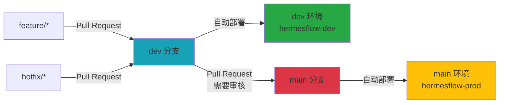

## 2. 时序图

### 2.1 标准部署时序

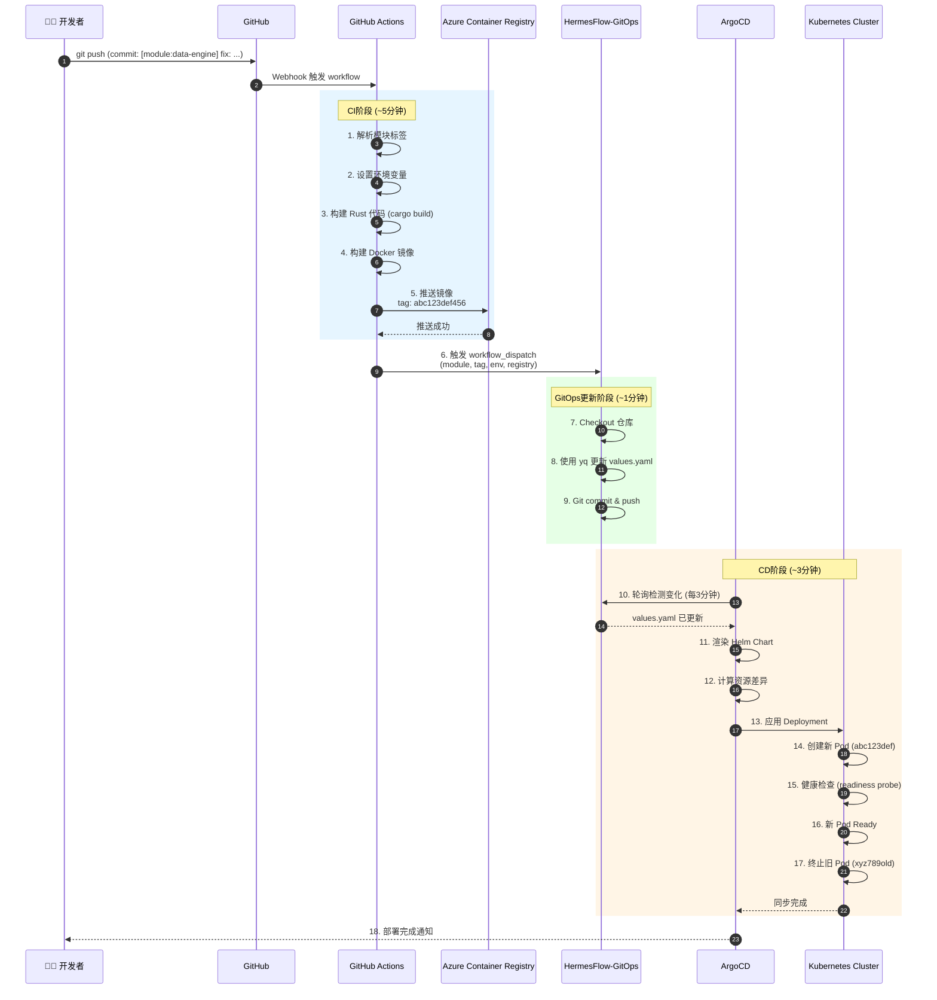

### 2.2 回滚时序

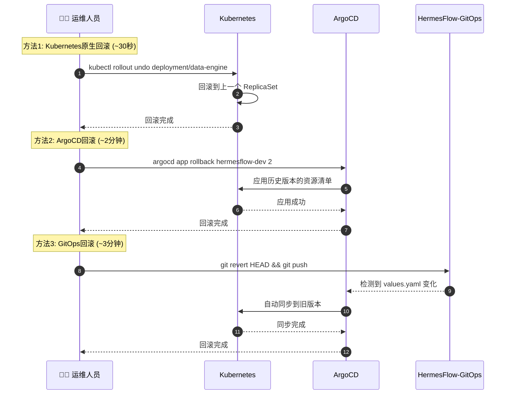

### 2.3 失败处理时序

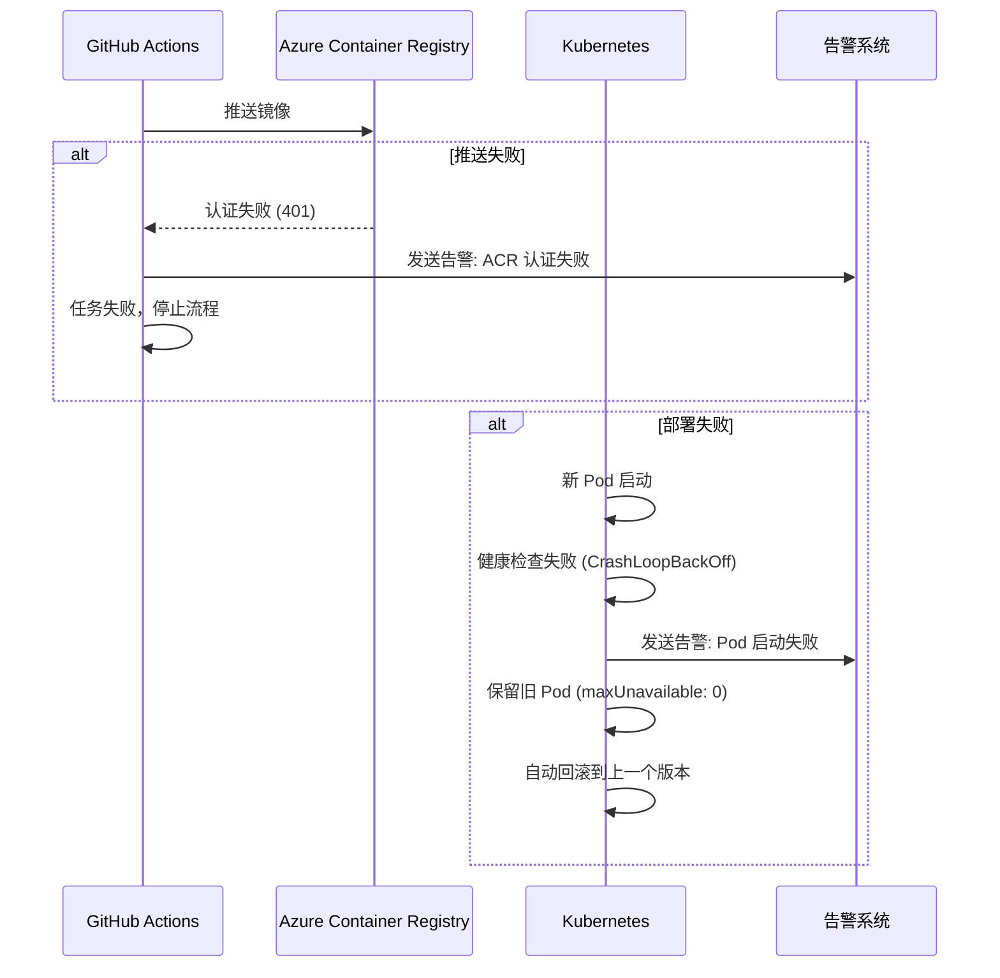

## 3. 组件交互图

### 3.1 CI/CD 系统组件

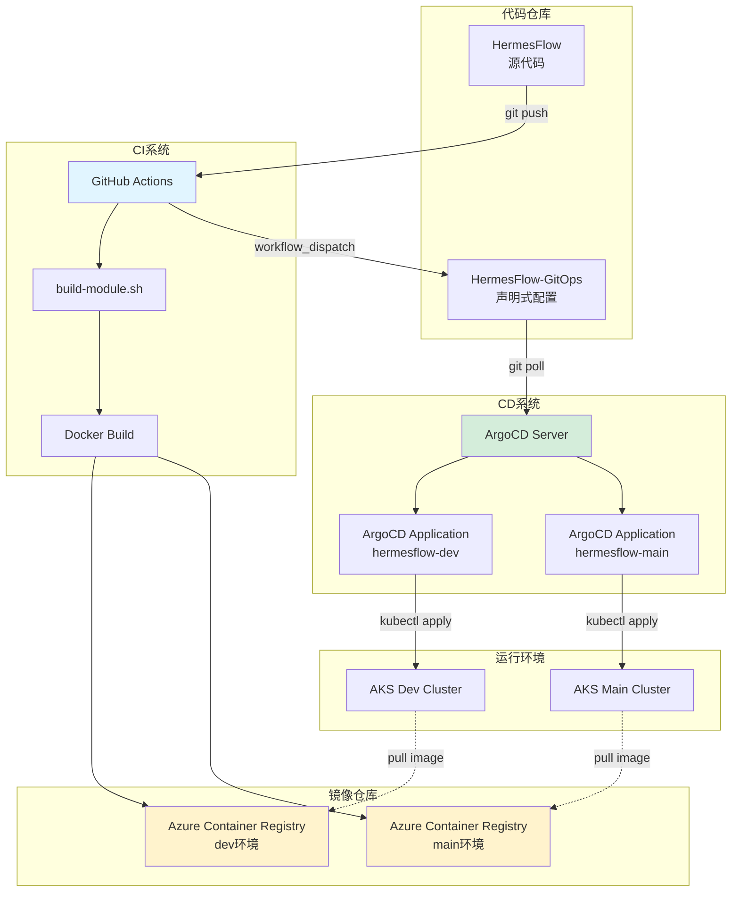

### 3.2 环境隔离架构

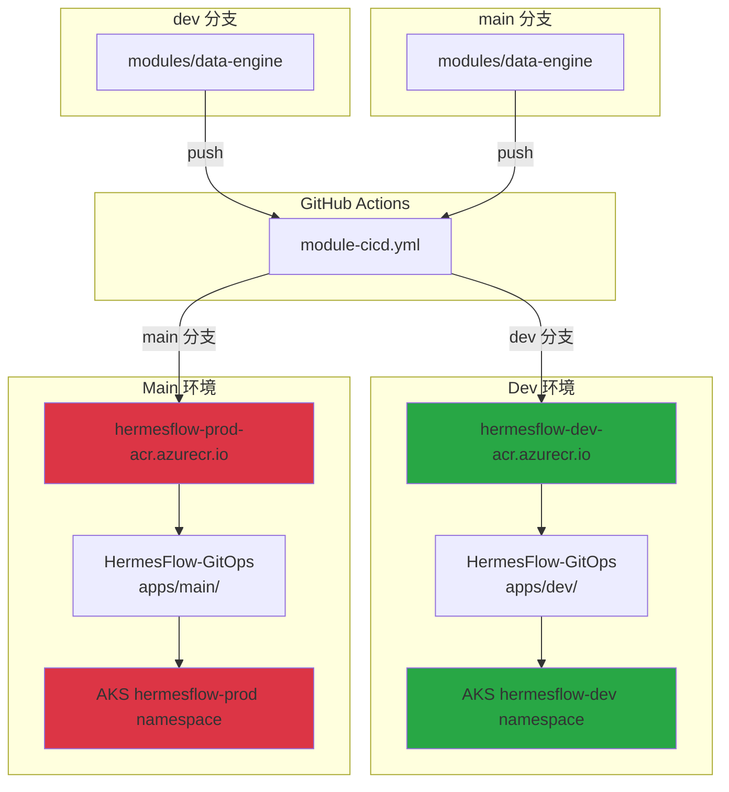

## 4. 数据流图

### 4.1 镜像标签流转

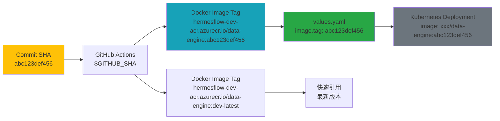

### 4.2 配置传递链

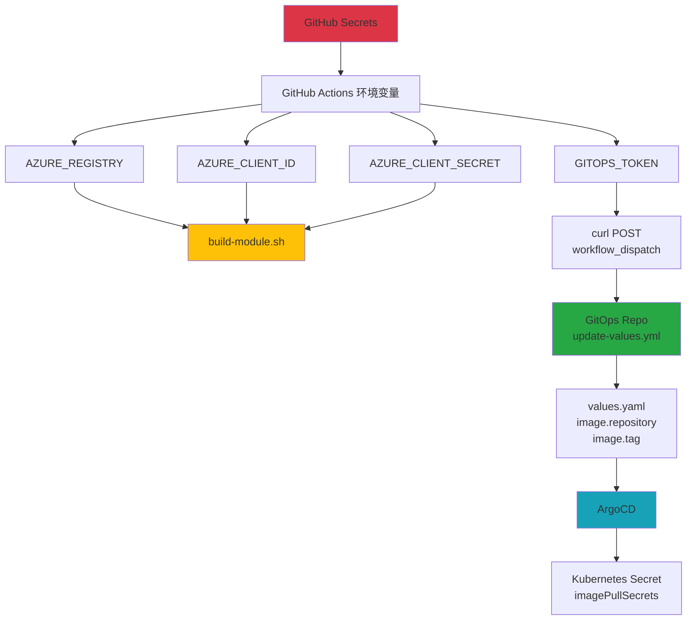

## 5. 状态转换图

### 5.1 部署状态机

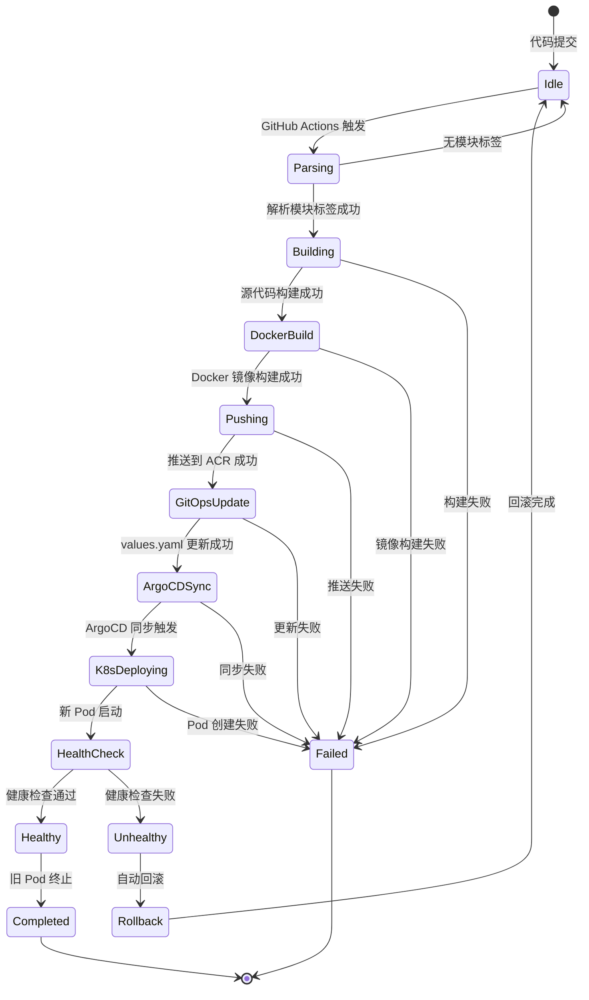

### 5.2 Pod 生命周期

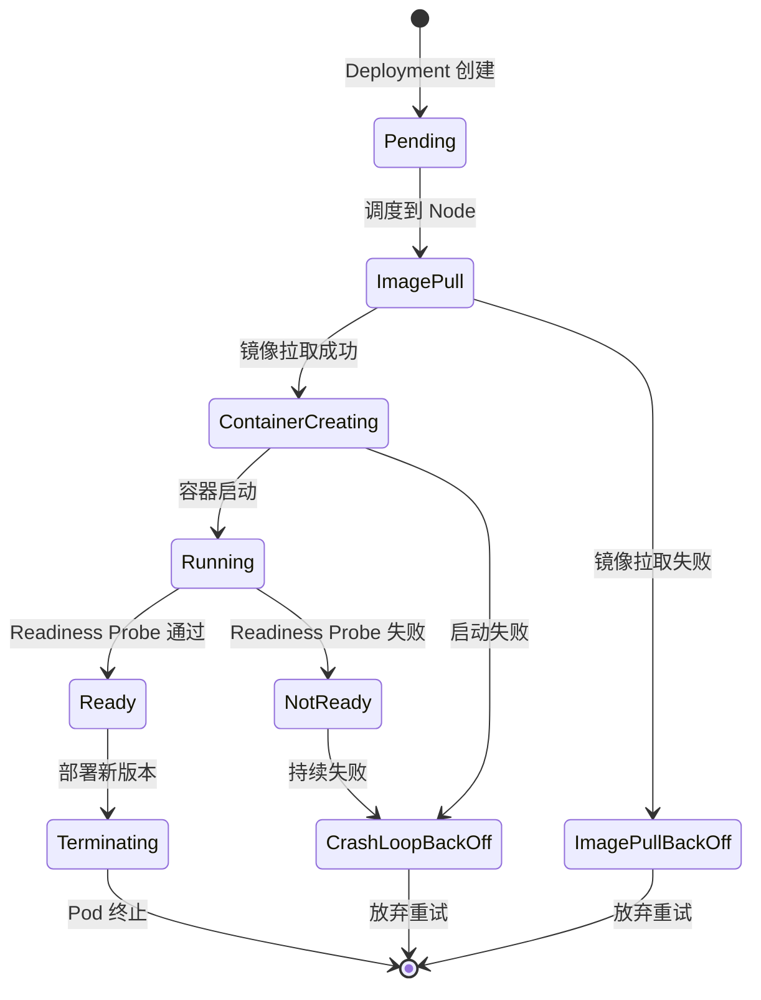

## 6. 网络拓扑

### 6.1 CI/CD 网络架构

```mermaid
graph TB
    subgraph "Internet"
        A[GitHub]
    end
    
    subgraph "Azure Public Services"
        B[Azure Container Registry]
    end
    
    subgraph "AKS Cluster (Private)"
        C[ArgoCD Server]
        D[Data Engine Pods]
        E[Strategy Engine Pods]
    end
    
    subgraph "External Monitoring"
        F[Prometheus]
        G[Grafana]
    end
    
    A -->|HTTPS| B
    A -->|HTTPS| C
    
    C -->|HTTPS| B
    C -->|API| D
    C -->|API| E
    
    D -->|metrics| F
    E -->|metrics| F
    F -->|query| G
    
    style A fill:#24292e
    style B fill:#0078d4
    style C fill:#ef7b4d
    style F fill:#e6522c
    style G fill:#f46800
```

## 7. 时间线图

### 7.1 完整部署时间线（9分钟）

```
0:00 ────────────────────────────────────────────────────────── 开发者 git push
  │
  ├── 0:05  GitHub Actions 触发
  │
  ├── 0:10  解析模块标签 + 设置环境变量
  │
  ├── 0:15  开始构建 Rust 源代码
  │
  ├── 3:45  源代码构建完成
  │
  ├── 3:50  开始构建 Docker 镜像
  │
  ├── 4:30  Docker 镜像构建完成
  │
  ├── 4:35  开始推送到 ACR
  │
  ├── 4:50  推送完成
  │
  ├── 4:55  触发 GitOps workflow
  │
5:00 ────────────────────────────────────────────────────────── GitHub Actions 完成
  │
  ├── 5:05  GitOps workflow 触发
  │
  ├── 5:10  Checkout GitOps 仓库
  │
  ├── 5:15  使用 yq 更新 values.yaml
  │
  ├── 5:20  Git commit & push
  │
6:00 ────────────────────────────────────────────────────────── GitOps 更新完成
  │
  ├── 6:30  ArgoCD 检测到变化（轮询）
  │
  ├── 6:35  渲染 Helm Chart
  │
  ├── 6:40  计算资源差异
  │
  ├── 6:45  应用 Deployment 到 K8s
  │
  ├── 6:50  Kubernetes 创建新 Pod
  │
  ├── 7:10  新 Pod Running
  │
  ├── 7:20  Readiness Probe 开始 (initialDelaySeconds: 10s)
  │
  ├── 7:30  Readiness Probe 通过
  │
  ├── 7:35  新 Pod Ready
  │
  ├── 7:40  开始终止旧 Pod
  │
  ├── 8:00  旧 Pod 优雅关闭完成
  │
  ├── 8:30  ArgoCD 更新同步状态
  │
9:00 ────────────────────────────────────────────────────────── 部署完成 ✅
```

## 8. 容量规划图

### 8.1 并发构建容量

```mermaid
gantt
    title GitHub Actions 并发构建能力
    dateFormat HH:mm
    axisFormat %H:%M
    
    section Runner 1
    data-engine build    :done, r1-1, 10:00, 5m
    frontend build       :done, r1-2, 10:05, 3m
    
    section Runner 2
    strategy-engine build :done, r2-1, 10:00, 4m
    risk-engine build     :done, r2-2, 10:04, 5m
    
    section Runner 3
    trading-engine build  :done, r3-1, 10:00, 5m
    user-management build :done, r3-2, 10:05, 5m
    
    section Queue
    gateway build         :crit, q1, 10:03, 2m
```

---

## 参考资料

- [GitHub Actions 工作流语法](https://docs.github.com/en/actions/using-workflows/workflow-syntax-for-github-actions)
- [ArgoCD 架构文档](https://argo-cd.readthedocs.io/en/stable/operator-manual/architecture/)
- [Kubernetes Deployment 滚动更新策略](https://kubernetes.io/docs/concepts/workloads/controllers/deployment/#rolling-update-deployment)
- [Helm Chart 最佳实践](https://helm.sh/docs/chart_best_practices/)

---

**最后更新**: 2024-12-20  
**维护团队**: HermesFlow Architecture Team

