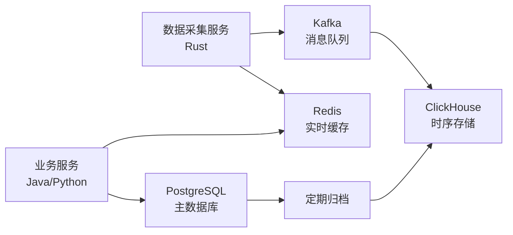

# HermesFlow 数据库设计文档

**版本**: v2.0.0  
**最后更新**: 2024-12-20  
**状态**: 设计中

---

## 目录

1. [数据架构概览](#1-数据架构概览)
2. [数据库选型说明](#2-数据库选型说明)
3. [PostgreSQL设计](#3-postgresql设计)
4. [ClickHouse设计](#4-clickhouse设计)
5. [Redis设计](#5-redis设计)
6. [数据生命周期管理](#6-数据生命周期管理)
7. [备份与恢复策略](#7-备份与恢复策略)

---

## 1. 数据架构概览

### 1.1 三层数据架构

HermesFlow 采用**热-温-冷**三层数据架构，根据数据访问频率和重要性分层存储：

```
┌─────────────────────────────────────────────────────────┐
│                      热数据层 (Redis)                     │
│              实时行情、订单簿、用户会话                    │
│                    TTL: 1小时 - 24小时                    │
│                    访问延迟: < 1ms                        │
└─────────────────────────────────────────────────────────┘
                          ↓ 异步写入
┌─────────────────────────────────────────────────────────┐
│                    温数据层 (PostgreSQL)                  │
│          用户数据、策略配置、订单记录、系统配置            │
│                    保留期: 永久                           │
│                    访问延迟: < 10ms                       │
└─────────────────────────────────────────────────────────┘
                          ↓ 定期归档
┌─────────────────────────────────────────────────────────┐
│                   冷数据层 (ClickHouse)                   │
│         历史行情、回测数据、审计日志、分析指标             │
│                 保留期: 2年（可配置）                      │
│                    访问延迟: < 100ms                      │
└─────────────────────────────────────────────────────────┘
```

### 1.2 数据流向



---

## 2. 数据库选型说明

### 2.1 PostgreSQL - 主数据库

**选型理由**：
1. **ACID保证**：完整的事务支持，确保数据一致性
2. **RLS支持**：行级安全(Row Level Security)，实现多租户隔离
3. **丰富功能**：支持JSON、数组、全文搜索等高级特性
4. **成熟生态**：工具链完善，社区活跃
5. **扩展性**：支持分区表、外键、触发器等

**适用数据**：
- 用户和租户数据
- 策略配置和代码
- 订单和交易记录
- 系统配置和元数据
- 审计日志

**版本**: PostgreSQL 15+

**关键配置**：
```ini
# postgresql.conf
max_connections = 200
shared_buffers = 2GB
effective_cache_size = 6GB
maintenance_work_mem = 512MB
checkpoint_completion_target = 0.9
wal_buffers = 16MB
default_statistics_target = 100
random_page_cost = 1.1  # SSD优化
effective_io_concurrency = 200
work_mem = 10MB
```

### 2.2 ClickHouse - 时序数据库

**选型理由**：
1. **列式存储**：压缩比高（10-30倍），查询快
2. **高性能写入**：支持百万级/秒的写入吞吐
3. **快速聚合**：OLAP场景优化，聚合查询快
4. **时序优化**：天然支持时间分区
5. **SQL支持**：标准SQL语法，易于使用

**适用数据**：
- 实时行情数据（Tick、Trade）
- K线数据（1m, 5m, 1h, 1d）
- 订单簿快照
- 回测结果数据
- 性能指标时序数据

**版本**: ClickHouse 23.x+

**关键配置**：
```xml
<!-- config.xml -->
<clickhouse>
    <max_concurrent_queries>100</max_concurrent_queries>
    <max_memory_usage>10000000000</max_memory_usage>
    <merge_tree>
        <max_suspicious_broken_parts>5</max_suspicious_broken_parts>
    </merge_tree>
    <compression>
        <case>
            <method>zstd</method>
        </case>
    </compression>
</clickhouse>
```

### 2.3 Redis - 缓存与消息

**选型理由**：
1. **极低延迟**：亚毫秒级读写
2. **丰富数据结构**：String、Hash、List、Set、ZSet、Stream
3. **持久化**：AOF + RDB双重保障
4. **发布订阅**：支持消息队列模式
5. **Lua脚本**：支持原子性复合操作

**适用数据**：
- 实时行情缓存
- 订单簿缓存
- 用户会话Token
- 分布式锁
- 限流计数器
- 消息队列（补充Kafka）

**版本**: Redis 7+

**关键配置**：
```ini
# redis.conf
maxmemory 4gb
maxmemory-policy allkeys-lru
appendonly yes
appendfsync everysec
```

---

## 3. PostgreSQL设计

### 3.1 数据库结构

```
hermesflow (Database)
├── public (Schema - 公共数据)
├── tenant_a (Schema - 租户A数据，可选方案)
├── tenant_b (Schema - 租户B数据，可选方案)
```

**租户隔离方案选择**：使用**RLS (行级安全)** 而非多Schema，简化架构。

### 3.2 核心表设计

#### 租户表 (tenants)

```sql
CREATE TABLE tenants (
    id UUID PRIMARY KEY DEFAULT gen_random_uuid(),
    name VARCHAR(100) NOT NULL,
    plan VARCHAR(20) NOT NULL DEFAULT 'BASIC',  -- BASIC, PRO, ENTERPRISE
    status VARCHAR(20) NOT NULL DEFAULT 'ACTIVE',  -- ACTIVE, SUSPENDED, DELETED
    
    -- 资源配额
    quota_cpu_cores INT DEFAULT 2,
    quota_memory_gb INT DEFAULT 4,
    quota_storage_gb INT DEFAULT 100,
    quota_api_calls_per_day INT DEFAULT 100000,
    
    -- 元数据
    metadata JSONB DEFAULT '{}',
    created_at TIMESTAMPTZ DEFAULT NOW(),
    updated_at TIMESTAMPTZ DEFAULT NOW(),
    deleted_at TIMESTAMPTZ,
    
    CONSTRAINT check_plan CHECK (plan IN ('BASIC', 'PRO', 'ENTERPRISE')),
    CONSTRAINT check_status CHECK (status IN ('ACTIVE', 'SUSPENDED', 'DELETED'))
);

CREATE INDEX idx_tenants_status ON tenants(status) WHERE deleted_at IS NULL;
```

#### 用户表 (users)

```sql
CREATE TABLE users (
    id UUID PRIMARY KEY DEFAULT gen_random_uuid(),
    tenant_id UUID NOT NULL REFERENCES tenants(id) ON DELETE CASCADE,
    
    -- 认证信息
    username VARCHAR(50) NOT NULL,
    email VARCHAR(100) NOT NULL,
    password_hash VARCHAR(255) NOT NULL,
    
    -- 用户信息
    full_name VARCHAR(100),
    avatar_url VARCHAR(500),
    language VARCHAR(10) DEFAULT 'en',
    timezone VARCHAR(50) DEFAULT 'UTC',
    
    -- 角色与权限
    role VARCHAR(20) NOT NULL DEFAULT 'VIEWER',  -- ADMIN, DEVELOPER, TRADER, VIEWER
    permissions JSONB DEFAULT '[]',
    
    -- 状态
    is_active BOOLEAN DEFAULT true,
    is_email_verified BOOLEAN DEFAULT false,
    last_login_at TIMESTAMPTZ,
    
    -- 元数据
    metadata JSONB DEFAULT '{}',
    created_at TIMESTAMPTZ DEFAULT NOW(),
    updated_at TIMESTAMPTZ DEFAULT NOW(),
    deleted_at TIMESTAMPTZ,
    
    CONSTRAINT check_role CHECK (role IN ('ADMIN', 'DEVELOPER', 'TRADER', 'VIEWER')),
    UNIQUE(tenant_id, username),
    UNIQUE(tenant_id, email)
);

-- RLS策略
ALTER TABLE users ENABLE ROW LEVEL SECURITY;

CREATE POLICY tenant_isolation ON users
    USING (tenant_id = current_setting('app.current_tenant')::UUID);

-- 索引
CREATE INDEX idx_users_tenant ON users(tenant_id);
CREATE INDEX idx_users_email ON users(email) WHERE deleted_at IS NULL;
CREATE INDEX idx_users_active ON users(is_active, tenant_id);
```

#### 策略表 (strategies)

```sql
CREATE TABLE strategies (
    id UUID PRIMARY KEY DEFAULT gen_random_uuid(),
    tenant_id UUID NOT NULL REFERENCES tenants(id),
    user_id UUID NOT NULL REFERENCES users(id),
    
    -- 基本信息
    name VARCHAR(100) NOT NULL,
    description TEXT,
    language VARCHAR(20) NOT NULL DEFAULT 'PYTHON',  -- PYTHON, JAVA, RUST
    version VARCHAR(20) DEFAULT '1.0.0',
    
    -- 代码
    code TEXT NOT NULL,
    code_checksum VARCHAR(64),  -- SHA256校验和
    
    -- 配置
    parameters JSONB DEFAULT '{}',
    config JSONB DEFAULT '{}',
    
    -- 状态
    status VARCHAR(20) NOT NULL DEFAULT 'DRAFT',  -- DRAFT, TESTING, ACTIVE, PAUSED, ARCHIVED
    
    -- 性能指标（缓存）
    performance_metrics JSONB,
    last_backtest_id UUID,
    
    -- 标签
    tags TEXT[],
    
    -- 元数据
    metadata JSONB DEFAULT '{}',
    created_at TIMESTAMPTZ DEFAULT NOW(),
    updated_at TIMESTAMPTZ DEFAULT NOW(),
    deleted_at TIMESTAMPTZ,
    
    CONSTRAINT check_language CHECK (language IN ('PYTHON', 'JAVA', 'RUST')),
    CONSTRAINT check_status CHECK (status IN ('DRAFT', 'TESTING', 'ACTIVE', 'PAUSED', 'ARCHIVED'))
);

-- RLS策略
ALTER TABLE strategies ENABLE ROW LEVEL SECURITY;

CREATE POLICY tenant_isolation ON strategies
    USING (tenant_id = current_setting('app.current_tenant')::UUID);

-- 索引
CREATE INDEX idx_strategies_tenant_user ON strategies(tenant_id, user_id);
CREATE INDEX idx_strategies_status ON strategies(status, tenant_id);
CREATE INDEX idx_strategies_tags ON strategies USING GIN(tags);
CREATE INDEX idx_strategies_updated ON strategies(updated_at DESC);
```

#### 订单表 (orders)

```sql
CREATE TABLE orders (
    id UUID PRIMARY KEY DEFAULT gen_random_uuid(),
    tenant_id UUID NOT NULL REFERENCES tenants(id),
    user_id UUID NOT NULL REFERENCES users(id),
    strategy_id UUID REFERENCES strategies(id),
    
    -- 交易所信息
    exchange VARCHAR(50) NOT NULL,
    exchange_order_id VARCHAR(100),
    
    -- 订单信息
    symbol VARCHAR(50) NOT NULL,
    side VARCHAR(10) NOT NULL,  -- BUY, SELL
    type VARCHAR(20) NOT NULL,  -- LIMIT, MARKET, STOP_LIMIT
    time_in_force VARCHAR(10) DEFAULT 'GTC',  -- GTC, IOC, FOK
    
    -- 价格与数量
    quantity DECIMAL(20, 8) NOT NULL,
    price DECIMAL(20, 8),
    stop_price DECIMAL(20, 8),
    
    -- 执行信息
    filled_quantity DECIMAL(20, 8) DEFAULT 0,
    avg_fill_price DECIMAL(20, 8),
    commission DECIMAL(20, 8) DEFAULT 0,
    commission_asset VARCHAR(20),
    
    -- 状态
    status VARCHAR(20) NOT NULL DEFAULT 'PENDING',  
    -- PENDING, SUBMITTED, PARTIAL_FILLED, FILLED, CANCELLED, REJECTED, EXPIRED
    
    -- 时间
    submitted_at TIMESTAMPTZ,
    filled_at TIMESTAMPTZ,
    cancelled_at TIMESTAMPTZ,
    
    -- 错误信息
    error_code VARCHAR(50),
    error_message TEXT,
    
    -- 元数据
    metadata JSONB DEFAULT '{}',
    created_at TIMESTAMPTZ DEFAULT NOW(),
    updated_at TIMESTAMPTZ DEFAULT NOW(),
    
    CONSTRAINT check_side CHECK (side IN ('BUY', 'SELL')),
    CONSTRAINT check_type CHECK (type IN ('LIMIT', 'MARKET', 'STOP_LIMIT', 'STOP_MARKET')),
    CONSTRAINT check_status CHECK (status IN (
        'PENDING', 'SUBMITTED', 'PARTIAL_FILLED', 'FILLED', 
        'CANCELLED', 'REJECTED', 'EXPIRED'
    ))
);

-- RLS策略
ALTER TABLE orders ENABLE ROW LEVEL SECURITY;

CREATE POLICY tenant_isolation ON orders
    USING (tenant_id = current_setting('app.current_tenant')::UUID);

-- 索引
CREATE INDEX idx_orders_tenant_user ON orders(tenant_id, user_id);
CREATE INDEX idx_orders_strategy ON orders(strategy_id, created_at DESC);
CREATE INDEX idx_orders_exchange_symbol ON orders(exchange, symbol, created_at DESC);
CREATE INDEX idx_orders_status ON orders(status, tenant_id);
CREATE INDEX idx_orders_created ON orders(created_at DESC);

-- 分区表（按月分区）
-- 创建分区表的示例
CREATE TABLE orders_2024_12 PARTITION OF orders
    FOR VALUES FROM ('2024-12-01') TO ('2025-01-01');
```

#### 持仓表 (positions)

```sql
CREATE TABLE positions (
    id UUID PRIMARY KEY DEFAULT gen_random_uuid(),
    tenant_id UUID NOT NULL REFERENCES tenants(id),
    user_id UUID NOT NULL REFERENCES users(id),
    strategy_id UUID REFERENCES strategies(id),
    
    -- 交易所信息
    exchange VARCHAR(50) NOT NULL,
    symbol VARCHAR(50) NOT NULL,
    
    -- 持仓信息
    side VARCHAR(10) NOT NULL,  -- LONG, SHORT
    quantity DECIMAL(20, 8) NOT NULL,
    available_quantity DECIMAL(20, 8) NOT NULL,
    
    -- 成本
    avg_entry_price DECIMAL(20, 8) NOT NULL,
    total_cost DECIMAL(20, 8) NOT NULL,
    
    -- 当前价值
    current_price DECIMAL(20, 8),
    market_value DECIMAL(20, 8),
    
    -- 盈亏
    unrealized_pnl DECIMAL(20, 8),
    unrealized_pnl_pct DECIMAL(10, 4),
    realized_pnl DECIMAL(20, 8) DEFAULT 0,
    
    -- 时间
    opened_at TIMESTAMPTZ DEFAULT NOW(),
    last_updated_at TIMESTAMPTZ DEFAULT NOW(),
    closed_at TIMESTAMPTZ,
    
    -- 元数据
    metadata JSONB DEFAULT '{}',
    created_at TIMESTAMPTZ DEFAULT NOW(),
    updated_at TIMESTAMPTZ DEFAULT NOW(),
    
    CONSTRAINT check_side CHECK (side IN ('LONG', 'SHORT')),
    CONSTRAINT check_quantity CHECK (quantity >= 0),
    UNIQUE(tenant_id, exchange, symbol, strategy_id) WHERE closed_at IS NULL
);

-- RLS策略
ALTER TABLE positions ENABLE ROW LEVEL SECURITY;

CREATE POLICY tenant_isolation ON positions
    USING (tenant_id = current_setting('app.current_tenant')::UUID);

-- 索引
CREATE INDEX idx_positions_tenant_user ON positions(tenant_id, user_id);
CREATE INDEX idx_positions_strategy ON positions(strategy_id);
CREATE INDEX idx_positions_exchange_symbol ON positions(exchange, symbol);
CREATE INDEX idx_positions_active ON positions(tenant_id) WHERE closed_at IS NULL;
```

#### API密钥表 (api_keys)

```sql
CREATE TABLE api_keys (
    id UUID PRIMARY KEY DEFAULT gen_random_uuid(),
    tenant_id UUID NOT NULL REFERENCES tenants(id),
    user_id UUID NOT NULL REFERENCES users(id),
    
    -- 交易所信息
    exchange VARCHAR(50) NOT NULL,
    
    -- 密钥信息（加密存储）
    api_key_encrypted BYTEA NOT NULL,
    api_secret_encrypted BYTEA NOT NULL,
    passphrase_encrypted BYTEA,  -- OKX需要
    
    -- 加密信息
    encryption_key_id VARCHAR(50) NOT NULL,  -- KMS key ID
    
    -- 权限
    permissions TEXT[] DEFAULT ARRAY['READ']::TEXT[],  -- READ, TRADE, WITHDRAW
    
    -- 状态
    is_active BOOLEAN DEFAULT true,
    last_used_at TIMESTAMPTZ,
    
    -- 元数据
    metadata JSONB DEFAULT '{}',
    created_at TIMESTAMPTZ DEFAULT NOW(),
    updated_at TIMESTAMPTZ DEFAULT NOW(),
    deleted_at TIMESTAMPTZ,
    
    UNIQUE(tenant_id, exchange, user_id) WHERE deleted_at IS NULL
);

-- RLS策略
ALTER TABLE api_keys ENABLE ROW LEVEL SECURITY;

CREATE POLICY tenant_isolation ON api_keys
    USING (tenant_id = current_setting('app.current_tenant')::UUID);

-- 额外的RLS策略：只能访问自己的密钥
CREATE POLICY user_isolation ON api_keys
    USING (user_id = current_setting('app.current_user')::UUID);

-- 索引
CREATE INDEX idx_api_keys_tenant_user ON api_keys(tenant_id, user_id);
CREATE INDEX idx_api_keys_exchange ON api_keys(exchange, is_active);
```

### 3.3 函数与触发器

#### 更新时间戳触发器

```sql
CREATE OR REPLACE FUNCTION update_updated_at_column()
RETURNS TRIGGER AS $$
BEGIN
    NEW.updated_at = NOW();
    RETURN NEW;
END;
$$ LANGUAGE plpgsql;

-- 为所有表添加触发器
CREATE TRIGGER update_tenants_updated_at
    BEFORE UPDATE ON tenants
    FOR EACH ROW EXECUTE FUNCTION update_updated_at_column();

CREATE TRIGGER update_users_updated_at
    BEFORE UPDATE ON users
    FOR EACH ROW EXECUTE FUNCTION update_updated_at_column();

CREATE TRIGGER update_strategies_updated_at
    BEFORE UPDATE ON strategies
    FOR EACH ROW EXECUTE FUNCTION update_updated_at_column();

-- ... 其他表同理
```

#### 设置租户上下文

```sql
CREATE OR REPLACE FUNCTION set_current_tenant(p_tenant_id UUID)
RETURNS VOID AS $$
BEGIN
    PERFORM set_config('app.current_tenant', p_tenant_id::TEXT, false);
END;
$$ LANGUAGE plpgsql;

-- 使用示例
SELECT set_current_tenant('00000000-0000-0000-0000-000000000001');
```

### 3.4 数据库迁移

使用 **Flyway** (Java) 或 **Alembic** (Python) 进行版本化数据库迁移。

```
db/migrations/
├── V001__create_tenants_table.sql
├── V002__create_users_table.sql
├── V003__create_strategies_table.sql
├── V004__create_orders_table.sql
├── V005__enable_rls_policies.sql
└── ...
```

---

## 4. ClickHouse设计

### 4.1 数据库结构

```
hermesflow (Database)
├── market_data (Database)
│   ├── ticks (Table)
│   ├── orderbook_snapshots (Table)
│   ├── kline_1m (Materialized View)
│   ├── kline_5m (Materialized View)
│   └── kline_1h (Materialized View)
├── backtest (Database)
│   ├── backtest_results (Table)
│   └── backtest_trades (Table)
└── analytics (Database)
    ├── strategy_metrics (Table)
    └── system_metrics (Table)
```

### 4.2 市场数据表设计

#### Tick数据表

```sql
CREATE DATABASE IF NOT EXISTS market_data;

CREATE TABLE market_data.ticks (
    timestamp DateTime64(6) CODEC(Delta, ZSTD),
    exchange LowCardinality(String),
    symbol LowCardinality(String),
    
    -- 价格数据
    price Decimal64(8) CODEC(Delta, ZSTD),
    volume Decimal64(8) CODEC(Delta, ZSTD),
    
    bid Nullable(Decimal64(8)) CODEC(Delta, ZSTD),
    ask Nullable(Decimal64(8)) CODEC(Delta, ZSTD),
    
    -- 质量评分
    quality_score UInt8 CODEC(ZSTD),
    
    -- 数据源
    data_source LowCardinality(String),
    
    -- 元数据
    metadata String CODEC(ZSTD)
    
) ENGINE = MergeTree()
PARTITION BY toYYYYMM(timestamp)
ORDER BY (exchange, symbol, timestamp)
TTL timestamp + INTERVAL 90 DAY  -- 90天后自动删除
SETTINGS index_granularity = 8192,
         ttl_only_drop_parts = 1;

-- 跳数索引（加速查询）
ALTER TABLE market_data.ticks 
    ADD INDEX idx_quality minmax(quality_score) TYPE minmax GRANULARITY 4;
```

#### K线物化视图

```sql
-- 1分钟K线
CREATE MATERIALIZED VIEW market_data.kline_1m
ENGINE = AggregatingMergeTree()
PARTITION BY toYYYYMM(timestamp)
ORDER BY (exchange, symbol, timestamp)
TTL timestamp + INTERVAL 180 DAY
AS SELECT
    exchange,
    symbol,
    toStartOfMinute(timestamp) as timestamp,
    argMin(price, timestamp) as open,
    max(price) as high,
    min(price) as low,
    argMax(price, timestamp) as close,
    sum(volume) as volume,
    count() as tick_count,
    avg(quality_score) as avg_quality
FROM market_data.ticks
GROUP BY exchange, symbol, timestamp;

-- 5分钟K线（从1分钟K线聚合）
CREATE MATERIALIZED VIEW market_data.kline_5m
ENGINE = AggregatingMergeTree()
PARTITION BY toYYYYMM(timestamp)
ORDER BY (exchange, symbol, timestamp)
TTL timestamp + INTERVAL 365 DAY
AS SELECT
    exchange,
    symbol,
    toStartOfFiveMinutes(timestamp) as timestamp,
    argMin(open, timestamp) as open,
    max(high) as high,
    min(low) as low,
    argMax(close, timestamp) as close,
    sum(volume) as volume
FROM market_data.kline_1m
GROUP BY exchange, symbol, timestamp;

-- 1小时K线
CREATE MATERIALIZED VIEW market_data.kline_1h
ENGINE = AggregatingMergeTree()
PARTITION BY toYYYYMM(timestamp)
ORDER BY (exchange, symbol, timestamp)
TTL timestamp + INTERVAL 730 DAY  -- 2年
AS SELECT
    exchange,
    symbol,
    toStartOfHour(timestamp) as timestamp,
    argMin(open, timestamp) as open,
    max(high) as high,
    min(low) as low,
    argMax(close, timestamp) as close,
    sum(volume) as volume
FROM market_data.kline_1m
GROUP BY exchange, symbol, timestamp;
```

#### 订单簿快照表

```sql
CREATE TABLE market_data.orderbook_snapshots (
    timestamp DateTime64(6),
    exchange LowCardinality(String),
    symbol LowCardinality(String),
    
    -- 买单（价格降序，最多20档）
    bid_prices Array(Decimal64(8)) CODEC(ZSTD),
    bid_quantities Array(Decimal64(8)) CODEC(ZSTD),
    
    -- 卖单（价格升序，最多20档）
    ask_prices Array(Decimal64(8)) CODEC(ZSTD),
    ask_quantities Array(Decimal64(8)) CODEC(ZSTD),
    
    -- 统计信息
    bid_depth Decimal64(8),  -- 买单总量
    ask_depth Decimal64(8),  -- 卖单总量
    spread Decimal64(8),     -- 买卖价差
    
    data_source LowCardinality(String)
    
) ENGINE = MergeTree()
PARTITION BY toYYYYMM(timestamp)
ORDER BY (exchange, symbol, timestamp)
TTL timestamp + INTERVAL 30 DAY
SETTINGS index_granularity = 8192;
```

### 4.3 回测数据表

```sql
CREATE DATABASE IF NOT EXISTS backtest;

CREATE TABLE backtest.backtest_results (
    id UUID,
    tenant_id UUID,
    strategy_id UUID,
    
    -- 回测参数
    start_time DateTime64(6),
    end_time DateTime64(6),
    initial_capital Decimal64(2),
    parameters String,  -- JSON
    
    -- 回测结果
    final_value Decimal64(2),
    total_return Decimal64(4),
    sharpe_ratio Decimal64(4),
    max_drawdown Decimal64(4),
    win_rate Decimal64(4),
    total_trades UInt32,
    
    -- 时间
    completed_at DateTime64(6),
    created_at DateTime64(6)
    
) ENGINE = MergeTree()
PARTITION BY toYYYYMM(completed_at)
ORDER BY (tenant_id, strategy_id, completed_at)
TTL completed_at + INTERVAL 365 DAY
SETTINGS index_granularity = 8192;
```

### 4.4 查询优化

#### 常用查询示例

```sql
-- 查询最近1小时的BTC价格
SELECT 
    timestamp,
    price,
    volume
FROM market_data.ticks
WHERE exchange = 'binance'
    AND symbol = 'BTCUSDT'
    AND timestamp >= now() - INTERVAL 1 HOUR
ORDER BY timestamp DESC
LIMIT 1000;

-- 查询K线数据（使用物化视图）
SELECT *
FROM market_data.kline_1h
WHERE exchange = 'binance'
    AND symbol = 'BTCUSDT'
    AND timestamp BETWEEN '2024-12-01' AND '2024-12-20'
ORDER BY timestamp;

-- 计算成交量前10的交易对
SELECT 
    symbol,
    sum(volume) as total_volume
FROM market_data.ticks
WHERE exchange = 'binance'
    AND timestamp >= today()
GROUP BY symbol
ORDER BY total_volume DESC
LIMIT 10;
```

---

## 5. Redis设计

### 5.1 Key命名规范

```
{namespace}:{object_type}:{identifier}:{field}

示例：
- market:binance:BTCUSDT:latest       # 最新行情
- orderbook:binance:BTCUSDT:bids      # 订单簿买单
- session:user:abc-123                # 用户会话
- ratelimit:api:user:xyz-789          # 限流计数
```

### 5.2 数据结构设计

#### 实时行情缓存（Hash）

```redis
# Key: market:{exchange}:{symbol}:latest
HSET market:binance:BTCUSDT:latest 
    bid 46000.00 
    ask 46001.50 
    last 46000.75 
    volume 12345.67 
    timestamp 1703001600000000

EXPIRE market:binance:BTCUSDT:latest 3600  # 1小时过期
```

#### 订单簿缓存（ZSet）

```redis
# Key: orderbook:{exchange}:{symbol}:bids
# Score: -price (负数用于降序排列)
# Member: quantity

ZADD orderbook:binance:BTCUSDT:bids -46000.00 "1.5"
ZADD orderbook:binance:BTCUSDT:bids -45999.00 "2.0"

# Key: orderbook:{exchange}:{symbol}:asks
# Score: price
ZADD orderbook:binance:BTCUSDT:asks 46001.00 "1.2"
ZADD orderbook:binance:BTCUSDT:asks 46002.00 "1.8"

EXPIRE orderbook:binance:BTCUSDT:bids 300  # 5分钟过期
EXPIRE orderbook:binance:BTCUSDT:asks 300
```

#### 用户会话（String）

```redis
# Key: session:user:{user_id}
# Value: JWT Token

SET session:user:abc-123 "eyJhbGciOiJIUzI1NiIsInR5cCI6IkpXVCJ9..."
EXPIRE session:user:abc-123 86400  # 24小时过期
```

#### 限流计数器（String + INCR）

```redis
# Key: ratelimit:api:user:{user_id}:{window}
# Value: 计数

INCR ratelimit:api:user:xyz-789:20241220103000
EXPIRE ratelimit:api:user:xyz-789:20241220103000 60  # 1分钟窗口

# Lua脚本实现原子性限流检查
local key = KEYS[1]
local limit = tonumber(ARGV[1])
local current = redis.call('INCR', key)
if current == 1 then
    redis.call('EXPIRE', key, 60)
end
if current > limit then
    return 0  -- 超过限流
else
    return 1  -- 允许请求
end
```

#### 分布式锁（String + NX + PX）

```redis
# 获取锁
SET lock:strategy:abc-123 "worker-1" NX PX 30000

# 释放锁（使用Lua脚本保证原子性）
if redis.call("GET", KEYS[1]) == ARGV[1] then
    return redis.call("DEL", KEYS[1])
else
    return 0
end
```

### 5.3 缓存策略

#### Cache-Aside模式

```python
async def get_market_data(exchange: str, symbol: str):
    # 1. 尝试从Redis获取
    key = f"market:{exchange}:{symbol}:latest"
    cached = await redis.hgetall(key)
    
    if cached:
        return MarketData.from_dict(cached)
    
    # 2. 缓存未命中，从数据库查询
    data = await db.query_latest_market_data(exchange, symbol)
    
    # 3. 写入缓存
    await redis.hset(key, mapping=data.to_dict())
    await redis.expire(key, 3600)
    
    return data
```

### 5.4 Redis集群配置

```ini
# redis-cluster.conf
cluster-enabled yes
cluster-config-file nodes.conf
cluster-node-timeout 5000
cluster-replica-validity-factor 10
cluster-migration-barrier 1
cluster-require-full-coverage yes
```

---

## 6. 数据生命周期管理

### 6.1 数据分层策略

| 数据类型 | 热数据(Redis) | 温数据(PostgreSQL) | 冷数据(ClickHouse) |
|---------|--------------|-------------------|-------------------|
| 实时行情 | 1小时 | - | 90天 |
| 订单簿 | 5分钟 | - | 30天 |
| 订单记录 | - | 永久 | 2年（归档） |
| 策略配置 | - | 永久 | - |
| 回测结果 | - | - | 1年 |
| 审计日志 | - | 90天 | 2年 |

### 6.2 数据归档流程

```sql
-- PostgreSQL归档到ClickHouse
INSERT INTO clickhouse.orders_archive
SELECT * FROM postgresql.orders
WHERE created_at < NOW() - INTERVAL '2 years';

DELETE FROM postgresql.orders
WHERE created_at < NOW() - INTERVAL '2 years';
```

### 6.3 自动清理任务

```python
# Celery定时任务
@app.task
def cleanup_old_data():
    # 清理Redis过期key
    redis.scan_iter("market:*", count=1000)
    
    # 删除ClickHouse过期分区
    clickhouse.execute("""
        ALTER TABLE market_data.ticks 
        DROP PARTITION '202410'
        WHERE toYYYYMM(timestamp) < toYYYYMM(now() - INTERVAL 90 DAY)
    """)
```

---

## 7. 备份与恢复策略

### 7.1 PostgreSQL备份

**备份策略**：
- **全量备份**：每周日凌晨2点
- **增量备份**：每天凌晨2点
- **WAL归档**：实时
- **保留期**：30天

```bash
# 使用pg_basebackup进行全量备份
pg_basebackup -h localhost -U postgres -D /backup/full_$(date +%Y%m%d) -Fp -Xs -P

# 使用pg_dump备份特定数据库
pg_dump -h localhost -U postgres hermesflow > hermesflow_$(date +%Y%m%d).sql

# WAL归档配置
# postgresql.conf
archive_mode = on
archive_command = 'cp %p /archive/%f'
```

**恢复流程**：
```bash
# 恢复全量备份
pg_basebackup -D /var/lib/postgresql/data

# 应用WAL日志
pg_waldump /archive/

# 启动数据库
pg_ctl start
```

### 7.2 ClickHouse备份

```bash
# 冻结分区（创建硬链接）
clickhouse-client --query "ALTER TABLE market_data.ticks FREEZE PARTITION '202412'"

# 备份frozen目录
tar -czf clickhouse_backup_$(date +%Y%m%d).tar.gz /var/lib/clickhouse/shadow/

# 恢复
tar -xzf clickhouse_backup_20241220.tar.gz -C /var/lib/clickhouse/shadow/
clickhouse-client --query "ALTER TABLE market_data.ticks ATTACH PARTITION '202412' FROM '/var/lib/clickhouse/shadow/1/'"
```

### 7.3 Redis备份

```bash
# RDB快照（自动）
save 900 1
save 300 10
save 60 10000

# AOF持久化（自动）
appendonly yes
appendfsync everysec

# 手动备份
redis-cli BGSAVE
cp /var/lib/redis/dump.rdb /backup/redis_$(date +%Y%m%d).rdb

# 恢复
cp /backup/redis_20241220.rdb /var/lib/redis/dump.rdb
redis-server
```

---

## 附录

### A. 数据库性能调优

#### PostgreSQL调优

1. **连接池配置**：使用PgBouncer或HikariCP
2. **索引优化**：定期ANALYZE和VACUUM
3. **分区表**：大表按时间分区
4. **查询优化**：使用EXPLAIN ANALYZE分析

#### ClickHouse调优

1. **批量写入**：每批至少1000行
2. **分区策略**：按月分区
3. **压缩算法**：使用ZSTD
4. **物化视图**：预聚合常用查询

#### Redis调优

1. **内存策略**：allkeys-lru
2. **持久化**：AOF + RDB
3. **连接池**：复用连接
4. **Pipeline**：批量操作

### B. 监控指标

**PostgreSQL**：
- 连接数
- QPS/TPS
- 慢查询
- 缓存命中率
- 复制延迟

**ClickHouse**：
- 查询延迟
- 插入速度
- 磁盘使用
- 压缩比

**Redis**：
- 内存使用
- 命中率
- 延迟
- 慢查询

---

**文档维护者**: Database Team  
**最后更新**: 2024-12-20  
**下次审阅**: 2025-01-20

