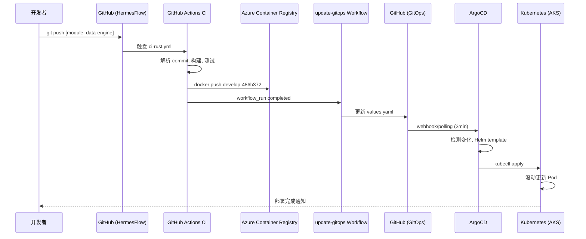

# HermesFlow CI/CD Workflow

**版本**: v1.0.0  
**最后更新**: 2025-10-21  
**维护者**: DevOps Team

本文档详细描述 HermesFlow 的完整 CI/CD 流程，包括触发机制、构建流程、GitOps 更新和自动部署。

---

## 📋 目录

- [架构概览](#架构概览)
- [触发机制](#触发机制)
- [CI Workflows](#ci-workflows)
- [GitOps 更新流程](#gitops-更新流程)
- [ArgoCD 自动同步](#argocd-自动同步)
- [环境映射](#环境映射)
- [镜像标签规则](#镜像标签规则)
- [完整流程示例](#完整流程示例)

---

## 架构概览

HermesFlow 采用 **GitOps** 工作流，通过 **ArgoCD** 实现声明式的应用部署和管理。

### 核心组件

```
┌─────────────────┐
│  开发者          │
│  git push        │
└────────┬────────┘
         │
         ▼
┌─────────────────────────────────────────────────────────┐
│  GitHub Actions - CI Workflows                          │
│  ┌──────────────┬──────────────┬──────────────┬───────┐│
│  │ ci-rust.yml  │ ci-java.yml  │ ci-python.yml│ ci-   ││
│  │              │              │              │frontend││
│  └──────────────┴──────────────┴──────────────┴───────┘│
│  - 解析 commit message                                  │
│  - 运行测试和代码质量检查                                │
│  - 构建 Docker 镜像                                      │
│  - 推送到 Azure Container Registry                      │
│  - 上传构建信息 artifact                                 │
└────────┬────────────────────────────────────────────────┘
         │
         ▼
┌─────────────────────────────────────────────────────────┐
│  GitHub Actions - update-gitops.yml                     │
│  - 下载 CI artifacts                                     │
│  - 确定目标环境 (develop→dev, main→main)                │
│  - 更新 GitOps 仓库的 values.yaml                        │
│  - Commit & Push 到 HermesFlow-GitOps/main             │
└────────┬────────────────────────────────────────────────┘
         │
         ▼
┌─────────────────────────────────────────────────────────┐
│  ArgoCD (运行在 Dev AKS)                                │
│  - 每 3 分钟轮询 GitOps 仓库                             │
│  - 检测配置变化                                          │
│  - 自动同步 (auto-sync enabled)                         │
│  - Helm template 渲染                                    │
│  - 应用到 Kubernetes                                     │
└────────┬────────────────────────────────────────────────┘
         │
         ▼
┌─────────────────────────────────────────────────────────┐
│  Azure Kubernetes Service (AKS)                         │
│  - 创建/更新 Deployment                                  │
│  - 滚动更新 Pod                                          │
│  - 健康检查                                              │
│  - 服务就绪                                              │
└─────────────────────────────────────────────────────────┘
```

### 仓库分离

| 仓库 | 用途 | 内容 |
|------|------|------|
| **HermesFlow** | 应用代码 | 源代码、Dockerfile、GitHub Actions CI workflows |
| **HermesFlow-GitOps** | 配置管理 | Helm Charts、values.yaml、ArgoCD Applications |

---

## 触发机制

CI/CD 流程通过 **commit message** 中的特殊标记触发特定模块的构建。

### Commit Message 格式

```bash
[module: <module-name>] <commit message>
```

### 支持的模块

| 模块名称 | 语言 | CI Workflow | 说明 |
|---------|------|-------------|------|
| `data-engine` | Rust | `ci-rust.yml` | 数据引擎 |
| `gateway` | Rust | `ci-rust.yml` | 网关服务 |
| `user-management` | Java | `ci-java.yml` | 用户管理 |
| `api-gateway` | Java | `ci-java.yml` | API网关 |
| `trading-engine` | Java | `ci-java.yml` | 交易引擎 |
| `strategy-engine` | Python | `ci-python.yml` | 策略引擎 |
| `backtest-engine` | Python | `ci-python.yml` | 回测引擎 |
| `risk-engine` | Python | `ci-python.yml` | 风控引擎 |
| `frontend` | React/TS | `ci-frontend.yml` | 前端应用 |

### 触发示例

```bash
# 单个模块
git commit -m "[module: data-engine] 添加行情数据缓存"
git push origin develop

# 多个模块（暂不支持，需要分别提交）
git commit -m "[module: data-engine] 更新"
git push origin develop
git commit -m "[module: user-management] 更新"
git push origin develop
```

### 不触发CI的情况

如果 commit message 不包含 `[module: xxx]`，则不会触发任何模块的构建：

```bash
# 以下提交不会触发CI
git commit -m "更新文档"
git commit -m "修复拼写错误"
git commit -m "chore: 更新依赖"
```

---

## CI Workflows

每种技术栈都有专门的 CI workflow，位于 `.github/workflows/` 目录。

### 1. Rust 服务 (`ci-rust.yml`)

**处理模块**: `data-engine`, `gateway`

**流程步骤**:

```yaml
jobs:
  parse-commit:
    # 1. 解析 commit message
    - 提取 [module: xxx]
    - 设置 build flags

  build-rust:
    # 2. 构建和测试
    - Setup Rust toolchain (1.75)
    - 缓存 cargo registry/index/build
    - cargo fmt --check
    - cargo clippy
    - cargo test
    - cargo build --release
    
    # 3. Docker 构建和推送 (仅 main/develop)
    - 生成镜像标签: {branch}-{short_sha}
    - 登录 Azure Container Registry
    - docker build & push
    - 上传 built modules artifact
    
    # 4. 安全扫描 (仅 main)
    - Trivy 漏洞扫描
    - 上传到 GitHub Security
```

**环境变量** (从 GitHub Environments 读取):
- `ACR_LOGIN_SERVER`: ACR 登录服务器
- `ACR_USERNAME`: Service Principal ID
- `ACR_PASSWORD`: Service Principal Password

### 2. Java 服务 (`ci-java.yml`)

**处理模块**: `user-management`, `api-gateway`, `trading-engine`

**流程步骤**:

```yaml
jobs:
  parse-commit:
    # 解析模块

  build-java:
    # 1. 构建和测试
    - Setup JDK 21
    - 缓存 Maven packages
    - mvn clean compile
    - mvn checkstyle:check (跳过)
    - mvn spotbugs:check (跳过)
    - mvn test
    - mvn jacoco:report (覆盖率)
    - mvn package -DskipTests
    
    # 2. Docker 构建和推送
    # 3. 安全扫描
```

**关键配置**:
- JDK: Eclipse Temurin 21
- Maven: 3.9
- Dockerfile: 多阶段构建，使用 `maven:3.9-eclipse-temurin-21`

### 3. Python 服务 (`ci-python.yml`)

**处理模块**: `strategy-engine`, `backtest-engine`, `risk-engine`

**流程步骤**:

```yaml
jobs:
  parse-commit:
    # 解析模块

  build-python:
    # 1. 构建和测试
    - Setup Python 3.12
    - 缓存 pip packages
    - pip install requirements.txt
    - flake8 代码检查
    - pylint (警告不中断)
    - pytest --cov 测试和覆盖率
    - 检查覆盖率阈值 (75%)
    
    # 2. Docker 构建和推送
    # 3. 安全扫描
```

### 4. Frontend (`ci-frontend.yml`)

**处理模块**: `frontend`

**流程步骤**:

```yaml
jobs:
  parse-commit:
    # 解析模块

  build-frontend:
    # 1. 构建和测试
    - Setup Node.js 20
    - npm install --legacy-peer-deps
    - npm run lint (警告不中断)
    - npm run format:check (警告不中断)
    - npm run type-check
    - npm test -- --coverage
    - npm run build (生产构建)
    
    # 2. Docker 构建和推送
    # 3. 安全扫描
```

**特殊配置**:
- 使用 `--legacy-peer-deps` 解决依赖冲突
- 设置 `SKIP_PREFLIGHT_CHECK=true`

---

## GitOps 更新流程

CI 成功后，`update-gitops.yml` workflow 自动更新 GitOps 仓库。

### Workflow 触发条件

```yaml
on:
  workflow_run:
    workflows: 
      - "CI - Rust Services"
      - "CI - Java Services"
      - "CI - Python Services"
      - "CI - Frontend"
    types: [completed]
    branches: [main, develop]
```

只有在 CI workflow **成功完成**后才会触发。

### 更新流程

```yaml
jobs:
  update-gitops:
    steps:
      # 1. 下载 CI artifacts
      - 从 CI workflow 下载 built-modules 信息
      
      # 2. 确定目标环境和模块
      - 解析分支: develop → dev, main → main
      - 读取 artifacts 获取构建的模块列表
      
      # 3. Checkout GitOps 仓库
      - 使用 GITOPS_PAT 克隆仓库
      - Pull 最新变更（带重试）
      
      # 4. 更新镜像标签
      - 安装 yq (YAML 处理工具)
      - 更新 apps/${env}/${module}/values.yaml
      - 生成新标签: {branch}-{short_sha}
      
      # 5. Commit 并推送
      - git commit -m "chore(${env}): update ${module} to ${tag}"
      - git push origin main (带重试，最多5次)
```

### 更新的文件

```bash
# 示例: develop 分支构建 data-engine
HermesFlow-GitOps/
└── apps/
    └── dev/
        └── data-engine/
            └── values.yaml  # 更新 image.tag
```

**values.yaml 更新示例**:

```yaml
hermesflow-microservice:
  image:
    repository: hermesflowdevacr.azurecr.io/data-engine
    tag: "develop-486b372"  # ← 自动更新
```

### 重试机制

- **Git Pull**: 最多重试 5 次，每次间隔 10 秒
- **Git Push**: 最多重试 5 次，每次间隔 10 秒
- 避免网络问题导致的更新失败

---

## ArgoCD 自动同步

ArgoCD 监控 GitOps 仓库，自动将变更同步到 Kubernetes 集群。

### ArgoCD 配置

**位置**: `HermesFlow-GitOps/apps/dev/argocd-applications.yaml`

```yaml
apiVersion: argoproj.io/v1alpha1
kind: Application
metadata:
  name: data-engine-dev
  namespace: argocd
spec:
  project: hermesflow
  source:
    repoURL: https://github.com/TomXiaoYZ/HermesFlow-GitOps
    targetRevision: main
    path: apps/dev/data-engine
  destination:
    server: https://kubernetes.default.svc
    namespace: hermesflow-dev
  syncPolicy:
    automated:
      prune: true          # 自动删除不需要的资源
      selfHeal: true       # 自动修复漂移
    syncOptions:
      - CreateNamespace=true
  revisionHistoryLimit: 5
```

### 关键特性

| 特性 | 说明 |
|------|------|
| **Auto-Sync** | 检测到变更后自动同步，无需手动操作 |
| **Self-Heal** | 如果有人手动修改 K8s 资源，ArgoCD 会自动恢复到 Git 状态 |
| **Prune** | 从 Git 删除的资源会自动从集群删除 |
| **Rollback** | 保留最近 5 个版本的历史，支持快速回滚 |

### 同步频率

- **轮询间隔**: 3 分钟
- **Webhook**: 支持 GitHub Webhook 实时触发（可选）

### 同步状态

```bash
# 查看应用状态
kubectl get application data-engine-dev -n argocd

# 输出示例
NAME              SYNC STATUS   HEALTH STATUS
data-engine-dev   Synced        Healthy
```

**状态说明**:
- `Synced`: Git 状态与集群状态一致
- `OutOfSync`: Git 有新变更，等待同步
- `Unknown`: 无法确定状态（通常是错误）

- `Healthy`: 所有资源运行正常
- `Progressing`: 部署进行中
- `Degraded`: 部分资源异常
- `Missing`: 资源缺失

---

## 环境映射

HermesFlow 支持两个环境：Dev 和 Prod（Main）。

### 分支到环境的映射

| Git 分支 | 目标环境 | GitOps 路径 | Kubernetes Namespace |
|---------|---------|------------|---------------------|
| `develop` | Dev | `apps/dev/` | `hermesflow-dev` |
| `main` | Prod | `apps/main/` | `hermesflow-main` |

### 环境配置差异

**Dev 环境**:
- ACR: `hermesflowdevacr.azurecr.io`
- 资源限制: 较低（单副本）
- 自动同步: 启用
- 日志级别: `debug`

**Prod 环境**:
- ACR: `hermesflowprodacr.azurecr.io`
- 资源限制: 较高（多副本）
- 自动同步: 可选择关闭（手动同步）
- 日志级别: `info`

### 环境隔离

- **网络隔离**: 不同 namespace
- **密钥隔离**: 不同 Kubernetes Secrets
- **资源隔离**: 独立的 Resource Quota
- **监控隔离**: 独立的 Grafana Dashboard

---

## 镜像标签规则

镜像标签格式: `{branch}-{short_sha}`

### 标签生成逻辑

```bash
# CI Workflow 中的标签生成
BRANCH_NAME=$(echo ${{ github.ref }} | sed 's/refs\/heads\///' | sed 's/\//-/g')
SHORT_SHA=$(echo ${{ github.sha }} | cut -c1-7)
IMAGE_TAG="${BRANCH_NAME}-${SHORT_SHA}"
```

### 标签示例

| 分支 | Commit SHA | 生成的标签 |
|------|-----------|----------|
| `develop` | `486b3729abc...` | `develop-486b372` |
| `main` | `a1b2c3d4e5f...` | `main-a1b2c3d` |
| `feature/new-api` | `1234567890a...` | `feature-new-api-1234567` |

### 特殊标签

- `latest`: 总是指向最新构建（同时推送）
- 用于本地开发和调试

---

## 完整流程示例

### 场景: 更新 data-engine 并部署到 Dev

**步骤 1: 开发和提交**

```bash
# 1. 切换到 develop 分支
git checkout develop
git pull origin develop

# 2. 修改代码
cd modules/data-engine
# ... 修改代码 ...

# 3. 本地测试
cargo test
cargo build --release

# 4. 提交并推送
git add .
git commit -m "[module: data-engine] 优化行情数据解析性能"
git push origin develop
```

**步骤 2: CI 构建 (3-4 分钟)**

```
1. GitHub Actions 触发 ci-rust.yml
   └─ parse-commit: 检测到 "data-engine"
   
2. build-rust job 执行
   ├─ 运行测试: cargo test ✅
   ├─ 代码检查: clippy ✅
   ├─ 构建发布版: cargo build --release ✅
   └─ Docker 构建和推送
      └─ 推送: hermesflowdevacr.azurecr.io/data-engine:develop-486b372

3. 上传 artifact: data-engine
```

**步骤 3: GitOps 更新 (10-30 秒)**

```
1. update-gitops.yml workflow 触发
   
2. 更新步骤
   ├─ 下载 CI artifacts
   ├─ 确定环境: develop → dev
   ├─ Checkout HermesFlow-GitOps
   ├─ 更新 apps/dev/data-engine/values.yaml
   │  └─ image.tag: "develop-486b372"
   ├─ Git commit
   │  └─ "chore(dev): update data-engine to develop-486b372"
   └─ Git push (带重试)
```

**步骤 4: ArgoCD 同步 (1-3 分钟)**

```
1. ArgoCD 检测到 GitOps 仓库变化
   └─ 新 commit: chore(dev): update data-engine to develop-486b372

2. 自动触发同步
   ├─ Helm template 渲染
   ├─ 生成 Kubernetes manifests
   └─ 应用到 hermesflow-dev namespace

3. Kubernetes 滚动更新
   ├─ 创建新 ReplicaSet
   ├─ 启动新 Pod (develop-486b372)
   ├─ 健康检查通过
   └─ 终止旧 Pod
```

**步骤 5: 验证部署 (30 秒)**

```bash
# 检查 ArgoCD 应用状态
kubectl get application data-engine-dev -n argocd
# 输出: Synced / Healthy

# 检查 Pod
kubectl get pods -n hermesflow-dev -l app.kubernetes.io/name=data-engine
# 输出: data-engine-dev-xxx-xxx  1/1  Running

# 检查镜像标签
kubectl get deployment data-engine-dev-hermesflow-microservice -n hermesflow-dev \
  -o jsonpath='{.spec.template.spec.containers[0].image}'
# 输出: hermesflowdevacr.azurecr.io/data-engine:develop-486b372
```

**总耗时**: 约 4-5 分钟

---

## 流程图

### 高层流程

```
Developer
    │
    │ git commit -m "[module: xxx]"
    │ git push origin develop
    │
    ▼
GitHub (HermesFlow Repo)
    │
    │ 触发 CI Workflow
    │
    ▼
CI - Build & Test (3-4 min)
    │
    │ 构建成功
    │
    ▼
CI - Docker Push
    │
    │ 推送到 ACR
    │
    ▼
update-gitops Workflow (30 sec)
    │
    │ 更新 values.yaml
    │
    ▼
GitHub (HermesFlow-GitOps Repo)
    │
    │ 新 commit
    │
    ▼
ArgoCD 检测变化 (1-3 min)
    │
    │ 自动同步
    │
    ▼
Kubernetes (AKS)
    │
    │ 滚动更新 Pod
    │
    ▼
✅ 部署完成
```

### 详细交互流程



---

## 最佳实践

### Commit Message

1. **总是包含模块名**: 确保 CI 能正确识别
   ```bash
   ✅ git commit -m "[module: data-engine] 修复内存泄漏"
   ❌ git commit -m "修复内存泄漏"
   ```

2. **一次提交一个模块**: 避免同时修改多个模块
   ```bash
   ✅ git commit -m "[module: data-engine] 更新"
      git push
      git commit -m "[module: user-management] 更新"
      git push
   
   ❌ git commit -m "[module: data-engine] [module: user-management] 更新"
   ```

3. **遵循 Conventional Commits** (可选):
   ```bash
   [module: data-engine] feat: 添加 Kafka 消费者
   [module: user-management] fix: 修复登录失败问题
   [module: frontend] chore: 升级 React 到 18.3
   ```

### 分支策略

1. **功能开发**: 在 `develop` 分支开发和测试
2. **生产发布**: 通过 PR 合并到 `main` 分支
3. **热修复**: 从 `main` 创建 `hotfix/` 分支，修复后合并回 `main` 和 `develop`

### 版本管理

1. **使用 Git Tags** 标记发布版本
   ```bash
   git tag -a v1.0.0 -m "Release v1.0.0"
   git push origin v1.0.0
   ```

2. **保持镜像标签可追溯**: 标签包含分支和 commit SHA

### 安全

1. **不在代码中硬编码密钥**: 使用 GitHub Secrets 和 Azure Key Vault
2. **定期更新依赖**: 使用 Dependabot 自动检测漏洞
3. **启用镜像扫描**: Trivy 扫描在 main 分支自动运行

---

## 故障排查

详细的故障排查指南请参考：
- [CI/CD Troubleshooting Guide](../operations/cicd-troubleshooting.md)

---

## 相关文档

- [Quick Reference](./quick-reference.md) - 快速命令参考
- [DEVOPS-003 User Story](../stories/sprint-01/DEVOPS-003-argocd-gitops.md) - ArgoCD GitOps 需求
- [ArgoCD Deployment Guide](../../HermesFlow-GitOps/infrastructure/argocd/README.md) - ArgoCD 部署指南

---

**维护者**: DevOps Team  
**最后更新**: 2025-10-21

