# 文档使用流程图

> **按场景快速找到所需文档** | **可视化导航**

---

## 🎯 使用方法

根据您当前的**场景**，找到对应的流程图，按照箭头指引阅读相关文档。

---

## 📋 场景目录

1. [场景 1: 新开发者入职](#场景-1-新开发者入职)
2. [场景 2: 开发新功能](#场景-2-开发新功能)
3. [场景 3: Bug 修复](#场景-3-bug-修复)
4. [场景 4: Code Review](#场景-4-code-review)
5. [场景 5: 准备部署](#场景-5-准备部署)
6. [场景 6: 生产问题排查](#场景-6-生产问题排查)
7. [场景 7: Sprint Planning](#场景-7-sprint-planning)
8. [场景 8: 编写测试](#场景-8-编写测试)
9. [场景 9: 性能优化](#场景-9-性能优化)
10. [场景 10: 架构决策](#场景-10-架构决策)

---

## 场景 1: 新开发者入职

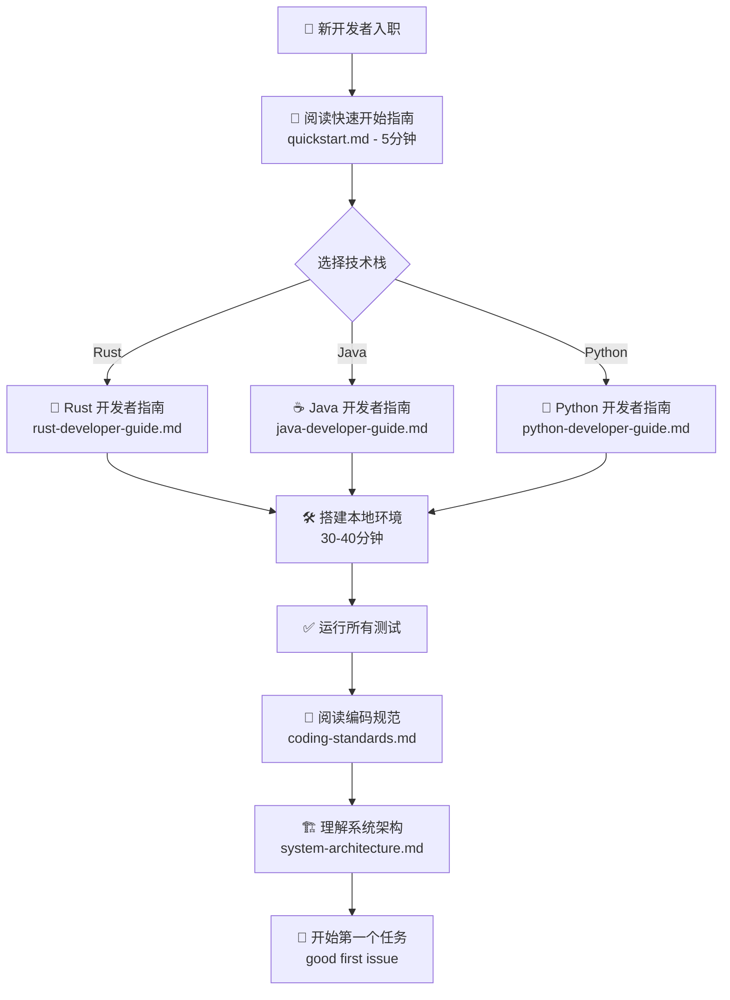

**文档路径**:
1. [快速开始指南](./quickstart.md)
2. 开发者指南:
   - [Rust 开发者指南](./development/rust-developer-guide.md)
   - [Java 开发者指南](./development/java-developer-guide.md)
   - [Python 开发者指南](./development/python-developer-guide.md)
3. [编码规范](./development/coding-standards.md)
4. [系统架构](./architecture/system-architecture.md)

---

## 场景 2: 开发新功能

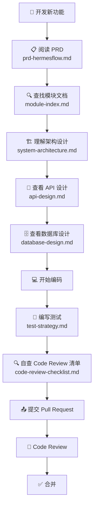

**文档路径**:
1. [PRD 主文档](./prd/prd-hermesflow.md)
2. [模块文档索引](./modules/module-index.md)
3. [系统架构](./architecture/system-architecture.md)
4. [API 设计](./api/api-design.md)
5. [数据库设计](./database/database-design.md)
6. [测试策略](./testing/test-strategy.md)
7. [代码审查清单](./development/code-review-checklist.md)

---

## 场景 3: Bug 修复

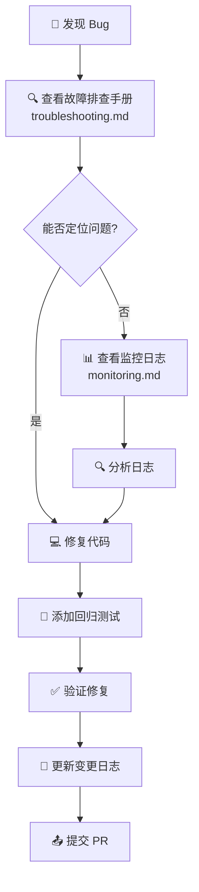

**文档路径**:
1. [故障排查手册](./operations/troubleshooting.md)
2. [监控方案](./operations/monitoring.md)
3. [测试策略](./testing/test-strategy.md)

---

## 场景 4: Code Review

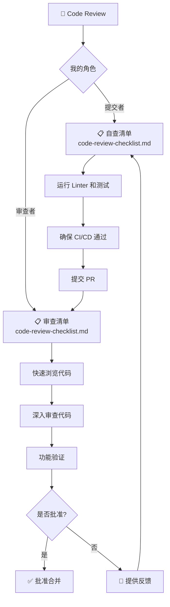

**文档路径**:
1. [代码审查清单](./development/code-review-checklist.md)
2. [编码规范](./development/coding-standards.md)
3. [测试策略](./testing/test-strategy.md)

---

## 场景 5: 准备部署

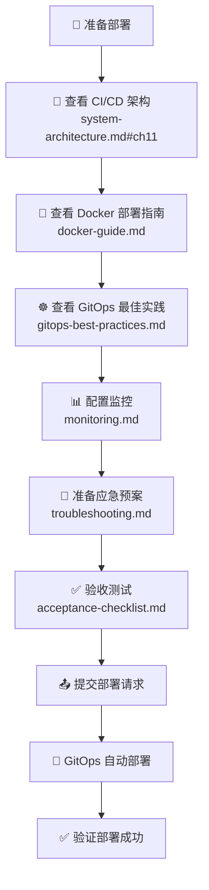

**文档路径**:
1. [CI/CD 架构](./architecture/system-architecture.md#第11章-cicd架构)
2. [Docker 部署指南](./deployment/docker-guide.md)
3. [GitOps 最佳实践](./deployment/gitops-best-practices.md)
4. [监控方案](./operations/monitoring.md)
5. [故障排查手册](./operations/troubleshooting.md)
6. [验收测试清单](./testing/acceptance-checklist.md)

---

## 场景 6: 生产问题排查

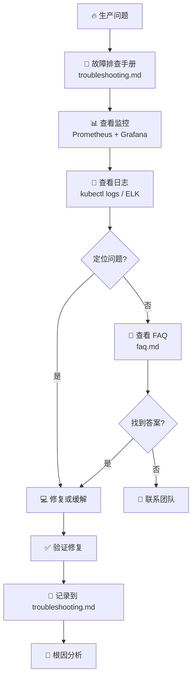

**文档路径**:
1. [故障排查手册](./operations/troubleshooting.md)
2. [监控方案](./operations/monitoring.md)
3. [FAQ](./faq.md)
4. [系统架构](./architecture/system-architecture.md)

---

## 场景 7: Sprint Planning

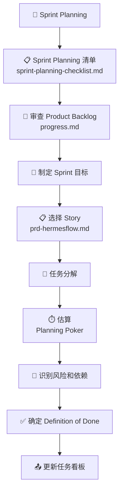

**文档路径**:
1. [Sprint Planning 清单](./scrum/sprint-planning-checklist.md)
2. [Scrum Master 指南](./scrum/sm-guide.md)
3. [项目进度](./progress.md)
4. [PRD 主文档](./prd/prd-hermesflow.md)
5. [模块文档索引](./modules/module-index.md)

---

## 场景 8: 编写测试

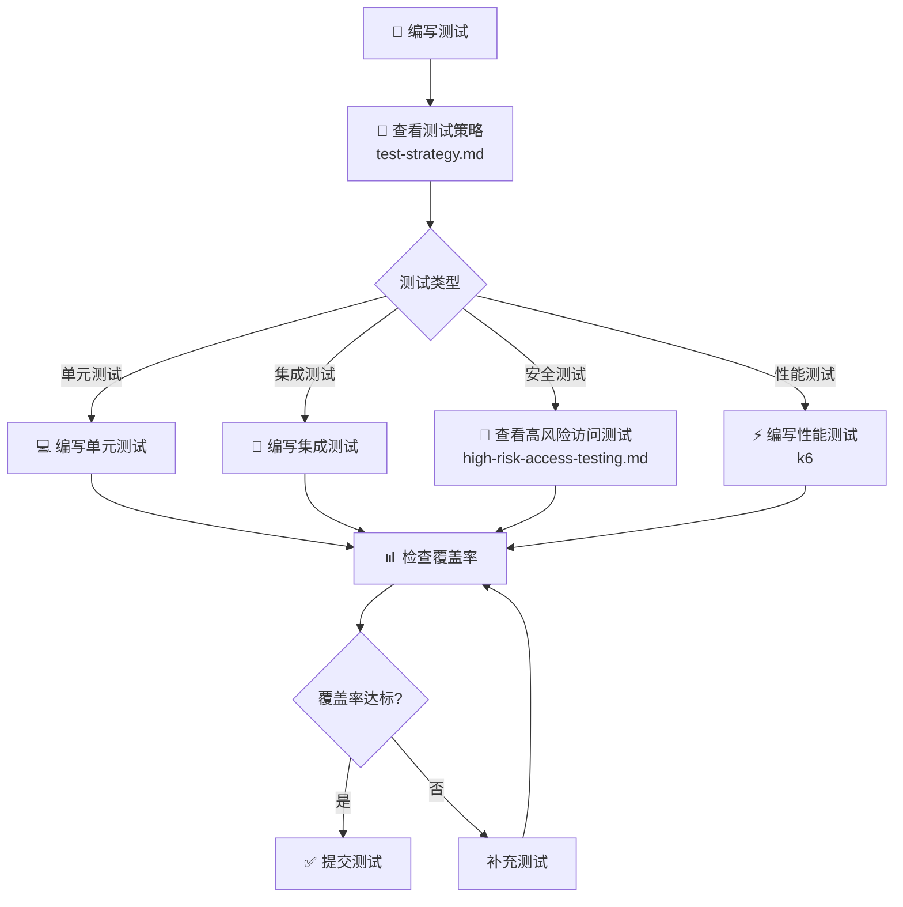

**文档路径**:
1. [测试策略](./testing/test-strategy.md)
2. [高风险访问测试](./testing/high-risk-access-testing.md)
3. [测试数据管理](./testing/test-data-management.md)
4. [CI/CD 测试集成](./testing/ci-cd-integration.md)
5. [验收测试清单](./testing/acceptance-checklist.md)

---

## 场景 9: 性能优化

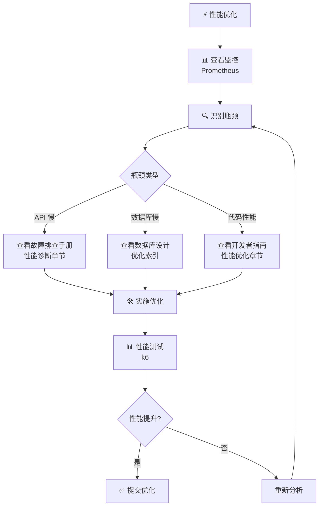

**文档路径**:
1. [故障排查手册 - 性能诊断](./operations/troubleshooting.md#性能诊断)
2. [监控方案](./operations/monitoring.md)
3. [数据库设计](./database/database-design.md)
4. 开发者指南（各语言性能优化章节）

---

## 场景 10: 架构决策

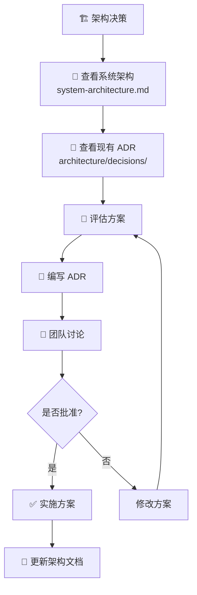

**文档路径**:
1. [系统架构](./architecture/system-architecture.md)
2. [ADR 文档](./architecture/decisions/)
3. [ADR 模板](./architecture/decisions/ADR-TEMPLATE.md)

---

## 🗺️ 全局文档地图

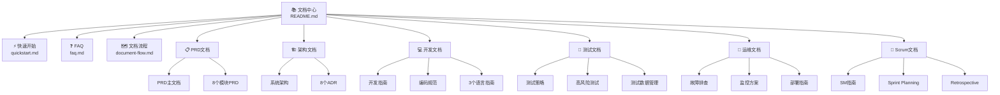

---

## 🔍 按关键词查找

| 关键词 | 相关文档 |
|--------|---------|
| **入职、新手** | [quickstart.md](./quickstart.md), 语言开发者指南 |
| **编码、开发** | [编码规范](./development/coding-standards.md), [开发指南](./development/dev-guide.md) |
| **测试、QA** | [测试策略](./testing/test-strategy.md), [验收清单](./testing/acceptance-checklist.md) |
| **部署、运维** | [Docker指南](./deployment/docker-guide.md), [GitOps](./deployment/gitops-best-practices.md) |
| **故障、问题** | [故障排查](./operations/troubleshooting.md), [FAQ](./faq.md) |
| **架构、设计** | [系统架构](./architecture/system-architecture.md), [ADR](./architecture/decisions/) |
| **Scrum、流程** | [SM指南](./scrum/sm-guide.md), [Sprint Planning](./scrum/sprint-planning-checklist.md) |

---

## 📞 仍然找不到？

1. 使用浏览器搜索功能（Ctrl+F / Cmd+F）在 [文档导航](./README.md) 中搜索关键词
2. 查看 [FAQ](./faq.md)
3. 在 Slack `#hermesflow-dev` 提问

---

**最后更新**: 2025-01-13  
**维护者**: @pm.mdc  
**版本**: v1.0

