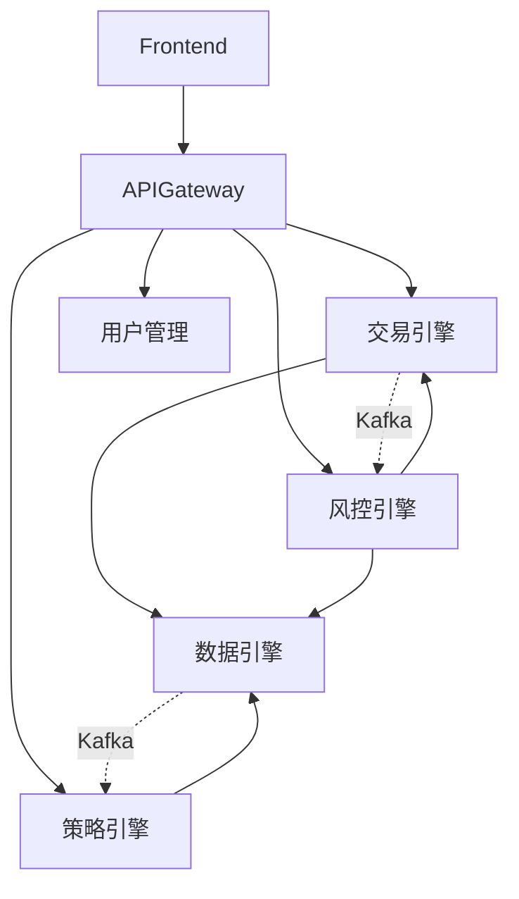

# 模块文档索引

> **HermesFlow 模块文档导航中心**  
> **版本**: v2.1.0 | **更新日期**: 2025-01-13

本文档提供快速访问各模块相关文档的入口，帮助开发者快速定位所需资源。

---

## 📋 模块概览

| 模块 | 语言 | 优先级 | 负责团队 | 状态 |
|------|------|--------|---------|------|
| 数据引擎 | Rust | 🔴 P0 | Rust Team | ✅ 开发中 |
| 策略引擎 | Python | 🔴 P0 | Python Team | ✅ 开发中 |
| 交易引擎 | Java | 🔴 P0 | Java Team | ✅ 开发中 |
| 用户管理 | Java | 🟡 P1 | Java Team | ✅ 开发中 |
| 风控引擎 | Java | 🟡 P1 | Java Team | 📝 规划中 |
| 报表系统 | Java | 🟢 P2 | Java Team | 📝 规划中 |
| 前端应用 | TypeScript | 🟡 P1 | Frontend Team | ✅ 开发中 |
| API Gateway | Java | 🔴 P0 | Java Team | ✅ 开发中 |

---

## 🦀 模块 1: 数据引擎（Rust）

### 核心职责
- 实时数据采集（Binance, OKX, Polygon 等）
- 高频数据处理（100万行/秒）
- ClickHouse/Redis 高性能写入

### 📚 文档资源

#### PRD 和需求
- 📋 [数据模块 PRD](../prd/modules/01-data-module.md)
  - 用户故事、验收标准、Epic 分解
  - 性能基线: 10万行/秒（P95 延迟 < 50ms）

#### 架构设计
- 🏗️ [系统架构 - Rust 数据服务层](../architecture/system-architecture.md#42-rust数据服务层)
  - 异步运行时（Tokio）
  - Web 框架（Actix-web）
  - 并行计算（Rayon）
- 📜 [ADR-006: Rust 数据层决策](../architecture/decisions/ADR-006-rust-data-layer.md)

#### 开发指南
- 🛠️ [Rust 开发者指南](../development/RUST-DEVELOPER-GUIDE.md)
  - 环境搭建、常用模式、调试技巧
- 📝 [编码规范 - Rust 部分](../development/coding-standards.md#rust-规范)
- 🚀 [开发指南 - Rust 开发](../development/dev-guide.md#rust-开发)

#### API 和数据库
- 🔌 [API 设计 - 数据服务 API](../api/api-design.md#数据服务-rust)
  - REST API、WebSocket、gRPC
- 🗄️ [数据库设计 - ClickHouse DDL](../database/database-design.md#clickhouse-设计)
  - 市场数据表、时序数据优化

#### 测试
- 🧪 [测试策略 - Rust 测试](../testing/test-strategy.md#rust-测试)
  - 单元测试、集成测试、性能测试
  - 覆盖率目标: ≥ 85%
- 📊 [性能测试 - 数据采集](../testing/test-strategy.md#性能测试)

#### 部署
- 🐳 [Docker 部署 - Rust 服务](../deployment/docker-guide.md#rust-服务)
  - 多阶段构建、镜像优化

### 代码位置
```
modules/data-engine/
├── src/
│   ├── connectors/      # 数据连接器
│   ├── processors/      # 数据处理
│   ├── storage/         # 存储层
│   └── api/             # API 接口
├── tests/               # 测试
└── Cargo.toml           # 依赖配置
```

### 快速链接
- [模块目录](../../modules/data-engine/)
- [Cargo.toml](../../modules/data-engine/Cargo.toml)
- [README](../../modules/data-engine/README.md)

---

## 🐍 模块 2: 策略引擎（Python）

### 核心职责
- 量化策略开发和回测
- Alpha 因子库
- 策略优化（参数优化、Walk-Forward）

### 📚 文档资源

#### PRD 和需求
- 📋 [策略模块 PRD](../prd/modules/02-strategy-module.md)
  - Alpha 因子库、策略回测、优化引擎

#### 架构设计
- 🏗️ [系统架构 - Python 策略引擎](../architecture/system-architecture.md#43-python-策略引擎)
  - FastAPI、NumPy/Pandas、asyncio
- 📜 [ADR-007: Alpha 因子库](../architecture/decisions/ADR-007-alpha-factor-library.md)

#### 开发指南
- 🛠️ [Python 开发者指南](../development/PYTHON-DEVELOPER-GUIDE.md)
  - Poetry、FastAPI、NumPy 优化
- 📝 [编码规范 - Python 部分](../development/coding-standards.md#python-规范)
- 🚀 [开发指南 - Python 开发](../development/dev-guide.md#python-开发)

#### API 和数据库
- 🔌 [API 设计 - 策略服务 API](../api/api-design.md#策略服务-python)
  - 策略 CRUD、回测 API、因子 API
- 🗄️ [数据库设计 - PostgreSQL](../database/database-design.md#postgresql-设计)
  - 策略表、回测结果表

#### 测试
- 🧪 [测试策略 - Python 测试](../testing/test-strategy.md#python-测试)
  - pytest、asyncio 测试、Mock 外部服务
  - 覆盖率目标: ≥ 75%

#### 部署
- 🐳 [Docker 部署 - Python 服务](../deployment/docker-guide.md#python-服务)

### 代码位置
```
modules/strategy-engine/
├── src/
│   ├── strategies/      # 策略实现
│   ├── backtest/        # 回测引擎
│   ├── factors/         # Alpha 因子
│   └── optimizers/      # 优化器
├── tests/
└── pyproject.toml       # Poetry 配置
```

### 快速链接
- [模块目录](../../modules/strategy-engine/)
- [pyproject.toml](../../modules/strategy-engine/pyproject.toml)

---

## ☕ 模块 3: 交易引擎（Java）

### 核心职责
- 订单执行和管理
- 实时持仓跟踪
- 与交易所 API 集成

### 📚 文档资源

#### PRD 和需求
- 📋 [执行模块 PRD](../prd/modules/03-execution-module.md)
  - 订单管理、持仓管理、交易所集成

#### 架构设计
- 🏗️ [系统架构 - Java 交易服务](../architecture/system-architecture.md#44-java-交易服务)
  - Spring Boot、Virtual Threads、Spring Data JPA
- 📜 [ADR-008: 模拟交易 API](../architecture/decisions/ADR-008-paper-trading-api.md)

#### 开发指南
- 🛠️ [Java 开发者指南](../development/JAVA-DEVELOPER-GUIDE.md)
  - Spring Boot、Virtual Threads、JPA 最佳实践
- 📝 [编码规范 - Java 部分](../development/coding-standards.md#java-规范)
- 🚀 [开发指南 - Java 开发](../development/dev-guide.md#java-开发)

#### API 和数据库
- 🔌 [API 设计 - 交易服务 API](../api/api-design.md#交易服务-java)
  - 订单 CRUD、持仓查询、执行报告
- 🗄️ [数据库设计 - Orders 表](../database/database-design.md#orders-表)

#### 测试
- 🧪 [测试策略 - Java 测试](../testing/test-strategy.md#java-测试)
  - JUnit 5、MockMvc、TestContainers
  - 覆盖率目标: ≥ 80%

#### 部署
- 🐳 [Docker 部署 - Java 服务](../deployment/docker-guide.md#java-服务)

### 代码位置
```
modules/trading-engine/
├── src/main/java/
│   ├── controller/      # REST Controllers
│   ├── service/         # 业务逻辑
│   ├── repository/      # 数据访问
│   └── config/          # 配置
├── src/test/java/
└── pom.xml              # Maven 配置
```

### 快速链接
- [模块目录](../../modules/trading-engine/)
- [pom.xml](../../modules/trading-engine/pom.xml)

---

## 🔐 模块 4: 用户管理（Java）

### 核心职责
- 用户注册、登录、认证
- 多租户管理（PostgreSQL RLS）
- RBAC 权限控制

### 📚 文档资源

#### PRD 和需求
- 📋 [账户模块 PRD](../prd/modules/05-account-module.md)
  - 用户管理、多租户、权限控制

#### 架构设计
- 🏗️ [系统架构 - Java 用户服务](../architecture/system-architecture.md#45-java-用户服务)
  - Spring Security、JWT、PostgreSQL RLS
- 📜 [ADR-002: 多租户架构](../architecture/decisions/ADR-002-multi-tenancy-architecture.md)

#### 开发指南
- 🛠️ [Java 开发者指南](../development/JAVA-DEVELOPER-GUIDE.md)
- 📝 [编码规范 - Java 部分](../development/coding-standards.md#java-规范)

#### API 和数据库
- 🔌 [API 设计 - 用户服务 API](../api/api-design.md#用户服务-java)
  - 注册、登录、JWT 刷新
- 🗄️ [数据库设计 - Users 表 + RLS](../database/database-design.md#users-表)

#### 测试
- 🧪 [测试策略 - 安全测试](../testing/test-strategy.md#安全测试)
  - JWT 验证、RBAC 测试、多租户隔离测试
- 🔐 [高风险访问测试 - RLS 测试](../testing/high-risk-access-testing.md#postgresql-rls-测试)

#### 部署
- 🐳 [Docker 部署 - Java 服务](../deployment/docker-guide.md#java-服务)

### 代码位置
```
modules/user-management/
├── src/main/java/
│   ├── security/        # 安全配置
│   ├── controller/
│   ├── service/
│   └── repository/
└── pom.xml
```

---

## 🛡️ 模块 5: 风控引擎（Java）

### 核心职责
- 实时风险监控
- 风险指标计算（VaR, Sharpe Ratio 等）
- 风险告警

### 📚 文档资源

#### PRD 和需求
- 📋 [风控模块 PRD](../prd/modules/04-risk-module.md)
  - 风险监控、指标计算、告警

#### 架构设计
- 🏗️ [系统架构 - Java 风控服务](../architecture/system-architecture.md#46-java-风控服务)
  - 实时计算、Kafka 集成

#### 开发指南
- 🛠️ [Java 开发者指南](../development/JAVA-DEVELOPER-GUIDE.md)

#### API 和数据库
- 🔌 [API 设计 - 风控服务 API](../api/api-design.md#风控服务-java)
- 🗄️ [数据库设计 - Risk Metrics 表](../database/database-design.md)

#### 测试
- 🧪 [测试策略 - Java 测试](../testing/test-strategy.md#java-测试)

### 代码位置
```
modules/risk-engine/
├── src/main/java/
│   ├── calculator/      # 风险计算
│   ├── monitor/         # 监控
│   └── alerting/        # 告警
└── pom.xml
```

---

## 📊 模块 6: 报表系统（Java）

### 核心职责
- 数据可视化
- 报表生成
- 性能分析

### 📚 文档资源

#### PRD 和需求
- 📋 [报表模块 PRD](../prd/modules/07-report-module.md)

#### 架构设计
- 🏗️ [系统架构 - 报表服务](../architecture/system-architecture.md)

---

## 💻 模块 7: 前端应用（TypeScript + React）

### 核心职责
- 用户界面
- 数据可视化
- 实时数据展示

### 📚 文档资源

#### PRD 和需求
- 📋 [UX 模块 PRD](../prd/modules/08-ux-module.md)

#### 设计
- 🎨 [设计系统](../design/design-system.md)
  - 颜色、字体、组件规范
- 📱 [页面设计](../design/page-designs.md)
  - 核心页面设计和交互
- 💻 [UI 实现指南 (Lovable/V0)](../design/lovable-v0-prompt.md)

#### 架构设计
- 🏗️ [系统架构 - 前端架构](../architecture/system-architecture.md#41-前端架构)
  - React 18、TypeScript、TailwindCSS、Zustand

#### 开发指南
- 🚀 [开发指南 - 前端开发](../development/dev-guide.md#前端开发)

### 代码位置
```
modules/frontend/
├── src/
│   ├── components/      # React 组件
│   ├── pages/           # 页面
│   ├── hooks/           # 自定义 Hooks
│   └── api/             # API 客户端
├── package.json
└── vite.config.ts
```

---

## 🌐 模块 8: API Gateway（Java）

### 核心职责
- 统一 API 入口
- 路由、负载均衡
- 认证、限流

### 📚 文档资源

#### 架构设计
- 🏗️ [系统架构 - API Gateway](../architecture/system-architecture.md#47-api-gateway)
  - Spring Cloud Gateway、JWT 验证、限流

#### 开发指南
- 🛠️ [Java 开发者指南](../development/JAVA-DEVELOPER-GUIDE.md)

### 代码位置
```
modules/api-gateway/
├── src/main/java/
│   ├── filter/          # 过滤器
│   ├── config/          # 路由配置
│   └── security/        # 安全配置
└── pom.xml
```

---

## 🔗 跨模块集成

### 通信方式

| 场景 | 通信方式 | 示例 |
|------|---------|------|
| 同步调用 | gRPC | 交易引擎 → 风控引擎（下单前风控检查） |
| 异步事件 | Kafka | 数据引擎 → 策略引擎（市场数据推送） |
| 缓存共享 | Redis | 所有服务（用户Session、配置缓存） |
| 数据共享 | PostgreSQL | 用户管理 ↔ 交易引擎（用户信息） |

### 依赖关系



### 集成文档
- 📜 [ADR-003: 消息通信](../architecture/decisions/ADR-003-message-communication.md)
- 🔌 [API 设计 - gRPC 协议](../api/api-design.md#grpc-协议)

---

## 📋 模块开发检查清单

开始开发新模块或功能时，使用此清单：

### Phase 1: 规划
- [ ] 阅读相关 PRD 文档
- [ ] 理解架构设计和 ADR
- [ ] 识别依赖关系和集成点
- [ ] 与相关团队同步接口定义

### Phase 2: 开发
- [ ] 参考编码规范
- [ ] 使用语言专属开发指南
- [ ] 编写单元测试（覆盖率达标）
- [ ] 更新 API 文档（如有新 API）

### Phase 3: 测试
- [ ] 运行单元测试
- [ ] 运行集成测试
- [ ] 安全测试（如涉及认证/授权/多租户）
- [ ] 性能测试（如有性能要求）

### Phase 4: 部署
- [ ] 更新 Dockerfile（如有变更）
- [ ] 更新 Helm Chart（如有配置变更）
- [ ] 在 Dev 环境验证
- [ ] 准备 Demo（Sprint Review）

### Phase 5: 文档
- [ ] 更新 README
- [ ] 更新 API 文档
- [ ] 更新数据库迁移脚本
- [ ] 更新变更日志

---

## 📞 获取帮助

### 技术问题
- **Rust 问题**: Slack `#rust-dev`
- **Java 问题**: Slack `#java-dev`
- **Python 问题**: Slack `#python-dev`
- **前端问题**: Slack `#frontend-dev`

### 文档问题
- **PRD 相关**: 联系 @pm.mdc
- **架构相关**: 联系 @architect.mdc
- **测试相关**: 联系 @qa.mdc

### 一般帮助
- 📖 [FAQ](../FAQ.md)
- 🔧 [故障排查手册](../operations/troubleshooting.md)
- 💬 Slack: `#hermesflow-dev`

---

**最后更新**: 2025-01-13  
**维护者**: @pm.mdc  
**版本**: v2.1.0

