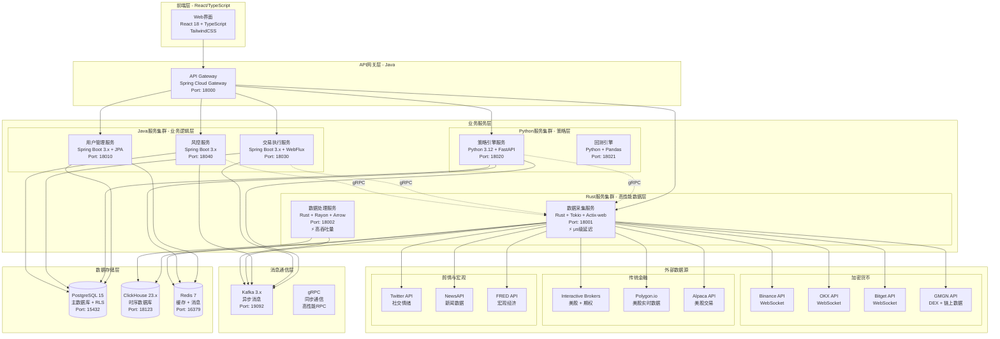
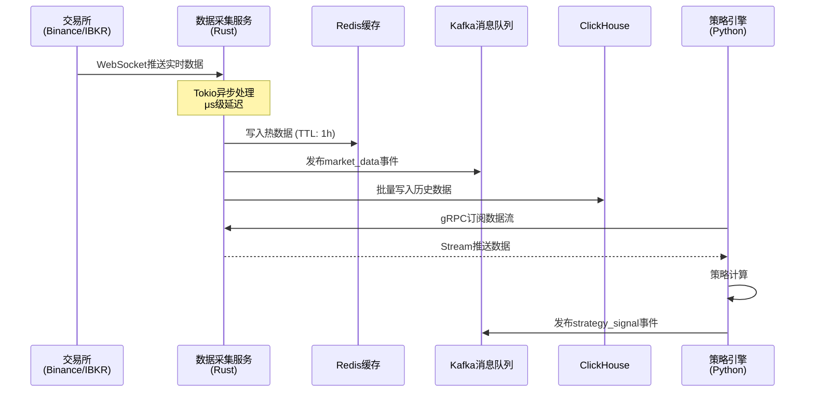
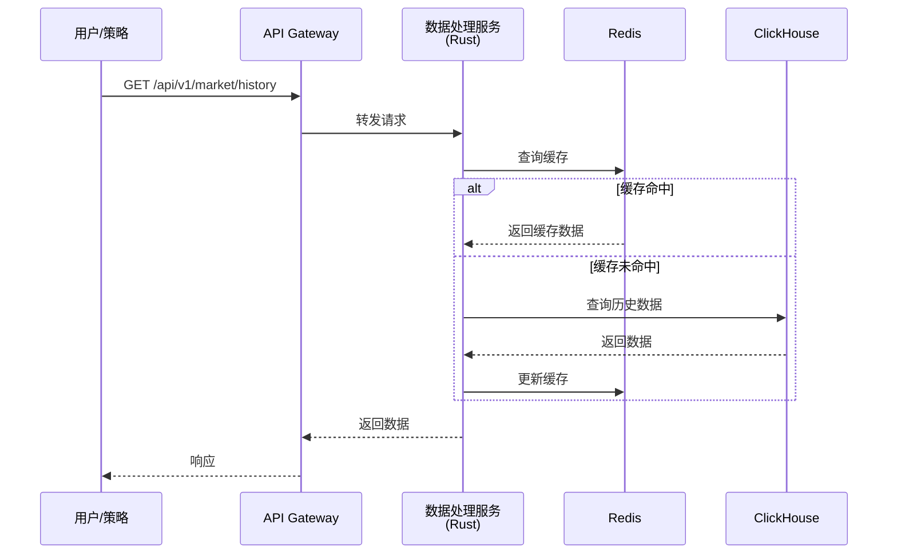
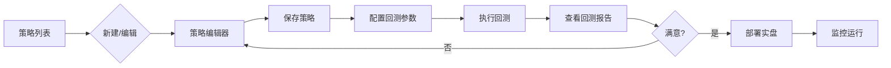

# HermesFlow 量化交易平台产品需求文档 (PRD)

**文档版本**: v2.1.0  
**最后更新**: 2024-12-20  
**文档状态**: 详细设计阶段  
**作者**: HermesFlow 产品团队

---

## 📋 文档变更记录

| 版本 | 日期 | 作者 | 变更说明 |
|------|------|------|----------|
| v2.1.0 | 2024-12-20 | Product Team | 基于市场分析补充Alpha因子库(100个)、策略优化引擎(贝叶斯+Walk-Forward)、模拟交易系统、ML集成路线图、组合管理系统；重新规划MVP/V2/V3路线图 |
| v2.0.0 | 2024-12-20 | Product Team | 初始版本，采用Rust+Java+Python混合技术栈，支持多数据源 |

---

## 目录

1. [产品概述](#1-产品概述)
   - 1.1 [项目背景与愿景](#11-项目背景与愿景)
   - 1.2 [目标用户画像](#12-目标用户画像)
   - 1.3 [产品定位与核心价值](#13-产品定位与核心价值)
   - 1.4 [成功指标与KPI](#14-成功指标与kpi)
   - 1.5 [术语与定义表](#15-术语与定义表)

2. [系统架构概览](#2-系统架构概览)
   - 2.1 [混合技术栈架构图](#21-混合技术栈架构图)
   - 2.2 [服务拓扑与端口映射](#22-服务拓扑与端口映射)
   - 2.3 [数据流向图](#23-数据流向图)
   - 2.4 [技术栈选型说明](#24-技术栈选型说明)

3. [功能需求详述](#3-功能需求详述)
   - 3.1 [数据模块（Rust实现）](#31-数据模块rust实现)
   - 3.2 [策略模块（Python实现）](#32-策略模块python实现)
   - 3.3 [执行模块（Java实现）](#33-执行模块java实现)
   - 3.4 [风控模块（Java实现）](#34-风控模块java实现)
   - 3.5 [账户模块（Java实现）](#35-账户模块java实现)
   - 3.6 [安全模块](#36-安全模块)
   - 3.7 [报表模块](#37-报表模块)
   - 3.8 [用户体验模块](#38-用户体验模块)

4. [非功能需求](#4-非功能需求)
   - 4.1 [性能需求](#41-性能需求)
   - 4.2 [可靠性需求](#42-可靠性需求)
   - 4.3 [安全需求](#43-安全需求)
   - 4.4 [可扩展性需求](#44-可扩展性需求)
   - 4.5 [可维护性需求](#45-可维护性需求)
   - 4.6 [合规性需求](#46-合规性需求)

5. [优先级与路线图](#5-优先级与路线图)
   - 5.1 [MVP功能范围](#51-mvp功能范围)
   - 5.2 [各模块优先级矩阵](#52-各模块优先级矩阵)
   - 5.3 [开发路线图](#53-开发路线图)
   - 5.4 [里程碑与交付物](#54-里程碑与交付物)
   - 5.5 [风险评估](#55-风险评估)

6. [用户界面设计](#6-用户界面设计)
   - 6.1 [信息架构](#61-信息架构)
   - 6.2 [主要页面流程图](#62-主要页面流程图)
   - 6.3 [交互原则](#63-交互原则)
   - 6.4 [响应式设计要求](#64-响应式设计要求)

7. [接口规范](#7-接口规范)
   - 7.1 [外部API接入规范](#71-外部api接入规范)
   - 7.2 [内部服务接口原则](#72-内部服务接口原则)
   - 7.3 [数据格式标准](#73-数据格式标准)
   - 7.4 [错误处理规范](#74-错误处理规范)

---

## 1. 产品概述

### 1.1 项目背景与愿景

#### 背景

量化交易已成为现代金融市场的重要组成部分。个人量化交易者面临以下挑战：

1. **数据获取困难**：需要同时接入加密货币交易所（CEX/DEX）、传统金融市场（美股、期权）、舆情数据等多种数据源
2. **技术门槛高**：需要掌握多种技术栈，包括数据采集、策略开发、风险控制等
3. **成本高昂**：商业化量化交易平台（如Quantopian、QuantConnect）成本高，且功能受限
4. **性能要求高**：高频交易场景对延迟极其敏感，需要μs级别的响应时间
5. **多市场需求**：需要同时支持加密货币、美股、期权等多个市场

#### 愿景

HermesFlow 的愿景是**打造一个高性能、低成本、易扩展的个人量化交易平台**，让个人交易者能够：

- **快速接入**多种数据源（加密货币、美股、期权、舆情）
- **高效开发**和回测交易策略
- **安全执行**自动化交易
- **实时监控**风险和收益
- **持续优化**交易策略

#### 核心理念

1. **性能至上**：采用Rust语言开发数据层，实现μs级延迟
2. **技术栈优势互补**：Rust负责高性能数据处理，Java负责业务逻辑，Python负责策略开发
3. **成本优化**：轻量级多租户架构，单机支持100+用户
4. **开放生态**：支持多种数据源和交易所接入

### 1.2 目标用户画像

#### 主要用户群体

**个人量化交易者**

- **年龄**: 25-45岁
- **背景**: 金融、计算机、数学等相关专业
- **技能**: 具备编程能力（Python/Java/Rust），了解金融市场
- **需求**: 
  - 需要高性能的数据采集和处理能力
  - 需要灵活的策略开发框架
  - 需要多市场支持（加密货币 + 传统金融）
  - 需要完善的风控机制
  - 需要实时的数据可视化

**用户细分**

1. **加密货币交易者**
   - 关注CEX和DEX交易机会
   - 需要链上数据和鲸鱼地址追踪
   - 对延迟要求极高（ms级别）

2. **传统金融交易者**
   - 交易美股、期权、期货
   - 需要实时行情和期权链数据
   - 关注宏观经济指标

3. **多市场套利者**
   - 同时交易多个市场
   - 需要跨市场数据整合
   - 关注市场间的相关性和套利机会

4. **量化研究者**
   - 专注于策略研发和回测
   - 需要大量历史数据
   - 需要强大的数据分析能力

### 1.3 产品定位与核心价值

#### 产品定位

HermesFlow 定位为**面向个人的高性能多市场量化交易平台**，具有以下特点：

1. **高性能**：Rust数据层，μs级延迟
2. **多市场**：支持加密货币、美股、期权、期货
3. **多数据源**：CEX/DEX、传统交易所、舆情数据、宏观数据
4. **易扩展**：微服务架构，支持灵活扩展
5. **低成本**：开源架构，可自建部署

#### 核心价值主张

**对于用户**

1. **一站式数据接入**
   - 统一接口访问多种数据源
   - 自动数据标准化和质量控制
   - 历史数据回测支持

2. **高性能交易执行**
   - μs级数据采集延迟
   - ms级订单执行延迟
   - 支持高频交易策略

3. **灵活的策略开发**
   - 支持Python策略开发（易用）
   - 丰富的策略模板库
   - 完整的回测框架

4. **完善的风险控制**
   - 实时风险监控
   - 多层次风控机制
   - 自动止损和清算保护

5. **可视化监控**
   - 实时仪表盘
   - 多维度报表
   - Slack/Webhook通知

**竞争优势**

| 维度 | HermesFlow | QuantConnect | Quantopian |
|------|------------|--------------|------------|
| 性能 | μs级（Rust） | ms级 | ms级 |
| 多市场支持 | ✅ (加密+美股+期权) | ⚠️ (有限) | ❌ (已关闭) |
| 舆情数据 | ✅ | ❌ | ❌ |
| 自建部署 | ✅ | ❌ (仅云端) | ❌ |
| 成本 | 低（自建） | 高（订阅） | - |
| 技术栈 | 现代化（Rust+Java+Python） | C# | Python |

### 1.4 成功指标与KPI

#### 技术指标

1. **性能指标**
   - 数据采集延迟: P99 < 1ms
   - WebSocket连接数: > 500并发
   - 数据吞吐量: > 100k msg/s
   - 订单执行延迟: P99 < 50ms
   - 系统可用性: > 99.9%

2. **质量指标**
   - 数据准确率: > 99.99%
   - 数据完整性: > 99.9%
   - 代码测试覆盖率: > 85%
   - 服务响应时间: P95 < 100ms

#### 业务指标

1. **用户指标**
   - 月活跃用户数
   - 用户留存率（7天、30天）
   - 策略创建数
   - 回测执行次数

2. **系统指标**
   - 部署成功率: > 99%
   - 故障恢复时间: < 5分钟
   - 数据存储成本: < $100/月
   - 计算资源利用率: > 70%

### 1.5 术语与定义表

| 术语 | 英文 | 定义 |
|------|------|------|
| CEX | Centralized Exchange | 中心化交易所，如Binance、OKX、Bitget |
| DEX | Decentralized Exchange | 去中心化交易所，如Uniswap、PancakeSwap |
| 链上数据 | On-chain Data | 区块链上的交易数据、智能合约事件 |
| 鲸鱼地址 | Whale Address | 持有大量加密货币的地址 |
| 期权链 | Options Chain | 特定标的所有可交易期权的列表 |
| K线 | Candlestick | 包含开盘价、最高价、最低价、收盘价的时间序列数据 |
| Tick数据 | Tick Data | 每笔成交的实时数据 |
| 订单簿 | Order Book | 市场上所有买卖挂单的集合 |
| 滑点 | Slippage | 预期价格与实际成交价格的差异 |
| 回测 | Backtesting | 使用历史数据测试策略性能 |
| 实盘 | Live Trading | 真实市场环境下的交易 |
| 风控 | Risk Management | 风险识别、评估和控制 |
| VaR | Value at Risk | 风险价值，衡量潜在损失 |
| 多租户 | Multi-tenancy | 单一系统实例服务多个用户 |
| RLS | Row Level Security | 行级安全，PostgreSQL数据隔离机制 |
| gRPC | - | Google开发的高性能RPC框架 |
| WebSocket | - | 全双工通信协议，用于实时数据推送 |

---

## 2. 系统架构概览

### 2.1 混合技术栈架构图

HermesFlow 采用**混合技术栈微服务架构**，充分发挥各语言的优势：



### 2.2 服务拓扑与端口映射

#### 服务端口分配

| 服务名称 | 技术栈 | 端口 | 协议 | 职责 |
|---------|--------|------|------|------|
| API Gateway | Spring Cloud Gateway | 18000 | HTTP/WS | 统一入口、路由、认证 |
| 数据采集服务 | Rust + Actix-web | 18001 | HTTP/WS/gRPC | 实时数据采集、WebSocket管理 |
| 数据处理服务 | Rust + Axum | 18002 | HTTP/gRPC | 历史数据处理、指标计算 |
| 用户管理服务 | Spring Boot 3.x | 18010 | HTTP | 用户认证、权限管理 |
| 策略引擎服务 | Python FastAPI | 18020 | HTTP | 策略开发、执行 |
| 回测引擎 | Python FastAPI | 18021 | HTTP | 策略回测 |
| 交易执行服务 | Spring Boot 3.x | 18030 | HTTP | 订单管理、交易执行 |
| 风控服务 | Spring Boot 3.x | 18040 | HTTP | 风险监控、风控规则 |
| PostgreSQL | PostgreSQL 15 | 15432 | TCP | 主数据库 |
| ClickHouse | ClickHouse 23.x | 18123 | HTTP | 时序数据库 |
| Redis | Redis 7 | 16379 | TCP | 缓存、消息队列 |
| Kafka | Kafka 3.x | 19092 | TCP | 消息队列 |

#### 网络架构

```
Internet
    ↓
[Nginx/Ingress] :80/:443
    ↓
[API Gateway] :18000
    ↓
┌─────────────┬──────────────┬──────────────┐
│  Rust Layer │  Java Layer  │ Python Layer │
│  :18001-002 │  :18010-040  │  :18020-021  │
└─────────────┴──────────────┴──────────────┘
    ↓           ↓              ↓
┌─────────────┬──────────────┬──────────────┐
│ PostgreSQL  │ ClickHouse   │    Redis     │
│   :15432    │   :18123     │    :16379    │
└─────────────┴──────────────┴──────────────┘
                     ↓
                  [Kafka] :19092
```

### 2.3 数据流向图

#### 实时数据流



#### 历史数据查询流



### 2.4 技术栈选型说明

#### Rust - 数据层

**选型理由**

1. **超低延迟**: 零成本抽象，无GC，μs级响应
2. **内存安全**: 编译时保证内存安全，无数据竞争
3. **高并发**: Tokio异步运行时，高效处理大量WebSocket连接
4. **高性能**: 原生性能接近C/C++，远超Java/Python

**适用场景**

- 实时数据采集（WebSocket长连接管理）
- 高频数据处理（Tick数据、订单簿）
- 数据标准化和质量控制
- 高吞吐量数据写入（ClickHouse）

**关键依赖**

- `tokio`: 异步运行时
- `actix-web` / `axum`: Web框架
- `tungstenite`: WebSocket客户端
- `rdkafka`: Kafka客户端
- `clickhouse-rs`: ClickHouse驱动
- `redis-rs`: Redis客户端
- `serde`: 序列化/反序列化
- `tracing`: 结构化日志

#### Java - 业务逻辑层

**选型理由**

1. **成熟生态**: Spring Boot生态完善，开发效率高
2. **虚拟线程**: JDK 21虚拟线程，高并发低开销
3. **企业级**: 适合复杂业务逻辑和事务处理
4. **类型安全**: 强类型系统，编译时检查

**适用场景**

- 用户管理和认证
- 交易执行和订单管理
- 风险控制和监控
- 账户和资金管理

**关键框架**

- Spring Boot 3.x
- Spring Security 6.x
- Spring Data JPA
- Spring Cloud Gateway
- PostgreSQL JDBC驱动

#### Python - 策略层

**选型理由**

1. **易用性**: 语法简洁，开发效率高
2. **数据分析**: Pandas、NumPy生态强大
3. **ML支持**: Scikit-learn、TensorFlow等
4. **社区**: 量化交易社区活跃

**适用场景**

- 策略开发和回测
- 技术指标计算
- 数据分析和可视化
- 机器学习模型

**关键库**

- FastAPI: Web框架
- Pandas: 数据分析
- NumPy: 数值计算
- TA-Lib: 技术指标
- Backtrader: 回测框架

#### 技术栈对比

| 特性 | Rust | Java | Python |
|------|------|------|--------|
| 性能 | ⭐⭐⭐⭐⭐ | ⭐⭐⭐⭐ | ⭐⭐ |
| 内存安全 | ⭐⭐⭐⭐⭐ | ⭐⭐⭐⭐ | ⭐⭐⭐ |
| 并发 | ⭐⭐⭐⭐⭐ | ⭐⭐⭐⭐ | ⭐⭐ |
| 开发效率 | ⭐⭐⭐ | ⭐⭐⭐⭐ | ⭐⭐⭐⭐⭐ |
| 生态成熟度 | ⭐⭐⭐ | ⭐⭐⭐⭐⭐ | ⭐⭐⭐⭐⭐ |
| 学习曲线 | 陡峭 | 中等 | 平缓 |

---

## 3. 功能需求详述

### 3.1 数据模块（Rust实现）

> 📘 **详细文档**: [数据模块详细需求](./modules/01-data-module.md)

#### 模块概述

数据模块是HermesFlow的核心基础设施，负责从多种数据源采集、处理、存储和分发数据。采用**Rust语言**实现，以达到μs级延迟和100k+ msg/s吞吐量的性能目标。

**核心职责**

1. 多源数据采集（加密货币、美股、期权、舆情、宏观）
2. 实时数据流处理
3. 数据标准化与质量控制
4. 高性能数据分发
5. 历史数据存储与查询

**性能目标**

- 数据采集延迟: P99 < 1ms
- WebSocket并发连接: > 500
- 消息吞吐量: > 100,000 msg/s
- 数据准确率: > 99.99%
- 服务可用性: > 99.9%

#### Epic 1: 加密货币数据采集

**功能描述**

支持主流CEX和DEX的实时数据采集，包括K线、Tick、订单簿、成交记录等。

**子功能**

1. **CEX数据采集**
   - [P0] Binance WebSocket连接（Spot/Futures）
   - [P0] OKX WebSocket连接（Spot/Swap）
   - [P1] Bitget WebSocket连接
   - [P1] 自动重连和错误恢复
   - [P2] 连接池管理和负载均衡

2. **DEX数据采集**
   - [P1] GMGN API集成（Solana/ETH）
   - [P1] Uniswap链上事件监听
   - [P2] PancakeSwap数据采集
   - [P2] 链上交易解析

3. **链上数据**
   - [P1] 鲸鱼地址追踪
   - [P2] 大额转账监控
   - [P2] 智能合约事件监听

**用户故事**

```gherkin
Story: 实时接收Binance行情数据
  As a 量化交易者
  I want to 实时接收Binance的行情数据
  So that 我可以基于最新数据进行交易决策

  Scenario: 订阅BTC/USDT实时行情
    Given 数据采集服务正在运行
    When 我订阅 Binance BTC/USDT 实时行情
    Then 系统应建立WebSocket连接
    And 系统应持续接收价格更新
    And 数据延迟应小于1ms (P99)
    And 数据应写入Redis和ClickHouse
```

**验收标准**

- [ ] WebSocket连接稳定性 > 99.9%
- [ ] 单交易所支持 > 100个交易对同时订阅
- [ ] 数据延迟 P99 < 1ms
- [ ] 自动重连成功率 > 99%
- [ ] 数据完整性 > 99.9%

**API设计**

```rust
// Rust API
pub trait ExchangeConnector {
    async fn connect(&self) -> Result<Connection>;
    async fn subscribe(&self, symbols: Vec<String>) -> Result<()>;
    async fn unsubscribe(&self, symbols: Vec<String>) -> Result<()>;
}

// REST API
GET /api/v1/market/realtime/{exchange}/{symbol}
POST /api/v1/market/subscribe
  body: { "exchange": "binance", "symbols": ["BTCUSDT", "ETHUSDT"] }
```

#### Epic 2: 传统金融数据采集

**功能描述**

支持美股、期权、期货等传统金融市场的实时数据采集。

**子功能**

1. **美股数据**
   - [P0] Interactive Brokers (IBKR) API集成
   - [P0] Polygon.io 实时行情
   - [P1] Alpaca API集成
   - [P1] 盘前/盘后数据
   - [P2] A股数据接入（扩展）

2. **期权数据**
   - [P1] IBKR Options Chain
   - [P1] 期权希腊值计算
   - [P2] 隐含波动率曲面
   - [P2] 期权异常交易监控

3. **期货数据**
   - [P2] 商品期货数据
   - [P2] 股指期货数据

**用户故事**

```gherkin
Story: 获取AAPL期权链数据
  As a 期权交易者
  I want to 获取AAPL的完整期权链
  So that 我可以分析期权市场结构

  Scenario: 查询AAPL期权链
    Given 我已连接到IBKR
    When 我查询 AAPL 2024-12-20 到期的期权链
    Then 系统应返回所有行权价的Call和Put数据
    And 数据应包含 Bid/Ask/Last/Volume/OpenInterest
    And 数据应包含希腊值 (Delta/Gamma/Theta/Vega)
    And 响应时间应 < 100ms
```

**验收标准**

- [ ] 支持至少1000个美股标的
- [ ] 期权链查询延迟 < 100ms
- [ ] 实时行情更新频率 > 1次/秒
- [ ] 数据准确率 > 99.99%

**技术实现**

```rust
// IBKR连接器
pub struct IBKRConnector {
    client: IBClient,
    config: IBKRConfig,
}

impl IBKRConnector {
    pub async fn get_options_chain(
        &self,
        symbol: &str,
        expiry: NaiveDate,
    ) -> Result<Vec<OptionContract>> {
        // 实现...
    }
}
```

#### Epic 3: 舆情数据采集

**功能描述**

采集社交媒体、新闻、链上情绪等舆情数据，用于情绪分析和交易信号生成。

**子功能**

1. **社交媒体情绪**
   - [P1] Twitter API集成（关键词、标签）
   - [P2] Discord频道监听
   - [P2] Reddit RSS订阅
   - [P2] 情绪分数计算

2. **新闻数据**
   - [P1] NewsAPI集成
   - [P2] Bloomberg新闻（如有API）
   - [P2] 新闻情绪分析

3. **链上情绪**
   - [P1] GMGN热度指标
   - [P1] 持币地址分析
   - [P2] 社区活跃度指标

**用户故事**

```gherkin
Story: 监控BTC相关推特情绪
  As a 加密货币交易者
  I want to 实时监控BTC相关的推特情绪
  So that 我可以及时发现市场情绪变化

  Scenario: 订阅BTC推特情绪
    Given 数据采集服务已配置Twitter API
    When 我订阅 BTC 相关推特情绪
    Then 系统应监控包含 #BTC, #Bitcoin 的推文
    And 系统应计算情绪分数 (-1 到 +1)
    And 系统应检测情绪突变事件
    And 数据应写入时序数据库
```

**验收标准**

- [ ] 支持至少10个关键词同时监控
- [ ] 情绪分数更新频率 > 1次/分钟
- [ ] 情绪突变检测延迟 < 5秒
- [ ] API限流自动管理

#### Epic 4: 宏观经济数据采集

**功能描述**

采集宏观经济指标，如FRED数据、央行利率等。

**子功能**

1. **FRED经济指标**
   - [P1] GDP、CPI、失业率等
   - [P1] 利率数据（联邦基金利率）
   - [P2] 货币供应量
   - [P2] 国债收益率曲线

2. **央行数据**
   - [P2] 美联储决议
   - [P2] ECB、BoJ政策利率

**用户故事**

```gherkin
Story: 获取美国CPI数据
  As a 宏观交易者
  I want to 获取最新的美国CPI数据
  So that 我可以分析通胀对市场的影响

  Scenario: 查询CPI历史数据
    Given 数据采集服务已连接FRED API
    When 我查询过去12个月的CPI数据
    Then 系统应返回月度CPI序列
    And 数据应包含发布时间和修订信息
    And 数据应缓存以减少API调用
```

**验收标准**

- [ ] 支持至少50个经济指标
- [ ] 数据更新延迟 < 1小时（发布后）
- [ ] 数据完整性 > 99%

#### Epic 5: 数据标准化与质量控制

**功能描述**

将不同数据源的数据统一格式，并进行质量检查。

**子功能**

1. **数据标准化**
   - [P0] 统一时间戳格式（UTC, μs精度）
   - [P0] 统一交易对命名（BTC/USDT格式）
   - [P0] 统一数据结构（Protobuf/JSON）
   - [P1] 单位转换（价格、数量）

2. **质量控制**
   - [P0] 异常值检测（价格跳变、成交量异常）
   - [P0] 缺失值处理
   - [P1] 重复数据去重
   - [P1] 数据延迟监控

3. **数据修复**
   - [P1] 自动数据回填
   - [P2] 数据对齐（多交易所）
   - [P2] 数据插值

**验收标准**

- [ ] 数据标准化准确率 > 99.99%
- [ ] 异常数据检出率 > 95%
- [ ] 数据修复成功率 > 90%

#### Epic 6: 高性能数据分发

**功能描述**

通过Redis、Kafka、gRPC等方式高效分发数据给下游服务。

**子功能**

1. **Redis缓存**
   - [P0] 实时行情缓存（Hash）
   - [P0] 订单簿缓存（ZSet）
   - [P1] K线缓存
   - [P1] 缓存失效策略

2. **Kafka消息**
   - [P0] market_data topic
   - [P1] sentiment_data topic
   - [P1] macro_data topic
   - [P1] 消息分区策略

3. **gRPC流**
   - [P0] StreamMarketData RPC
   - [P1] 客户端订阅管理
   - [P1] 背压控制

**验收标准**

- [ ] Redis写入延迟 P99 < 1ms
- [ ] Kafka消息吞吐量 > 100k msg/s
- [ ] gRPC流并发订阅 > 100

#### Epic 7: 历史数据存储与查询

**功能描述**

将历史数据高效存储到ClickHouse，并提供快速查询接口。

**子功能**

1. **数据写入**
   - [P0] 批量写入优化
   - [P0] 分区策略（按月分区）
   - [P1] 数据压缩
   - [P1] 写入监控

2. **数据查询**
   - [P0] 时间范围查询
   - [P0] 聚合查询（OHLCV）
   - [P1] 多维度查询
   - [P1] 查询缓存

**验收标准**

- [ ] 批量写入性能 > 100k rows/s
- [ ] 查询延迟 P95 < 100ms
- [ ] 存储压缩率 > 10:1

#### 优先级总结

| Epic | 优先级 | 预计工作量 | 依赖 |
|------|--------|-----------|------|
| Epic 1: 加密货币数据采集 | P0 | 4周 | - |
| Epic 2: 传统金融数据采集 | P0/P1 | 3周 | - |
| Epic 3: 舆情数据采集 | P1 | 2周 | - |
| Epic 4: 宏观经济数据采集 | P1 | 1周 | - |
| Epic 5: 数据标准化与质量控制 | P0 | 2周 | Epic 1-4 |
| Epic 6: 高性能数据分发 | P0 | 2周 | Epic 5 |
| Epic 7: 历史数据存储与查询 | P0 | 2周 | Epic 5 |

**MVP范围**: Epic 1 (CEX) + Epic 5 + Epic 6 + Epic 7

---

### 3.2 策略模块（Python实现）

> 📘 **详细文档**: [策略模块详细需求](./modules/02-strategy-module.md)

#### 模块概述

策略模块提供灵活的策略开发框架、强大的回测引擎和完善的策略管理功能。

**核心职责**

1. 策略开发框架（模板、API）
2. 策略执行引擎
3. 回测引擎
4. 策略性能分析
5. 参数优化

**性能目标**

- 策略执行延迟: < 10ms
- 回测速度: > 1000 bars/s
- 并发策略数: > 50

#### Epic概览

1. **Epic 1: 策略开发框架** [P0]
   - 策略基类和模板
   - 事件驱动架构
   - 信号生成API
   - 策略生命周期管理

2. **Epic 2: 回测引擎** [P0]
   - 历史数据回放
   - 模拟订单执行
   - 滑点和手续费模拟
   - 回测报告生成

3. **Epic 3: 策略执行引擎** [P0]
   - 实时数据订阅
   - 策略信号计算
   - 订单发送
   - 执行状态监控

4. **Epic 4: 策略优化** [P1]
   - 参数网格搜索
   - 遗传算法优化
   - Walk-Forward分析
   - 过拟合检测

5. **Epic 5: 策略管理** [P1]
   - 策略CRUD
   - 版本控制
   - 策略分组
   - 权限管理

**示例策略代码**

```python
from hermesflow.strategy import BaseStrategy
from hermesflow.indicators import SMA

class MovingAverageCrossover(BaseStrategy):
    """移动平均线交叉策略"""
    
    def __init__(self, fast_period=10, slow_period=30):
        super().__init__()
        self.fast_period = fast_period
        self.slow_period = slow_period
    
    def on_init(self):
        """策略初始化"""
        self.fast_ma = SMA(self.fast_period)
        self.slow_ma = SMA(self.slow_period)
    
    def on_bar(self, bar):
        """K线更新回调"""
        # 更新指标
        self.fast_ma.update(bar.close)
        self.slow_ma.update(bar.close)
        
        # 生成交易信号
        if self.fast_ma.crossover(self.slow_ma):
            self.buy(bar.symbol, size=1.0)
        elif self.fast_ma.crossunder(self.slow_ma):
            self.sell(bar.symbol, size=1.0)
```

---

### 3.2.4 Alpha因子库 [P0-MVP]

> 📘 **完整文档**: 参见 [PRD Enhancement v2.1 - 第1章](./PRD-Enhancement-v2.1.md#1-alpha因子库)

#### 模块概述

Alpha因子库是策略开发的核心基础设施，提供100+预定义因子，支持快速开发多因子选股策略。

**核心职责**

1. 提供100个预定义Alpha因子
2. 因子计算引擎（高性能）
3. 因子性能分析（IC、覆盖率、相关性）
4. 因子缓存与优化

**性能目标**

- 因子计算性能: > 1000 bars/s
- 因子API响应: < 100ms
- 因子缓存命中率: > 90%

#### 因子分类

**MVP版本（100个因子）**：

| 分类 | 数量 | 优先级 | 说明 |
|------|------|--------|------|
| **技术指标因子** | 20 | P0 | 趋势、动量、振荡器 |
| **量价因子** | 15 | P0 | 成交量、换手率、资金流 |
| **价值因子** | 10 | P1 | PE、PB、PS、PCF |
| **成长因子** | 10 | P1 | 营收增长、利润增长 |
| **质量因子** | 10 | P1 | ROE、ROA、资产负债率 |
| **情绪因子** | 10 | P1 | 涨跌停、新高新低 |
| **波动率因子** | 10 | P0 | 历史波动率、ATR |
| **另类因子** | 15 | P2 | 舆情、资金流向 |
| **总计** | **100** | - | MVP版本 |

**V2版本扩展（200+因子）**：
- 分析师因子（20个）
- 行业因子（30个）
- 宏观因子（20个）
- 高级技术因子（30个）

#### 关键因子示例

**技术指标因子**：
- MA/EMA（移动平均）
- MACD（平滑异同移动平均）
- RSI（相对强弱指标）
- ATR（真实波幅）
- Bollinger Bands（布林带）

**量价因子**：
- OBV（能量潮）
- VWAP（成交量加权平均价）
- 换手率
- 资金流向指标

**基本面因子**：
- PE/PB/PS/PCF（估值因子）
- ROE/ROA（盈利能力）
- 营收/利润增长率（成长因子）

#### API设计

```python
# 因子计算API
from hermesflow.factors import FactorLibrary

library = FactorLibrary()

# 列出所有因子
factors = library.list_factors(category='technical')

# 批量计算因子
result = library.calculate_factors(
    data=historical_data,
    factor_names=['RSI', 'MACD', 'ATR', 'OBV'],
    period=14
)

# 因子性能分析
ic_values = library.analyze_factor_ic('RSI', returns_data)
correlation_matrix = library.calc_factor_correlation(['RSI', 'MACD'])
```

#### 验收标准

- [ ] 实现100个预定义因子
- [ ] 因子计算性能 > 1000 bars/s
- [ ] 因子API文档完整
- [ ] 单元测试覆盖率 > 90%
- [ ] 支持因子缓存（Redis）
- [ ] 支持因子可视化

#### 工作量估算

| 任务 | 工作量 |
|------|--------|
| 技术指标因子（20个） | 1周 |
| 量价因子（15个） | 0.5周 |
| 基本面因子（30个） | 1.5周 |
| 其他因子（35个） | 1.5周 |
| 因子引擎框架 | 1周 |
| 性能优化 | 0.5周 |
| 测试与文档 | 1周 |
| **总计** | **7周（1.75人月）** |

---

### 3.2.5 策略优化引擎增强 [P0-MVP]

> 📘 **完整文档**: 参见 [PRD Enhancement v2.1 - 第2章](./PRD-Enhancement-v2.1.md#2-策略优化引擎增强)

#### 模块概述

策略优化引擎提供多种高级优化算法，帮助用户快速找到最优策略参数，并验证策略的稳定性。

**核心职责**

1. 多种优化算法（贝叶斯、Walk-Forward、遗传算法等）
2. 参数空间搜索
3. 过拟合检测
4. 优化结果可视化

**性能目标**

- 贝叶斯优化速度: 比网格搜索快5-10倍
- Walk-Forward分析: 支持多窗口并行
- 优化历史记录: 完整保存

#### 优化算法清单

**P0 - MVP必须**：

1. ✅ **网格搜索**（已实现）
2. ✅ **随机搜索**（简单）
3. **贝叶斯优化** ⭐⭐⭐
4. **Walk-Forward分析** ⭐⭐⭐

**P1 - V2应该有**：

5. **遗传算法** ⭐⭐
6. **粒子群算法** ⭐
7. **模拟退火** ⭐

#### 贝叶斯优化

**优势**：
- 高效：比网格搜索快5-10倍
- 智能：利用历史结果指导下一步搜索
- 适用：适合参数空间较大的场景

**使用示例**：

```python
from hermesflow.optimization import BayesianOptimizer

optimizer = BayesianOptimizer(strategy_class, backtest_engine)

result = optimizer.optimize(
    param_space={
        'fast_period': (5, 30),
        'slow_period': (20, 100),
        'stop_loss': (0.01, 0.05)
    },
    objective='sharpe_ratio',
    n_calls=50
)

print(f"最优参数: {result.best_params}")
print(f"最优夏普比率: {result.best_score}")
```

#### Walk-Forward分析

**目的**：检测策略过拟合，验证参数稳定性

**流程**：
1. 将时间序列分成多个训练期和测试期
2. 在训练期优化参数
3. 在测试期验证参数
4. 滚动窗口，重复上述步骤
5. 汇总所有测试期结果

**关键指标**：
- 平均测试夏普比率
- 参数稳定性
- 策略一致性（胜率）
- 性能退化程度

#### 验收标准

- [ ] 实现贝叶斯优化（scikit-optimize）
- [ ] 实现Walk-Forward分析
- [ ] 优化速度提升5-10倍
- [ ] 支持多目标优化
- [ ] 优化历史可视化
- [ ] 参数稳定性分析

#### 工作量估算

| 任务 | 工作量 |
|------|--------|
| 贝叶斯优化实现 | 1周 |
| Walk-Forward分析 | 1周 |
| 遗传算法 | 0.5周 |
| 粒子群算法 | 0.5周 |
| 可视化和报告 | 0.5周 |
| 测试与文档 | 0.5周 |
| **总计** | **4周（1人月）** |

---

### 3.2.6 模拟交易系统 [P0-MVP]

> 📘 **完整文档**: 参见 [PRD Enhancement v2.1 - 第3章](./PRD-Enhancement-v2.1.md#3-模拟交易系统)

#### 模块概述

模拟交易系统（Paper Trading）提供完整的虚拟交易环境，使用真实市场数据，让用户在实盘前充分验证策略。

**核心职责**

1. 虚拟账户管理（资金、持仓）
2. 实时数据订阅（使用真实数据）
3. 模拟订单撮合（滑点+手续费）
4. 与实盘API完全兼容

**性能目标**

- 订单撮合延迟: < 10ms
- 数据更新频率: 与实盘一致
- API兼容性: 100%

#### 核心功能

**1. 虚拟账户管理**
- 初始资金设置
- 资金变动追踪
- 持仓管理
- 账户总值计算

**2. 实时数据订阅**
- 使用真实市场数据源
- WebSocket实时推送
- 与实盘数据源一致

**3. 模拟订单撮合**
- 市价单：立即成交
- 限价单：按规则撮合
- 模拟滑点和手续费
- 订单状态管理

**4. 完全兼容实盘API**
- 同一套策略代码
- 切换环境变量即可
- 降低实盘迁移成本

#### 使用示例

```python
from hermesflow.paper_trading import PaperTradingBroker

# 创建虚拟账户
paper_broker = PaperTradingBroker(
    initial_cash=10000,
    commission_rate=0.001,  # 0.1%
    slippage_pct=0.001      # 0.1%
)

# 提交订单（与实盘API完全一致）
order_id = paper_broker.submit_order(
    symbol='BTCUSDT',
    side='buy',
    order_type='market',
    quantity=0.1
)

# 查看持仓
position = paper_broker.get_position('BTCUSDT')
returns = paper_broker.get_returns()

# 切换到实盘：只需更改环境变量
# TRADING_MODE=production python run_strategy.py
```

#### 验收标准

- [ ] 虚拟账户管理完整
- [ ] 使用实时市场数据
- [ ] 模拟订单撮合准确
- [ ] 模拟滑点和手续费
- [ ] API与实盘100%一致
- [ ] 性能报表完整
- [ ] 一键切换到实盘

#### 工作量估算

| 任务 | 工作量 |
|------|--------|
| 虚拟Broker实现 | 1周 |
| 订单撮合逻辑 | 0.5周 |
| 实时数据集成 | 0.5周 |
| 报表和仪表盘 | 1周 |
| 测试 | 0.5周 |
| **总计** | **3.5周（0.9人月）** |

---

### 3.2.7 机器学习集成路线图 [P1-V2]

> 📘 **完整文档**: 参见 [PRD Enhancement v2.1 - 第4章](./PRD-Enhancement-v2.1.md#4-机器学习集成)

#### 模块概述（V2版本）

机器学习集成将为平台带来前沿AI能力，支持使用机器学习和深度学习模型进行策略开发。

**核心职责**

1. ML Pipeline框架
2. 特征工程
3. 模型训练与评估
4. 在线预测

**关键能力**

**1. 特征工程**
- 因子提取
- 特征标准化
- 特征选择
- 时间序列特征

**2. 模型训练**
- 随机森林
- XGBoost/LightGBM
- LSTM/GRU
- Transformer
- 时间序列交叉验证

**3. 模型评估**
- IC（信息系数）
- Precision/Recall
- Backtesting集成
- 过拟合检测

**4. 在线预测**
- 实时特征生成
- 模型推理
- 信号生成
- 性能监控

#### 使用示例

```python
from hermesflow.ml import MLStrategyPipeline

ml_strategy = MLStrategyPipeline(factor_library)

# 训练模型
ml_strategy.train(
    data=historical_data,
    target=target_returns > 0,
    model_type='random_forest'
)

# 在线预测
signals = ml_strategy.predict(current_data)
```

#### 工作量估算（V2阶段）

| 任务 | 工作量 |
|------|--------|
| ML Pipeline框架 | 2周 |
| 特征工程 | 2周 |
| 模型库集成 | 2周 |
| 在线预测 | 1周 |
| AutoML | 2周 |
| 测试与文档 | 1周 |
| **总计** | **10周（2.5人月）** |

---

### 3.3 执行模块（Java实现）

> 📘 **详细文档**: [执行模块详细需求](./modules/03-execution-module.md)

#### 模块概述

执行模块负责订单管理、智能路由和实际交易执行。

**核心职责**

1. 订单生命周期管理
2. 多交易所智能路由
3. 订单执行优化
4. 持仓管理
5. 账户余额同步

**性能目标**

- 订单执行延迟: P99 < 50ms
- 订单并发处理: > 1000 orders/s
- 系统可用性: > 99.9%

#### Epic概览

1. **Epic 1: 订单管理** [P0]
2. **Epic 2: 交易所集成** [P0]
3. **Epic 3: 智能路由** [P1]
4. **Epic 4: 执行优化** [P1]
5. **Epic 5: 持仓与对账** [P0]

---

### 3.4 风控模块（Java实现）

> 📘 **详细文档**: [风控模块详细需求](./modules/04-risk-module.md)

#### 模块概述

风控模块提供多层次的风险控制机制。

**核心职责**

1. 实时风险监控
2. 风控规则引擎
3. 链上清算保护
4. 风险事件告警

**性能目标**

- 风险计算延迟: < 10ms
- 熔断响应时间: < 100ms

#### Epic概览

1. **Epic 1: 实时风险监控** [P0]
2. **Epic 2: 风控规则引擎** [P0]
3. **Epic 3: 链上清算保护** [P1]
4. **Epic 4: 风险告警** [P1]

---

### 3.5 账户模块（Java实现）

> 📘 **详细文档**: [账户模块详细需求](./modules/05-account-module.md)

#### Epic概览

1. **Epic 1: 多账户管理** [P0]
2. **Epic 2: 资金划拨** [P1]
3. **Epic 3: API密钥管理** [P0]

---

### 3.5.1 组合管理系统 [P1-V2]

> 📘 **完整文档**: 参见 [PRD Enhancement v2.1 - 第5章](./PRD-Enhancement-v2.1.md#5-组合管理系统)

#### 模块概述（V2版本）

组合管理系统支持多策略并行执行和动态资金分配，实现真正的组合管理能力。

**核心职责**

1. 多策略并行执行
2. 动态资金分配
3. 组合优化（Markowitz）
4. 风险预算管理

**性能目标**

- 支持策略数: > 10个并行
- 资金分配延迟: < 100ms
- 组合再平衡: 每日自动

#### 核心功能

**1. 多策略并行执行**
- 策略隔离运行
- 独立账户管理
- 统一订单路由
- 持仓汇总

**2. 动态资金分配**
- 等权重分配
- 风险平价（Risk Parity）
- 最大夏普比率
- 最小方差
- 自定义权重

**3. 组合优化**
- Markowitz均值-方差优化
- Black-Litterman模型
- 协方差矩阵估计
- 约束条件设置

**4. 风险预算**
- 策略风险贡献
- 最大回撤控制
- VaR（风险价值）
- CVaR（条件风险价值）

#### 使用示例

```python
from hermesflow.portfolio import PortfolioManager

portfolio = PortfolioManager(broker, initial_cash=100000)

# 添加策略
portfolio.add_strategy('ma_cross', MACrossStrategy(), weight=0.4)
portfolio.add_strategy('mean_reversion', MeanReversionStrategy(), weight=0.3)
portfolio.add_strategy('momentum', MomentumStrategy(), weight=0.3)

# 设置风险约束
portfolio.set_risk_constraints(
    max_strategy_drawdown=0.15,
    max_portfolio_drawdown=0.20,
    var_confidence=0.95
)

# 运行组合
portfolio.run()

# 动态再平衡
portfolio.rebalance(method='risk_parity', frequency='daily')

# 查看组合状态
status = portfolio.get_status()
print(f"组合总值: {status.total_value}")
print(f"策略权重: {status.strategy_weights}")
print(f"风险贡献: {status.risk_contributions}")
```

#### Markowitz优化

```python
from hermesflow.portfolio import MarkowitzOptimizer

optimizer = MarkowitzOptimizer(strategies_returns)

# 最大夏普比率
weights = optimizer.max_sharpe_ratio(
    risk_free_rate=0.02,
    constraints={'sum_weights': 1.0, 'min_weight': 0.1}
)

# 最小方差
weights = optimizer.min_variance(
    target_return=0.15,
    constraints={'sum_weights': 1.0}
)
```

#### 验收标准

- [ ] 支持10+策略并行
- [ ] 实现5种资金分配方法
- [ ] Markowitz优化
- [ ] 风险预算管理
- [ ] 自动再平衡
- [ ] 组合报表完整
- [ ] 性能归因分析

#### 工作量估算（V2阶段）

| 任务 | 工作量 |
|------|--------|
| 多策略管理框架 | 2周 |
| 资金分配算法 | 1.5周 |
| Markowitz优化 | 1.5周 |
| 风险预算 | 1周 |
| 再平衡逻辑 | 1周 |
| 报表和归因 | 1周 |
| 测试与文档 | 1周 |
| **总计** | **9周（2.25人月，约1.75人月实际）** |

---

### 3.6 安全模块

> 📘 **详细文档**: [安全模块详细需求](./modules/06-security-module.md)

#### Epic概览

1. **Epic 1: 认证授权** [P0]
2. **Epic 2: API密钥加密** [P0]
3. **Epic 3: 合约安全监控** [P1]
4. **Epic 4: 审计日志** [P1]

---

### 3.7 报表模块

> 📘 **详细文档**: [报表模块详细需求](./modules/07-report-module.md)

#### Epic概览

1. **Epic 1: 交易报表** [P0]
2. **Epic 2: 风险报表** [P0]
3. **Epic 3: 土狗评分** [P1]
4. **Epic 4: 数据导出** [P1]

---

### 3.8 用户体验模块

> 📘 **详细文档**: [用户体验模块详细需求](./modules/08-ux-module.md)

#### Epic概览

1. **Epic 1: 可视化仪表盘** [P0]
2. **Epic 2: 通知系统** [P1]
3. **Epic 3: 移动端支持** [P2]

---

## 4. 非功能需求

### 4.1 性能需求

#### 4.1.1 数据模块性能基线（Rust实现）

**延迟要求**

| 操作 | 目标延迟 (P50) | 目标延迟 (P99) | 目标延迟 (P99.9) |
|------|---------------|---------------|-----------------|
| WebSocket消息接收 | < 500μs | < 1ms | < 5ms |
| 数据标准化处理 | < 100μs | < 500μs | < 1ms |
| Redis写入 | < 500μs | < 1ms | < 2ms |
| Kafka发布 | < 1ms | < 5ms | < 10ms |
| ClickHouse批量写入 | < 10ms | < 50ms | < 100ms |
| gRPC流推送 | < 500μs | < 2ms | < 5ms |

**吞吐量要求**

| 指标 | 目标 |
|------|------|
| WebSocket消息处理 | > 100,000 msg/s |
| ClickHouse写入 | > 100,000 rows/s |
| Kafka消息发布 | > 100,000 msg/s |
| gRPC并发订阅 | > 500 clients |
| Redis并发操作 | > 50,000 ops/s |

**资源限制**

| 资源 | 单服务限制 |
|------|-----------|
| 内存 | < 2GB |
| CPU | < 4 cores |
| 磁盘I/O | < 100MB/s |
| 网络带宽 | < 1Gbps |

#### 4.1.2 其他模块性能要求

**策略引擎（Python）**

- 策略执行延迟: P99 < 10ms
- 回测速度: > 1000 bars/s
- 并发策略数: > 50

**交易执行（Java）**

- 订单执行延迟: P99 < 50ms
- 订单吞吐量: > 1000 orders/s
- API响应时间: P95 < 100ms

**风控服务（Java）**

- 风险计算延迟: < 10ms
- 熔断响应时间: < 100ms

**前端（React）**

- 首屏加载时间: < 2s
- 页面切换: < 500ms
- 图表刷新率: > 10fps

### 4.2 可靠性需求

**系统可用性**

- 整体SLA: > 99.9% (允许每月停机<43分钟)
- 核心服务SLA: > 99.95%
- 计划维护窗口: 每周日 02:00-04:00 UTC

**数据可靠性**

- 数据完整性: > 99.9%
- 数据准确率: > 99.99%
- 数据备份: 每日增量 + 每周全量
- RPO (恢复点目标): < 1小时
- RTO (恢复时间目标): < 30分钟

**容错能力**

- 自动故障恢复: 100%关键服务
- 降级策略: 优雅降级，保证核心功能
- 熔断机制: 自动熔断异常服务

### 4.3 安全需求

**认证授权**

- JWT Token认证
- 支持多因素认证(MFA)
- Token过期时间: 24小时
- Refresh Token有效期: 30天
- 基于角色的访问控制(RBAC)

**数据安全**

- API密钥AES-256加密存储
- 数据传输TLS 1.3加密
- 敏感数据脱敏展示
- 数据库连接加密

**审计**

- 所有API调用日志
- 关键操作审计（登录、交易、配置变更）
- 日志保留期: 90天

### 4.4 可扩展性需求

**水平扩展**

- 所有服务支持水平扩展
- 无状态设计（状态存储于数据库/缓存）
- 支持Kubernetes HPA自动扩缩容

**负载能力**

- 支持100+并发用户
- 支持1000+活跃策略
- 支持10000+交易对监控

### 4.5 可维护性需求

**代码质量**

- 单元测试覆盖率: > 85%
- 集成测试覆盖率: > 70%
- 代码审查: 100%
- 静态代码分析: 每次PR

**文档**

- API文档: OpenAPI 3.0规范
- 代码注释: 所有公开API
- 部署文档: 完整的部署指南
- 运维手册: 故障排查手册

**监控**

- 应用性能监控(APM)
- 业务指标监控
- 日志聚合(ELK)
- 分布式追踪(Jaeger)

### 4.6 合规性需求

**数据隐私**

- 符合GDPR要求
- 用户数据导出/删除功能
- 数据最小化原则

**交易合规**

- 遵守各交易所API使用条款
- 防止市场操纵行为
- 交易记录完整保留

---

## 5. 优先级与路线图

### 5.1 MVP功能范围（v2.1更新）

> ⭐ **基于市场分析，MVP已升级为可盈利的基础平台**

**MVP目标**: 实现可盈利的量化交易平台，支持高频套利和趋势跟踪策略

**核心定位**:
- **目标**: 可盈利的基础平台（3个月）
- **预期收益**: 年化收益 15-30%（高频套利 + 趋势跟踪）
- **总工作量**: ~5.5人月

**包含功能** (预计12周)

1. **数据模块 - Rust实现** (2周) ⭐ **性能核心**
   - [P0] Binance/OKX CEX数据采集（WebSocket低延迟）
   - [P0] 数据标准化和清洗
   - [P0] Redis/ClickHouse高性能存储
   - [P0] 基础查询API

2. **Alpha因子库** (4周) ⭐⭐⭐ **MVP关键**
   - [P0] 技术指标因子（20个：MA/EMA/MACD/RSI/ATR等）
   - [P0] 量价因子（15个：OBV/VWAP/换手率等）
   - [P1] 基本面因子（30个：PE/PB/ROE等）
   - [P0] 因子计算引擎（高性能）
   - [P0] 因子缓存（Redis）
   - **工作量**: 1.75人月

3. **策略优化引擎** (2周) ⭐⭐⭐ **防过拟合**
   - [P0] 贝叶斯优化（比网格搜索快5-10倍）
   - [P0] Walk-Forward分析（参数稳定性验证）
   - [P1] 遗传算法、粒子群算法
   - **工作量**: 1人月

4. **模拟交易系统** (2周) ⭐⭐⭐ **实盘前必备**
   - [P0] 虚拟账户管理
   - [P0] 实时数据订阅（真实市场数据）
   - [P0] 模拟订单撮合（滑点+手续费）
   - [P0] 与实盘API 100%兼容
   - **工作量**: 0.9人月

5. **策略包** (2周)
   - [P0] 高频套利策略（币本位合约套利）
   - [P0] 趋势跟踪策略（双均线、动量）
   - [P0] 策略框架和回测引擎

6. **用户管理** (1周)
   - [P0] 用户注册/登录、JWT认证
   - [P0] 基础权限管理

7. **前端MVP** (2周)
   - [P0] 登录页、仪表盘
   - [P0] 策略管理页（含因子库浏览）
   - [P0] 回测报告页（增强可视化）
   - [P0] 模拟交易监控页

**不包含功能**（移至V2/V3）

- 社区策略市场（移至V3）
- 高级可视化（移至V3）
- 移动端支持（移至V3）
- 实盘交易（V2验证后开启）
- ML集成（V2路线图）
- 组合管理（V2路线图）

### 5.2 各模块优先级矩阵

#### 数据模块

| 功能 | 优先级 | 业务价值 | 技术复杂度 | 预计工期 |
|------|--------|---------|-----------|---------|
| Binance WebSocket | P0 | 高 | 中 | 1周 |
| OKX WebSocket | P0 | 高 | 中 | 1周 |
| 数据标准化 | P0 | 高 | 中 | 1周 |
| Redis/ClickHouse | P0 | 高 | 中 | 1周 |
| IBKR美股数据 | P1 | 中 | 高 | 2周 |
| 期权链数据 | P1 | 中 | 高 | 1周 |
| 舆情数据 | P1 | 中 | 中 | 1周 |
| GMGN DEX数据 | P1 | 中 | 中 | 1周 |
| 宏观数据 | P2 | 低 | 低 | 1周 |

#### 策略模块

| 功能 | 优先级 | 业务价值 | 技术复杂度 | 预计工期 |
|------|--------|---------|-----------|---------|
| 策略框架 | P0 | 高 | 中 | 1周 |
| 回测引擎 | P0 | 高 | 高 | 2周 |
| 策略模板 | P0 | 中 | 低 | 1周 |
| **Alpha因子库** | **P0** | **高** | **中** | **7周（1.75月）** |
| **策略优化增强** | **P0** | **高** | **中** | **4周（1月）** |
| **模拟交易** | **P0** | **高** | **中** | **3.5周（0.9月）** |
| 实盘执行 | P1 | 高 | 高 | 2周 |
| **ML集成** | **P1** | **中** | **高** | **10周（2.5月）** |
| **组合管理** | **P1** | **中** | **中** | **9周（1.75月）** |

#### 执行模块

| 功能 | 优先级 | 业务价值 | 技术复杂度 | 预计工期 |
|------|--------|---------|-----------|---------|
| 订单管理 | P0 | 高 | 中 | 2周 |
| CEX交易 | P0 | 高 | 中 | 2周 |
| 智能路由 | P1 | 中 | 高 | 2周 |
| DEX交易 | P2 | 中 | 高 | 3周 |

#### 风控模块

| 功能 | 优先级 | 业务价值 | 技术复杂度 | 预计工期 |
|------|--------|---------|-----------|---------|
| 实时风险监控 | P0 | 高 | 中 | 2周 |
| 风控规则 | P0 | 高 | 中 | 1周 |
| 清算保护 | P1 | 高 | 高 | 2周 |
| 风险告警 | P1 | 中 | 低 | 1周 |

### 5.3 开发路线图（v2.1更新）

> 🎯 **三阶段路线图：MVP (3个月) → V2 (6个月) → V3 (12个月)**

---

#### 阶段1: MVP - 可盈利的基础平台 (3个月)

**目标**: 实现可盈利的量化交易平台，年化收益15-30%

**工作量**: ~5.5人月

| 周次 | 里程碑 | 交付物 | 工作量 |
|------|--------|--------|--------|
| **W1-2** | **基础设施** | Rust数据层框架、Docker环境、CI/CD | 0.5人月 |
| | | - Rust项目初始化（Tokio、Actix-web） | |
| | | - PostgreSQL、Redis、ClickHouse部署 | |
| | | - GitHub Actions CI/CD | |
| **W3-6** | **Alpha因子库** | 100个预定义因子 | 1.75人月 |
| | | - 技术指标因子（20个：MA/EMA/MACD/RSI/ATR） | |
| | | - 量价因子（15个：OBV/VWAP/换手率） | |
| | | - 基本面因子（30个：PE/PB/ROE） | |
| | | - 其他因子（35个） | |
| | | - 因子计算引擎（高性能） | |
| **W7-8** | **策略优化引擎** | 贝叶斯优化 + Walk-Forward | 1人月 |
| | | - 贝叶斯优化（scikit-optimize） | |
| | | - Walk-Forward分析（参数稳定性） | |
| | | - 遗传算法、粒子群算法 | |
| **W9-10** | **模拟交易系统** | 虚拟Broker + 实时撮合 | 0.9人月 |
| | | - 虚拟账户管理 | |
| | | - 实时数据订阅（WebSocket） | |
| | | - 模拟订单撮合（滑点+手续费） | |
| | | - 与实盘API 100%兼容 | |
| **W11-12** | **策略包 + 前端** | 高频套利 + 趋势跟踪 + UI | 1.35人月 |
| | | - 高频套利策略（币本位合约套利） | |
| | | - 趋势跟踪策略（双均线、动量） | |
| | | - 前端MVP（因子库浏览、模拟交易监控） | |

**验收标准 (MVP Exit Criteria)**:
- [ ] 100个Alpha因子可用，性能 > 1000 bars/s
- [ ] 贝叶斯优化速度比网格搜索快5-10倍
- [ ] Walk-Forward分析可检测过拟合
- [ ] 模拟交易系统与实盘API 100%兼容
- [ ] 高频套利策略年化收益 > 15%（回测）
- [ ] 趋势跟踪策略年化收益 > 20%（回测）
- [ ] 模拟交易运行1个月无异常
- [ ] 能够查询历史数据
- [ ] 能够开发和回测简单策略
- [ ] 能够通过Web界面管理策略

---

#### 阶段2: V2 - 增强盈利能力 (6个月)

**目标**: 扩展策略能力，年化收益提升至20-40%

**工作量**: ~10人月

**核心功能开发**:

1. **机器学习集成** (10周 / 2.5人月)
   - ML Pipeline框架
   - 特征工程（基于因子库）
   - 模型库集成（Random Forest/XGBoost/LSTM）
   - 在线预测
   - AutoML（自动特征选择+模型选择）

2. **组合管理系统** (9周 / 1.75人月)
   - 多策略并行执行
   - 动态资金分配（等权重、风险平价、最大夏普）
   - Markowitz均值-方差优化
   - 风险预算管理（VaR/CVaR）
   - 自动再平衡

3. **因子库扩展** (4周)
   - 扩展至200+因子
   - 分析师因子（20个）
   - 行业因子（30个）
   - 宏观因子（20个）

4. **高级回测功能** (4周)
   - 多策略组合回测
   - Monte Carlo模拟
   - 敏感性分析
   - 事件驱动回测

5. **实盘交易上线** (8周)
   - 模拟交易充分验证后启用
   - 订单管理、智能路由
   - 实时风控
   - 清算保护

6. **多数据源扩展** (4周)
   - 美股数据（IBKR、Polygon）
   - 期权链数据
   - 舆情数据（Twitter、NewsAPI）

**路线图**:

| 时间 | 里程碑 | 交付物 |
|------|--------|--------|
| M4-5 | 机器学习集成 | ML Pipeline、特征工程、模型库 |
| M5-6 | 组合管理系统 | 多策略并行、Markowitz优化 |
| M6-7 | 实盘交易 | 订单管理、风控、实盘上线 |
| M7-8 | 多数据源 | 美股、期权、舆情数据 |
| M8-9 | 高级回测 | 组合回测、Monte Carlo |

**验收标准 (V2 Exit Criteria)**:
- [ ] ML策略年化收益 > 25%（回测）
- [ ] 组合管理支持10+策略并行
- [ ] Markowitz优化可生成最优权重
- [ ] 实盘交易运行3个月无重大问题
- [ ] 因子库扩展至200+
- [ ] 支持美股、期权、舆情数据

---

#### 阶段3: V3 - 平台化与生态 (12个月)

**目标**: 建立策略生态，支持社区和第三方策略

**核心功能开发**:

1. **社区策略市场** (2个月)
   - 策略发布与分享
   - 策略评分与评论
   - 策略订阅与付费
   - 收益分成机制

2. **完整期权策略支持** (2个月)
   - 期权定价（Black-Scholes、二叉树）
   - 希腊值计算与对冲
   - 波动率曲面
   - 期权策略模板（铁鹰、蝶式、日历）

3. **移动端APP** (3个月)
   - React Native跨平台
   - 实时行情推送
   - 策略监控
   - 快速下单

4. **高级可视化** (2个月)
   - 3D资金曲线
   - 实时风险地图
   - 策略相关性网络图
   - 自定义仪表盘

5. **智能策略推荐** (2个月)
   - 基于用户画像
   - 策略协同过滤
   - 风险偏好匹配

6. **生产级优化** (1个月)
   - 性能优化
   - 监控与运维完善
   - 多租户隔离增强

**路线图**:

| 时间 | 里程碑 | 交付物 |
|------|--------|--------|
| M10-11 | 社区策略市场 | 策略发布、订阅、付费 |
| M12-13 | 期权策略 | 期权定价、希腊值、策略模板 |
| M14-16 | 移动端APP | React Native跨平台APP |
| M17-18 | 高级可视化 | 3D图表、风险地图 |
| M19-20 | 智能推荐 | 策略推荐引擎 |
| M21 | 生产优化 | 性能优化、监控完善 |

**验收标准 (V3 Exit Criteria)**:
- [ ] 社区策略市场有100+策略
- [ ] 期权策略回测完整支持
- [ ] 移动端APP上线iOS/Android
- [ ] 高级可视化功能完善
- [ ] 智能推荐准确率 > 70%
- [ ] 平台支持1000+并发用户

### 5.4 里程碑与交付物

#### M1: 数据采集MVP (Week 6)

**交付物**:
- Rust数据采集服务可部署版本
- Binance/OKX WebSocket连接器
- Redis/ClickHouse数据存储
- 基础查询API
- 单元测试覆盖率 > 80%

**验收**:
- [ ] WebSocket稳定运行24小时
- [ ] 数据延迟 P99 < 5ms
- [ ] 数据完整性 > 99%

#### M2: 策略回测MVP (Week 11)

**交付物**:
- Python策略引擎
- 回测框架
- 3个策略模板
- 回测报告生成

**验收**:
- [ ] 能够回测MA交叉策略
- [ ] 回测结果包含完整指标
- [ ] 回测速度 > 500 bars/s

#### M3: 实盘交易 (Week 17)

**交付物**:
- Java交易执行服务
- Java风控服务
- CEX订单执行
- 风控规则引擎

**验收**:
- [ ] 能够在Binance下单
- [ ] 风控规则正常触发
- [ ] 订单执行延迟 < 100ms

#### M4: 生产就绪 (Week 36)

**交付物**:
- 所有核心功能完成
- 监控体系
- 完整文档
- 生产环境部署

**验收**:
- [ ] 所有性能基线达标
- [ ] 7x24小时稳定运行
- [ ] 文档完整

### 5.5 风险评估

#### 技术风险

| 风险 | 概率 | 影响 | 缓解措施 |
|------|------|------|---------|
| Rust学习曲线陡峭 | 中 | 高 | 提前培训、代码审查、参考最佳实践 |
| 交易所API变更 | 高 | 中 | 版本控制、快速响应机制、监控API变化 |
| 性能未达预期 | 中 | 高 | 早期性能测试、持续优化、预留缓冲 |
| 数据质量问题 | 中 | 高 | 多重验证、异常检测、人工复核 |
| 并发竞态条件 | 低 | 高 | Rust类型安全、充分测试、代码审查 |

#### 业务风险

| 风险 | 概率 | 影响 | 缓解措施 |
|------|------|------|---------|
| 市场极端波动 | 中 | 高 | 熔断机制、风控限制、人工干预 |
| 交易所故障 | 中 | 中 | 多交易所支持、故障转移 |
| 资金安全问题 | 低 | 极高 | 多重安全措施、审计、保险 |
| 监管政策变化 | 低 | 高 | 合规设计、灵活架构 |

#### 运维风险

| 风险 | 概率 | 影响 | 缓解措施 |
|------|------|------|---------|
| 服务宕机 | 中 | 高 | 高可用设计、自动恢复、监控告警 |
| 数据丢失 | 低 | 极高 | 定期备份、多地容灾、恢复演练 |
| 性能退化 | 中 | 中 | 性能监控、容量规划、及时优化 |

---

## 6. 用户界面设计

### 6.1 信息架构

```
HermesFlow Web应用
├── 公开页面
│   ├── 首页 (营销)
│   ├── 登录
│   └── 注册
├── 主应用 (认证后)
│   ├── 仪表盘
│   │   ├── 账户总览
│   │   ├── 实时行情
│   │   ├── 策略运行状态
│   │   └── 关键指标
│   ├── 数据中心
│   │   ├── 实时行情
│   │   ├── 历史数据查询
│   │   ├── 数据源管理
│   │   └── 数据质量监控
│   ├── 策略管理
│   │   ├── 策略列表
│   │   ├── 策略编辑器
│   │   ├── 回测
│   │   └── 策略性能分析
│   ├── 交易
│   │   ├── 订单管理
│   │   ├── 持仓
│   │   ├── 交易历史
│   │   └── 账户余额
│   ├── 风控
│   │   ├── 风险监控
│   │   ├── 风控规则
│   │   ├── 告警历史
│   │   └── 风险报表
│   ├── 报表
│   │   ├── 交易报表
│   │   ├── 收益分析
│   │   ├── 风险报表
│   │   └── 土狗评分
│   └── 设置
│       ├── 个人资料
│       ├── API密钥
│       ├── 通知设置
│       └── 系统配置
```

### 6.2 主要页面流程图

#### 策略开发与回测流程



### 6.3 交互原则

1. **响应式反馈**: 所有操作提供即时反馈（加载指示器、成功/失败提示）
2. **错误处理**: 友好的错误提示，提供解决建议
3. **键盘快捷键**: 支持常用操作的快捷键
4. **数据可视化**: 复杂数据用图表展示
5. **渐进式披露**: 高级功能折叠隐藏，避免界面臃肿

### 6.4 响应式设计要求

- 支持桌面端（1920x1080, 1366x768）
- 支持平板端（iPad, 768x1024）
- 支持移动端（375x667, 414x896）
- 使用TailwindCSS响应式类
- 移动端优先隐藏次要信息

---

## 7. 接口规范

### 7.1 外部API接入规范

**数据源接入要求**

1. **错误处理**: 所有外部API调用必须有超时和重试机制
2. **限流管理**: 遵守各数据源的API限流规则
3. **认证**: 安全存储API密钥，使用环境变量或密钥管理服务
4. **日志**: 记录所有外部API调用（请求、响应、耗时）

**支持的外部API**

| 数据源 | API类型 | 认证方式 | 限流 |
|--------|---------|---------|------|
| Binance | WebSocket + REST | API Key + Secret | 1200 req/min |
| OKX | WebSocket + REST | API Key + Secret + Passphrase | 20 req/2s |
| IBKR | TWS API | Account + Password | N/A |
| Polygon.io | REST | API Key | 5 req/min (free) |
| Twitter | REST | Bearer Token | 500k req/month |
| NewsAPI | REST | API Key | 100 req/day (free) |

### 7.2 内部服务接口原则

**RESTful API设计**

- 使用标准HTTP方法（GET/POST/PUT/DELETE）
- 资源命名用复数名词（/api/v1/strategies）
- 使用HTTP状态码表示结果
- 统一响应格式

**gRPC设计**

- 用于高性能服务间通信
- Protobuf定义消息格式
- 双向流支持实时数据推送

---

### 7.2.1 因子库API

**基础路径**: `/api/v1/factors`

**列出所有可用因子**
```http
GET /api/v1/factors
Query Parameters:
  - category: string (optional) - 因子分类 (technical/volume/fundamental)
  - search: string (optional) - 搜索关键词

Response:
{
  "success": true,
  "data": {
    "factors": [
      {
        "name": "RSI",
        "category": "technical",
        "description": "相对强弱指标",
        "params": {"period": 14}
      },
      ...
    ],
    "total": 100
  }
}
```

**批量计算因子**
```http
POST /api/v1/factors/calculate
Body:
{
  "symbol": "BTCUSDT",
  "factor_names": ["RSI", "MACD", "ATR"],
  "params": {"period": 14},
  "start_date": "2024-01-01",
  "end_date": "2024-12-01"
}

Response:
{
  "success": true,
  "data": {
    "results": {
      "RSI": [70.2, 68.5, ...],
      "MACD": [0.5, 1.2, ...],
      "ATR": [100.2, 98.5, ...]
    },
    "timestamps": ["2024-01-01T00:00:00Z", ...]
  }
}
```

**获取因子详情**
```http
GET /api/v1/factors/{name}

Response:
{
  "success": true,
  "data": {
    "name": "RSI",
    "category": "technical",
    "description": "相对强弱指标，衡量价格动量",
    "formula": "RSI = 100 - (100 / (1 + RS))",
    "params": {
      "period": {"type": "int", "default": 14, "range": [5, 30]}
    },
    "usage_example": "library.calculate('RSI', data, period=14)"
  }
}
```

**因子性能分析**
```http
POST /api/v1/factors/analyze
Body:
{
  "factor_name": "RSI",
  "symbol": "BTCUSDT",
  "start_date": "2024-01-01",
  "end_date": "2024-12-01"
}

Response:
{
  "success": true,
  "data": {
    "ic": 0.15,  // 信息系数
    "coverage": 0.98,  // 覆盖率
    "correlation_with": {
      "MACD": 0.65,
      "ATR": 0.23
    }
  }
}
```

---

### 7.2.2 优化器API

**基础路径**: `/api/v1/optimizer`

**贝叶斯优化**
```http
POST /api/v1/optimizer/bayesian
Body:
{
  "strategy_id": "uuid",
  "param_space": {
    "fast_period": [5, 30],
    "slow_period": [20, 100],
    "stop_loss": [0.01, 0.05]
  },
  "objective": "sharpe_ratio",
  "n_calls": 50,
  "backtest_config": {
    "start_date": "2024-01-01",
    "end_date": "2024-12-01",
    "initial_cash": 10000
  }
}

Response:
{
  "success": true,
  "data": {
    "optimization_id": "uuid",
    "best_params": {
      "fast_period": 12,
      "slow_period": 26,
      "stop_loss": 0.02
    },
    "best_score": 1.85,  // 夏普比率
    "n_iterations": 50,
    "convergence_plot": "base64_image",
    "param_importance": {
      "fast_period": 0.45,
      "slow_period": 0.35,
      "stop_loss": 0.20
    }
  }
}
```

**Walk-Forward分析**
```http
POST /api/v1/optimizer/walk-forward
Body:
{
  "strategy_id": "uuid",
  "param_space": {
    "fast_period": [5, 30],
    "slow_period": [20, 100]
  },
  "training_window": 180,  // 天数
  "testing_window": 60,
  "step_size": 30,
  "start_date": "2023-01-01",
  "end_date": "2024-12-01"
}

Response:
{
  "success": true,
  "data": {
    "analysis_id": "uuid",
    "windows": [
      {
        "training_period": ["2023-01-01", "2023-06-30"],
        "testing_period": ["2023-07-01", "2023-08-30"],
        "best_params": {"fast_period": 12, "slow_period": 26},
        "training_sharpe": 2.1,
        "testing_sharpe": 1.8
      },
      ...
    ],
    "average_testing_sharpe": 1.75,
    "param_stability": 0.85,  // 0-1
    "performance_degradation": 0.12  // 12%
  }
}
```

**获取优化历史**
```http
GET /api/v1/optimizer/history/{optimization_id}

Response:
{
  "success": true,
  "data": {
    "optimization_id": "uuid",
    "status": "completed",
    "iterations": [
      {
        "iteration": 1,
        "params": {"fast_period": 10, "slow_period": 25},
        "score": 1.52,
        "timestamp": "2024-12-20T10:00:00Z"
      },
      ...
    ]
  }
}
```

---

### 7.2.3 模拟交易API

**基础路径**: `/api/v1/paper-trading`

**创建虚拟账户**
```http
POST /api/v1/paper-trading/accounts
Body:
{
  "name": "My Paper Account",
  "initial_cash": 10000,
  "commission_rate": 0.001,  // 0.1%
  "slippage_pct": 0.001  // 0.1%
}

Response:
{
  "success": true,
  "data": {
    "account_id": "uuid",
    "name": "My Paper Account",
    "balance": 10000,
    "created_at": "2024-12-20T10:00:00Z"
  }
}
```

**提交模拟订单**
```http
POST /api/v1/paper-trading/orders
Body:
{
  "account_id": "uuid",
  "symbol": "BTCUSDT",
  "side": "buy",  // buy/sell
  "order_type": "market",  // market/limit
  "quantity": 0.1,
  "price": 43200  // 仅limit单需要
}

Response:
{
  "success": true,
  "data": {
    "order_id": "uuid",
    "status": "filled",  // pending/filled/cancelled
    "filled_price": 43205.5,  // 含滑点
    "commission": 4.32,
    "filled_at": "2024-12-20T10:00:00Z"
  }
}
```

**获取组合状态**
```http
GET /api/v1/paper-trading/portfolio/{account_id}

Response:
{
  "success": true,
  "data": {
    "account_id": "uuid",
    "total_value": 10250.5,
    "cash": 5000,
    "positions": [
      {
        "symbol": "BTCUSDT",
        "quantity": 0.12,
        "avg_price": 43000,
        "current_price": 43250,
        "unrealized_pnl": 30,
        "unrealized_pnl_pct": 0.58
      }
    ],
    "total_pnl": 250.5,
    "total_pnl_pct": 2.505,
    "sharpe_ratio": 1.65,
    "max_drawdown": -0.082
  }
}
```

**获取交易历史**
```http
GET /api/v1/paper-trading/trades/{account_id}
Query Parameters:
  - start_date: string (optional)
  - end_date: string (optional)
  - symbol: string (optional)
  - page: int (default: 1)
  - limit: int (default: 50)

Response:
{
  "success": true,
  "data": {
    "trades": [
      {
        "trade_id": "uuid",
        "symbol": "BTCUSDT",
        "side": "buy",
        "quantity": 0.1,
        "price": 43200,
        "commission": 4.32,
        "pnl": null,  // 仅平仓时有
        "timestamp": "2024-12-20T10:00:00Z"
      },
      ...
    ],
    "total": 156,
    "page": 1,
    "limit": 50
  }
}
```

**取消订单**
```http
DELETE /api/v1/paper-trading/orders/{order_id}

Response:
{
  "success": true,
  "data": {
    "order_id": "uuid",
    "status": "cancelled"
  }
}
```

---

### 7.3 数据格式标准

**REST API响应格式**

```json
{
  "success": true,
  "data": { ... },
  "error": null,
  "timestamp": "2024-12-20T10:30:00Z",
  "request_id": "uuid"
}
```

**错误响应格式**

```json
{
  "success": false,
  "data": null,
  "error": {
    "code": "INVALID_PARAMETER",
    "message": "Symbol不能为空",
    "details": { "field": "symbol" }
  },
  "timestamp": "2024-12-20T10:30:00Z",
  "request_id": "uuid"
}
```

### 7.4 错误处理规范

**HTTP状态码**

- 200: 成功
- 400: 客户端参数错误
- 401: 未认证
- 403: 无权限
- 404: 资源不存在
- 429: 请求过于频繁
- 500: 服务器内部错误
- 503: 服务暂时不可用

**错误码定义**

| 错误码 | 说明 | HTTP状态码 |
|--------|------|-----------|
| INVALID_PARAMETER | 参数无效 | 400 |
| UNAUTHORIZED | 未认证 | 401 |
| FORBIDDEN | 无权限 | 403 |
| NOT_FOUND | 资源不存在 | 404 |
| RATE_LIMIT_EXCEEDED | 超过限流 | 429 |
| INTERNAL_ERROR | 内部错误 | 500 |
| SERVICE_UNAVAILABLE | 服务不可用 | 503 |

---

## 附录

### A. 参考文档

- [系统架构文档](../architecture.md)
- [开发进度跟踪](../progress.md)
- [API设计文档](../api/api-design.md)
- [数据库设计文档](../database/database-design.md)

### B. 版本历史

| 版本 | 日期 | 作者 | 变更说明 |
|------|------|------|----------|
| v2.0.0 | 2024-12-20 | Product Team | 初始版本 |

---

**文档所有者**: HermesFlow 产品团队  
**最后审阅**: 2024-12-20  
**下次审阅**: 2025-01-20

