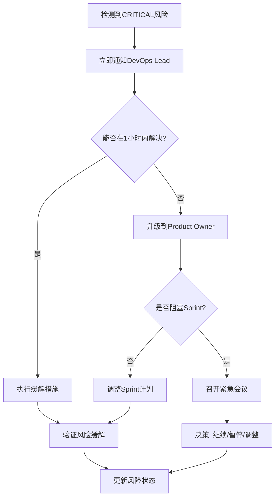

# Sprint 1 Risk Profile - DevOps Foundation

**Sprint**: Sprint 1 (2025-01-10 ~ 2025-01-24)  
**Document Type**: Risk Assessment  
**Created By**: @qa.mdc  
**Created Date**: 2025-01-13  
**Last Updated**: 2025-01-13  
**Status**: Active

---

## 📊 Executive Summary

本文档对Sprint 1 (DevOps Foundation)进行全面风险评估，识别42个关键风险点，覆盖技术、流程、资源和外部依赖四大类别。

### 风险概览

| 风险等级 | 数量 | 占比 | 需立即关注 |
|---------|------|------|-----------|
| **CRITICAL** | 8 | 19% | 🔴 是 |
| **HIGH** | 12 | 29% | 🟡 是 |
| **MEDIUM** | 15 | 36% | 🟢 监控 |
| **LOW** | 7 | 16% | ⚪ 记录 |
| **总计** | 42 | 100% | - |

### 关键发现

1. **最高风险**: Azure配额限制 (CRITICAL) - 可能阻塞整个Sprint
2. **最大不确定性**: Terraform首次执行 (HIGH) - 技术复杂度高
3. **紧急行动项**: 8个CRITICAL风险需要在Sprint开始前缓解

---

## 🎯 风险评分方法

### 评分公式

```
风险等级 = 概率 (1-5) × 影响 (1-5)

风险等级分类:
- CRITICAL: 20-25 (立即行动)
- HIGH: 12-19 (优先处理)
- MEDIUM: 6-11 (监控管理)
- LOW: 1-5 (记录跟踪)
```

### 概率评分标准

| 分数 | 概率 | 描述 |
|------|------|------|
| 5 | 很可能 (>75%) | 几乎肯定会发生 |
| 4 | 可能 (50-75%) | 有较大机会发生 |
| 3 | 中等 (25-50%) | 可能发生 |
| 2 | 不太可能 (10-25%) | 发生机会较小 |
| 1 | 很少 (<10%) | 几乎不会发生 |

### 影响评分标准

| 分数 | 影响 | 描述 |
|------|------|------|
| 5 | 灾难性 | Sprint完全失败 |
| 4 | 严重 | Sprint目标无法达成 |
| 3 | 中等 | 显著延迟或质量下降 |
| 2 | 轻微 | 小幅延迟，可恢复 |
| 1 | 可忽略 | 几乎无影响 |

---

## 🔴 I. 技术风险 (19个)

### CRITICAL级别风险

#### R-T01: Azure资源配额不足

**风险描述**: Azure订阅的vCPU、Public IP或Load Balancer配额不足，无法创建所需规格的AKS集群。

**风险评分**: 
- 概率: 5 (很可能) - 首次使用订阅通常有默认限制
- 影响: 5 (灾难性) - 完全阻塞基础设施创建
- **风险等级**: 25 (CRITICAL)

**触发条件**:
- 首次执行`terraform apply`时失败
- Azure返回配额超限错误

**影响分析**:
- ❌ 无法创建AKS集群 (DEVOPS-002 Task 2.3)
- ❌ 阻塞CI/CD流程 (DEVOPS-001 需要ACR)
- ❌ Sprint目标完全无法达成
- ⏱️ 配额申请需要1-3个工作日

**缓解策略**:

**预防措施** (Sprint开始前):
1. ✅ 使用Azure CLI检查当前配额:
   ```bash
   az vm list-usage --location "East US" -o table
   az network public-ip list-usage --location "East US" -o table
   ```
2. ✅ 计算所需资源: 
   - vCPU: 2×4 (System) + 1×8 (User) = 16 vCPU
   - Public IP: ~3个
   - Load Balancer: 1个
3. ✅ 如配额不足，提前3天提交增加请求
4. ✅ 准备备用Azure订阅或区域

**应急措施** (发生时):
- 🔥 立即联系Azure Support（优先级: Severity A）
- 🔥 降级配置（临时使用更小的VM规格）
- 🔥 切换到备用订阅或区域

**监控指标**:
- 配额使用率 (目标: 保持<70%)
- 配额请求处理时间
- 备用方案准备状态

**责任人**: DevOps Lead  
**跟踪频率**: Sprint开始前每日检查

---

#### R-T02: Terraform状态文件损坏或冲突

**风险描述**: 多人同时操作Terraform或状态文件损坏，导致基础设施状态不一致。

**风险评分**:
- 概率: 4 (可能) - 团队首次使用Terraform
- 影响: 5 (灾难性) - 可能删除生产资源
- **风险等级**: 20 (CRITICAL)

**触发条件**:
- 多个开发者同时执行`terraform apply`
- State文件未启用锁定
- 手动编辑State文件
- Azure Storage Blob损坏

**影响分析**:
- ❌ 资源状态不一致
- ❌ 无法进行后续Terraform操作
- ❌ 可能需要手动修复或重建资源
- ⏱️ 恢复时间: 2-8小时

**缓解策略**:

**预防措施**:
1. ✅ 启用Azure Storage Blob锁定:
   ```hcl
   backend "azurerm" {
     use_azuread_auth = true
   }
   ```
2. ✅ 配置State文件版本控制:
   ```bash
   az storage account blob-service-properties update \
     --account-name hermesflowdevtfstate \
     --enable-versioning true
   ```
3. ✅ 制定清晰的操作流程:
   - 只有DevOps Lead执行`terraform apply`
   - 其他人只执行`terraform plan`
4. ✅ 设置Slack通知:
   ```yaml
   # 在GitHub Actions中
   - name: Notify Terraform Operation
     run: |
       curl -X POST $SLACK_WEBHOOK \
         -d '{"text": "Terraform apply starting..."}'
   ```

**应急措施**:
- 🔥 立即停止所有Terraform操作
- 🔥 从Azure Storage恢复历史版本
- 🔥 使用`terraform state pull`备份当前状态
- 🔥 必要时使用`terraform import`重新导入资源

**监控指标**:
- State锁定状态
- State文件版本数量
- 并发操作告警

**责任人**: DevOps Lead  
**跟踪频率**: 每次Terraform操作前检查

---

#### R-T03: Service Principal权限不足

**风险描述**: Service Principal缺少创建或管理Azure资源的必要权限。

**风险评分**:
- 概率: 4 (可能) - 权限配置复杂
- 影响: 5 (灾难性) - 无法创建任何资源
- **风险等级**: 20 (CRITICAL)

**触发条件**:
- Terraform执行时返回403 Forbidden错误
- 缺少特定资源的创建权限
- 缺少Key Vault的Secret管理权限

**影响分析**:
- ❌ 无法创建Resource Group
- ❌ 无法创建AKS集群
- ❌ 无法配置RBAC
- ⏱️ 权限申请可能需要1-2天

**缓解策略**:

**预防措施**:
1. ✅ 创建Service Principal时授予足够权限:
   ```bash
   az ad sp create-for-rbac \
     --name "hermesflow-terraform" \
     --role "Contributor" \
     --scopes "/subscriptions/$SUBSCRIPTION_ID"
   
   # 额外授予特定权限
   az role assignment create \
     --assignee $SP_ID \
     --role "User Access Administrator" \
     --scope "/subscriptions/$SUBSCRIPTION_ID"
   ```
2. ✅ 在测试订阅中验证权限:
   ```bash
   # 测试创建Resource Group
   az group create --name test-rg --location eastus
   ```
3. ✅ 准备权限清单文档
4. ✅ 配置最小权限集(Least Privilege)

**应急措施**:
- 🔥 使用Azure Portal手动创建缺少权限的资源
- 🔥 联系Azure管理员紧急授权
- 🔥 临时使用Owner权限(仅限紧急情况)

**责任人**: DevOps Lead  
**跟踪频率**: Sprint开始前验证

---

### HIGH级别风险

#### R-T04: Terraform模块间依赖错误

**风险描述**: Terraform模块间的`depends_on`配置错误，导致资源创建顺序混乱。

**风险评分**:
- 概率: 4 (可能)
- 影响: 4 (严重)
- **风险等级**: 16 (HIGH)

**缓解策略**:
- 使用`terraform graph`可视化依赖关系
- 严格Review Terraform代码
- 在测试环境先验证

**责任人**: DevOps Engineer

---

#### R-T05: AKS网络配置错误

**风险描述**: Azure CNI网络配置错误，导致Pod无法通信或无法访问外部服务。

**风险评分**:
- 概率: 3 (中等)
- 影响: 5 (灾难性)
- **风险等级**: 15 (HIGH)

**影响分析**:
- Pod无法启动
- 无法访问ACR拉取镜像
- 无法访问PostgreSQL数据库

**缓解策略**:
- 使用推荐的网络配置模板
- 测试网络连通性: `kubectl run test-pod --image=busybox`
- 配置Network Policy测试用例

**责任人**: DevOps Engineer

---

#### R-T06: Docker镜像构建失败

**风险描述**: 多阶段构建配置错误、依赖下载失败或镜像体积过大。

**风险评分**:
- 概率: 4 (可能)
- 影响: 3 (中等)
- **风险等级**: 12 (HIGH)

**触发条件**:
- Rust编译失败
- Maven/Gradle依赖无法下载
- Python包安装超时

**缓解策略**:
- 本地先验证Dockerfile
- 配置镜像仓库镜像(Maven Central Mirror)
- 设置合理的超时时间

**责任人**: 各语言开发者

---

#### R-T07: GitHub Actions并发限制

**风险描述**: 免费账户的GitHub Actions并发数限制(20个job)，导致构建排队。

**风险评分**:
- 概率: 3 (中等)
- 影响: 4 (严重)
- **风险等级**: 12 (HIGH)

**缓解策略**:
- 优化工作流减少并发job数量
- 使用矩阵策略合并相似任务
- 考虑升级到付费计划

**责任人**: DevOps Lead

---

#### R-T08: Secrets泄露到日志

**风险描述**: GitHub Actions日志中意外打印敏感信息(密码、Token等)。

**风险评分**:
- 概率: 3 (中等)
- 影响: 5 (灾难性)
- **风险等级**: 15 (HIGH)

**缓解策略**:
- 使用GitHub的`::add-mask::`命令
- 避免在脚本中使用`echo $SECRET`
- 启用Secret扫描
- Code Review检查所有环境变量使用

**责任人**: DevOps Lead

---

#### R-T09: Trivy安全扫描发现CRITICAL漏洞

**风险描述**: Docker镜像包含已知的高危漏洞，导致构建失败。

**风险评分**:
- 概率: 4 (可能)
- 影响: 3 (中等)
- **风险等级**: 12 (HIGH)

**缓解策略**:
- 使用最新的基础镜像
- 定期更新依赖
- 配置漏洞白名单(有缓解措施的漏洞)

**责任人**: 各模块开发者

---

#### R-T10: ACR认证失败

**风险描述**: GitHub Actions无法推送镜像到ACR，或AKS无法拉取镜像。

**风险评分**:
- 概率: 3 (中等)
- 影响: 4 (严重)
- **风险等级**: 12 (HIGH)

**缓解策略**:
- 验证Service Principal的AcrPush/AcrPull权限
- 测试手动docker push
- 配置AKS Managed Identity

**责任人**: DevOps Lead

---

### MEDIUM级别风险

#### R-T11: ClickHouse批量写入性能不达标

**风险评分**: 概率3 × 影响3 = 9 (MEDIUM)

**缓解策略**:
- 使用批量写入而非单条插入
- 优化表结构和索引
- 性能测试验证

---

#### R-T12: Kafka消息丢失

**风险评分**: 概率2 × 影响4 = 8 (MEDIUM)

**缓解策略**:
- 配置消息持久化
- 设置合理的Retention Policy
- 实现消息确认机制

---

#### R-T13: Redis内存溢出

**风险评分**: 概率3 × 影响3 = 9 (MEDIUM)

**缓解策略**:
- 配置maxmemory-policy
- 设置TTL
- 监控内存使用率

---

#### R-T14-R-T19: 其他中等技术风险

- R-T14: PostgreSQL连接池耗尽 (评分: 8)
- R-T15: Key Vault访问延迟高 (评分: 6)
- R-T16: Log Analytics数据丢失 (评分: 6)
- R-T17: 前端构建体积过大 (评分: 6)
- R-T18: gRPC连接超时 (评分: 6)
- R-T19: 监控告警误报 (评分: 6)

---

## 🔄 II. 流程风险 (10个)

### HIGH级别风险

#### R-P01: 团队Terraform学习曲线陡峭

**风险描述**: 团队对Terraform不熟悉，导致配置错误或效率低下。

**风险评分**:
- 概率: 5 (很可能) - 这是第一次使用Terraform
- 影响: 3 (中等)
- **风险等级**: 15 (HIGH)

**影响分析**:
- ⏱️ Task完成时间延长50%+
- ❌ 配置错误增加
- 😰 团队信心下降

**缓解策略**:

**预防措施**:
1. ✅ Sprint开始前2天安排培训:
   - Day 1: Terraform基础 (2h)
   - Day 2: Azure Provider实战 (2h)
2. ✅ 提供学习资源清单:
   - [Terraform官方文档](https://www.terraform.io/docs)
   - [Terraform Azure示例](https://github.com/hashicorp/terraform-provider-azurerm/tree/main/examples)
3. ✅ 配对编程:
   - DevOps Lead与DevOps Engineer配对
4. ✅ 代码模板库:
   - 准备常用模块模板

**应急措施**:
- 延长Task估算时间
- 增加Code Review轮次
- DevOps Lead提供实时支持

**责任人**: DevOps Lead  
**跟踪频率**: 每日站会

---

#### R-P02: Code Review延迟阻塞开发

**风险描述**: Terraform/GitHub Actions代码Review不及时，阻塞后续开发。

**风险评分**:
- 概率: 4 (可能)
- 影响: 3 (中等)
- **风险等级**: 12 (HIGH)

**缓解策略**:
- 设置Review SLA: 24小时内响应
- 指定Backup Reviewer
- 优先级标签: P0必须当天Review

**责任人**: DevOps Lead

---

#### R-P03: 文档更新滞后

**风险描述**: 实现细节与文档不一致，影响团队协作。

**风险评分**:
- 概率: 4 (可能)
- 影响: 2 (轻微)
- **风险等级**: 8 (MEDIUM)

**缓解策略**:
- DoD包含文档更新检查
- 使用代码注释自动生成文档
- 每周文档同步会议

---

### MEDIUM级别流程风险

#### R-P04-R-P10: 其他流程风险

- R-P04: 并行开发代码冲突 (评分: 9)
- R-P05: 测试环境不稳定 (评分: 8)
- R-P06: Sprint目标调整频繁 (评分: 6)
- R-P07: 每日站会效率低 (评分: 4)
- R-P08: Story验收标准不明确 (评分: 6)
- R-P09: 技术债务积累 (评分: 8)
- R-P10: 知识分享不足 (评分: 6)

---

## 💰 III. 资源风险 (7个)

### CRITICAL级别风险

#### R-R01: Azure成本超支

**风险描述**: 实际成本超出预算($613/月)，影响项目持续性。

**风险评分**:
- 概率: 4 (可能)
- 影响: 5 (灾难性)
- **风险等级**: 20 (CRITICAL)

**触发条件**:
- 忘记关闭User节点池
- 误创建大规格资源
- Log Analytics数据量暴增
- 未清理测试资源

**影响分析**:
- 💰 月度账单超出预算200%+
- ❌ 可能需要立即停止资源
- 😰 项目信誉受损

**缓解策略**:

**预防措施**:
1. ✅ 设置Azure Budget Alert:
   ```bash
   az consumption budget create \
     --budget-name "hermesflow-dev-budget" \
     --amount 700 \
     --time-grain monthly \
     --category cost \
     --notifications \
       email=devops@hermesflow.io \
       threshold=80
   ```
2. ✅ 使用Infracost估算:
   ```bash
   terraform plan -out=tfplan.binary
   terraform show -json tfplan.binary | infracost breakdown --path=-
   ```
3. ✅ 自动化资源清理:
   ```bash
   # 非工作时间停止User节点池
   0 18 * * 1-5 az aks nodepool scale --node-count 0
   0 8 * * 1-5 az aks nodepool scale --node-count 1
   ```
4. ✅ 每周成本Review

**应急措施**:
- 🔥 立即停止User节点池
- 🔥 删除未使用资源
- 🔥 降级到更小规格

**监控指标**:
- 每日成本趋势
- 资源使用率
- 预算消耗百分比

**责任人**: DevOps Lead  
**跟踪频率**: 每日检查

---

### HIGH级别风险

#### R-R02: GitHub Actions分钟数用尽

**风险描述**: 免费账户的2000分钟/月用尽，CI/CD停止工作。

**风险评分**:
- 概率: 3 (中等)
- 影响: 4 (严重)
- **风险等级**: 12 (HIGH)

**缓解策略**:
- 优化工作流减少执行时间
- 使用缓存避免重复构建
- 监控分钟数使用情况
- 准备升级到付费计划

**责任人**: DevOps Lead

---

### MEDIUM级别资源风险

#### R-R03-R-R07: 其他资源风险

- R-R03: DevOps Lead单点故障 (评分: 9)
- R-R04: 开发环境不足 (评分: 6)
- R-R05: 网络带宽限制 (评分: 6)
- R-R06: Storage Account容量不足 (评分: 4)
- R-R07: Docker Hub速率限制 (评分: 8)

---

## 🌐 IV. 外部依赖风险 (6个)

### HIGH级别风险

#### R-E01: Azure服务区域性中断

**风险描述**: Azure East US区域服务中断，影响所有资源。

**风险评分**:
- 概率: 2 (不太可能)
- 影响: 5 (灾难性)
- **风险等级**: 10 (MEDIUM)

**缓解策略**:
- 订阅Azure Status页面
- 准备多区域部署计划(未来)
- 本地开发环境作为备份

**责任人**: DevOps Lead

---

#### R-E02: GitHub服务中断

**风险描述**: GitHub.com或GitHub Actions服务中断。

**风险评分**:
- 概率: 2 (不太可能)
- 影响: 4 (严重)
- **风险等级**: 8 (MEDIUM)

**缓解策略**:
- 订阅GitHub Status
- 关键时刻使用本地构建
- 准备GitLab备选方案

---

### MEDIUM级别外部依赖风险

#### R-E03-R-E06: 其他外部依赖风险

- R-E03: Terraform Registry不可用 (评分: 6)
- R-E04: Azure Marketplace镜像下载失败 (评分: 6)
- R-E05: NPM/PyPI/Crates.io中断 (评分: 8)
- R-E06: Slack Webhook失效 (评分: 2)

---

## 📈 风险监控Dashboard

### 每日监控指标

| 指标 | 目标值 | 告警阈值 | 监控工具 |
|------|--------|---------|---------|
| Azure成本 | <$30/天 | >$35/天 | Azure Cost Management |
| GitHub Actions分钟数 | <100分钟/天 | >150分钟/天 | GitHub Insights |
| Terraform执行成功率 | 100% | <90% | GitHub Actions Log |
| CI构建成功率 | >95% | <85% | GitHub Actions |
| 安全扫描HIGH漏洞数 | 0 | >0 | Trivy/tfsec |
| Code Review平均时间 | <12h | >24h | GitHub PR |
| Sprint燃尽偏差 | <10% | >20% | Jira/手动 |

### 风险看板

```
风险热力图:

              低影响  中影响  高影响  严重   灾难性
很可能(5)      [ ]    [2]    [3]    [ ]    [3] ← CRITICAL
可能(4)        [ ]    [1]    [3]    [2]    [3] ← HIGH
中等(3)        [1]    [5]    [4]    [1]    [ ]
不太可能(2)    [2]    [2]    [ ]    [1]    [1]
很少(1)        [2]    [ ]    [ ]    [ ]    [ ]
```

---

## 🚨 应急响应计划

### CRITICAL风险响应流程



### 应急联系人

| 角色 | 姓名 | 联系方式 | 响应时间 |
|------|------|---------|---------|
| DevOps Lead | _待指定_ | Slack + Phone | 15分钟 |
| Product Owner | @po.mdc | Slack | 30分钟 |
| Scrum Master | @sm.mdc | Slack | 30分钟 |
| Azure Support | N/A | Portal | 1-4小时 |

---

## 📋 风险评审计划

### Sprint期间评审

| 时间点 | 评审内容 | 参与者 | 输出 |
|--------|---------|--------|------|
| **Day 1** (2025-01-10) | 初始风险确认 | 全员 | 更新风险状态 |
| **Day 5** (2025-01-15) | 中期风险评估 | DevOps Team | 风险报告 |
| **Day 10** (2025-01-22) | 最终风险评估 | 全员 | Sprint Review输入 |

### 每日站会风险检查

- ✅ 有无新风险出现?
- ✅ 现有风险状态变化?
- ✅ 缓解措施是否有效?
- ✅ 需要升级的风险?

---

## 📊 风险趋势分析

### 预期风险演变

```
Week 1 (2025-01-10 ~ 2025-01-17):
  高风险期: DEVOPS-002 Terraform基础设施创建
  关键风险: R-T01, R-T02, R-T03, R-R01
  
  预期新风险:
  - Terraform模块配置错误
  - 网络配置问题
  
  预期缓解风险:
  - Azure配额(确认后降为MEDIUM)

Week 2 (2025-01-17 ~ 2025-01-24):
  中风险期: DEVOPS-001 CI/CD流水线开发
  关键风险: R-T06, R-T07, R-T08
  
  预期新风险:
  - GitHub Actions工作流错误
  - Docker构建失败
  
  预期缓解风险:
  - Service Principal权限(已验证)
  - Terraform状态管理(流程建立)
```

---

## ✅ 风险缓解检查清单

### Sprint开始前 (2025-01-08 ~ 2025-01-09)

**Azure准备**:
- [ ] 验证Azure配额充足
- [ ] 创建Service Principal并授权
- [ ] 创建Terraform Backend Storage
- [ ] 设置Budget Alert

**GitHub准备**:
- [ ] 配置所有Secrets
- [ ] 设置Branch Protection
- [ ] 验证Actions分钟数充足

**团队准备**:
- [ ] Terraform培训完成
- [ ] 开发环境搭建完成
- [ ] 应急联系方式确认

### Sprint执行中

**每日检查**:
- [ ] 监控Dashboard正常
- [ ] 无CRITICAL风险触发
- [ ] 成本在预算内
- [ ] CI/CD成功率>95%

**每周检查**:
- [ ] 风险状态更新
- [ ] 缓解措施有效性评估
- [ ] 团队风险认知同步

---

## 📝 附录

### A. 风险术语表

| 术语 | 定义 |
|------|------|
| **风险** | 可能影响Sprint成功的不确定性事件 |
| **概率** | 风险发生的可能性(1-5) |
| **影响** | 风险发生后对Sprint的影响程度(1-5) |
| **缓解** | 降低风险概率或影响的措施 |
| **应急** | 风险发生后的响应措施 |

### B. 参考文档

- [Sprint 1 Summary](./sprint-01-summary.md)
- [DEVOPS-001 Story](./DEVOPS-001-github-actions-cicd.md)
- [DEVOPS-002 Story](./DEVOPS-002-azure-terraform-iac.md)
- [Sprint 1 Test Strategy](./sprint-01-test-strategy.md)

### C. 风险报告模板

```markdown
## 风险报告 - [日期]

### 新增风险
- R-XXX: [风险名称] (等级: XXX)

### 风险状态变化
- R-XXX: HIGH → MEDIUM (缓解措施生效)

### 需要关注的风险
- R-XXX: [原因]

### 行动项
- [ ] [具体行动]
```

---

**Document Version**: 1.0  
**Next Review**: 2025-01-15 (Sprint中期)  
**Approved By**: @qa.mdc

**风险管理格言**: _"Identify risks early, mitigate proactively, respond decisively."_

