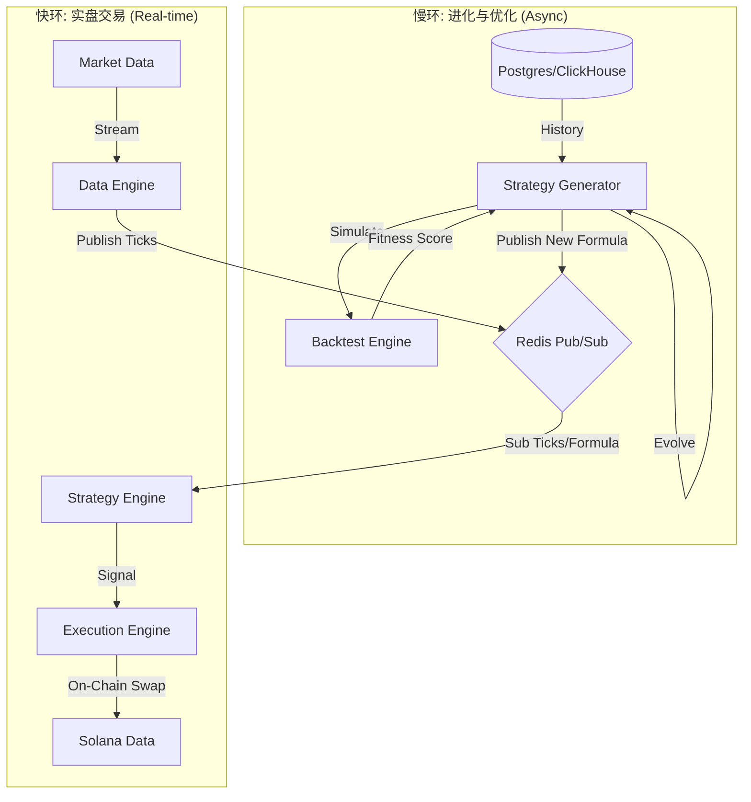

# HermesFlow System Architecture & Data Flow

本文档深入解构 HermesFlow 从因子挖掘、策略进化到实盘交易的全链路架构。

## 1. 核心架构逻辑: 双环驱动 (Dual-Loop Architecture)

HermesFlow 采用 **"快慢双环"** 设计：
1.  **快环 (Real-time Loop)**: 毫秒级信号生成与交易执行 (Data -> Strategy -> Execution)。
2.  **慢环 (Optimization Loop)**: 异步策略进化与回测 (DB -> Generator -> Backtester -> Strategy Update)。

---

## 2. 模块级详细工作流 (Module-Level Detail)

### 模块 0: 策略生成器 (Strategy Generator)
**角色**: 这一环节在后台持续运行，通过遗传算法寻找最优交易公式。这是用户提到的 **"回测环节"** 的核心载体。

| 步骤 | 动作 (Action) | 输入数据 (Input) | 处理逻辑 (Process) | 输出数据 (Output) | 数据落库 (Storage) |
|---|---|---|---|---|---|
| **0.1** | **加载历史** | Postgres `market_data_snapshots` | 提取过去N天的 Price/Volume 数据，构建回测环境 | `BacktestContext` | 内存缓存 |
| **0.2** | **种群初始化** | - | 随机生成 100 个策略公式 (Genome) | `Population` | - |
| **0.3** | **并行回测** | `Population`, `BacktestContext` | 对每个策略运行 `StackVM`，模拟历史交易，计算 Sharpe/Sortino 比率 | `Fitness Scores` | - |
| **0.4** | **优胜劣汰** | `Fitness Scores` | 选择最佳个体，进行交叉(Crossover)和变异(Mutation) | 新一代 `Population` | Postgres: `strategy_generations` (记录每一代的最佳表现) |
| **0.5** | **部署策略** | Best Genome | 当新策略显著优于旧策略时，触发热更新 | JSON Payload | Redis Channel: `strategy_updates` Redis Key: `strategy:status` |

---

### 模块 1: 数据引擎 (Data Engine)
**角色**: 系统的眼睛，负责全网数据采集与清洗。

| 步骤 | 动作 | 输入数据 | 处理逻辑 | 输出数据 | 数据落库 |
|---|---|---|---|---|---|
| **1.1** | **全网扫描** | Jupiter/Birdeye API | 轮询热门代币列表，发现新池子 | `Raw Token Info` | Postgres: `active_tokens` |
| **1.2** | **实时采集** | Websocket/Rest API | 接收实时价格、成交量流 | `MarketTick` | - |
| **1.3** | **快照清洗** | `MarketTick` | 去除异常值，对齐时间戳，标准化格式 | `MarketDataUpdate` | Postgres: `market_data_snapshots` (热数据) ClickHouse: `market_ticks` (海量冷数据) |
| **1.4** | **广播** | `MarketDataUpdate` | - | JSON Stream | Redis Channel: `market_data` |

---

### 模块 2: 策略引擎 (Strategy Engine)
**角色**: 实时决策大脑，执行由模块0生成的策略。

| 步骤 | 动作 | 输入数据 | 处理逻辑 | 输出数据 | 数据落库 |
|---|---|---|---|---|---|
| **2.1** | **策略同步** | Redis `strategy_updates` | 接收模块0发布的新公式，**无需重启**即刻替换内存中的 VM 逻辑 | `CurrentFormula` | 内存 (Atomic Reference) |
| **2.2** | **特征工程** | Redis `market_data` | 维护滑动窗口 (Sliding Window)，实时计算 33 个因子 (RSI, Volatility等) | `FeatureVector` | - |
| **2.3** | **信号计算** | `FeatureVector` | 运行 `StackVM.execute(formula, features)`，计算得分为 $S$ | Signal Score ($0.0-1.0$) | - |
| **2.4** | **风控初审** | Signal Score | 检查是否 $S > Threshold$，且当前无持仓 | `EntryIntent` | - |
| **2.5** | **信号发布** | `EntryIntent` | 生成唯一 Signal ID | `TradeSignal` (JSON) | Redis Channel: `trade_signals` Postgres: `trade_signals` (审计记录) |

---

### 模块 3: 执行引擎 (Execution Engine)
**角色**: 交易员，负责与区块链交互。

| 步骤 | 动作 | 输入数据 | 处理逻辑 | 输出数据 | 数据落库 |
|---|---|---|---|---|---|
| **3.1** | **信号接收** | Redis `trade_signals` | 解析 JSON，验证签名（如需） | Validated Signal | - |
| **3.2** | **路由择优** | Symbol, Amount | 并行查询 Raydium 直连路由和 Jupiter 聚合路由，计算预估滑点 | `SwapRoute` | - |
| **3.3** | **链上风控** | `SwapRoute` | **Honeypot Check**: 模拟卖出以确保非貔貅盘；**Self-Swap Check**: 防止自交易 | Boolean (Pass/Fail) | Logs (Vector) |
| **3.4** | **交易上链** | `SwapRoute` | 构建 Transaction -> 私钥签名 -> 发送 RPC | `Signature` (TxHash) | - |
| **3.5** | **确认与反馈** | TxHash | 轮询链上状态直到 Finalized | `ExecutionResult` | Postgres: `trade_executions` Redis Channel: `portfolio_updates` |

---

## 3. AlphaGPT vs HermesFlow 深度对比 (Architectural Gap)

您之前询问了与 AlphaGPT 的差距，这里从**系统工程**角度进行更深层的剖析：

| 维度 | AlphaGPT (Research Toy) | HermesFlow (Production System) | 核心差距点 |
|---|---|---|---|
| **回测机制** | **静态脚本**: 使用 `pandas` 在 CSV 上跑一次性脚本。 | **动态循环**: 后台服务 (`Strategy Generator`) 持续运行，基于最新数据不断自进化策略。 | **时效性**: AlphaGPT 的策略是"死"的，HermesFlow 是"活"的。 |
| **数据流转** | **文件传递**: 数据存为 CSV/JSON 文件，模块间通过读写文件通信。 | **事件总线**: 使用 Redis Pub/Sub 实现微服务解耦，数据在内存中毫秒级流转。 | **延迟**: 文件IO vs 内存通信，延迟差距 1000x。 |
| **因子计算** | **全量重算**: 每次回测都重新计算所有因子。 | **增量计算**: 策略引擎维护滑动窗口，仅计算最新一个 Tick 的因子值 (O(1)复杂度)。 | **性能**: 适合高频实时交易。 |
| **容错设计** | **无**: 遇到网络错误脚本直接 Crash。 | **健壮**: 这种重试机制、熔断机制 (Breaker)、死信队列 (DLQ) 设计。 | **稳定性**: 7x24小时运行能力。 |

## 4. 总结

HermesFlow 的架构不仅仅是一个交易脚本，而是一个**闭环的自动做市与策略进化系统**。
每一步都有明确的数据落地（Postgres用于审计/回测，Redis用于实时/缓存，ClickHouse用于分析），确保了系统的**可追溯性**和**高性能**。

---

## 6. 退出逻辑 (Exit Strategy)

除了买入，Strategy Engine 还负责卖出：
1.  **实时监控**: 对每个持仓代币，监控实时传入的 `market_data`。
2.  **盈亏检查**: `PortfolioManager` 计算当前未实现盈亏 (PnL)。
3.  **触发规则**:
    *   **Stop Loss (止损)**: 跌幅超过阈值 (如 -15%)。
    *   **Take Profit (止盈)**: 涨幅超过阈值 (如 +30%)。
4.  **卖出信号**: 触发 `Sell Signal` -> Redis `trade_signals` -> Execution Engine -> 卖出变现 -> SOL 回流。
